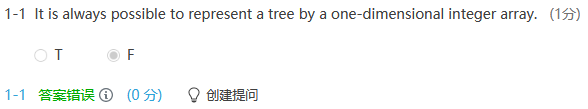
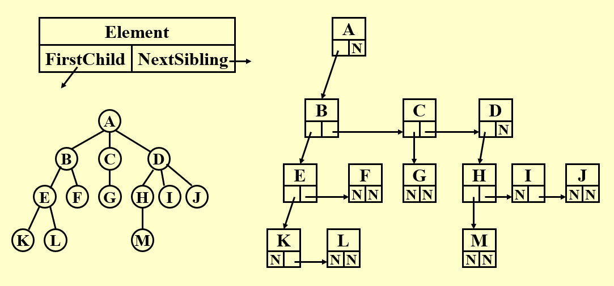
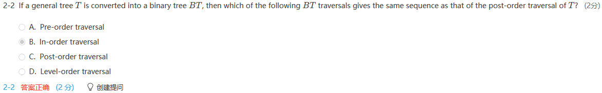
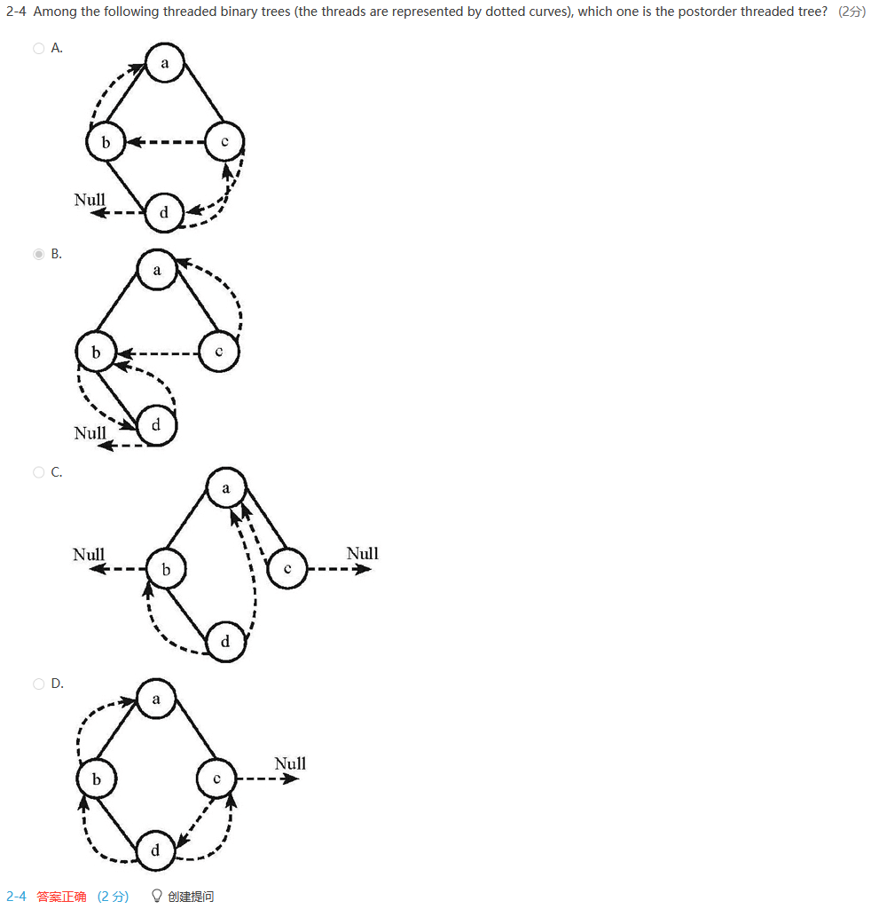

# WEEK 4

## 3 Trees

大纲：

树的定义是递归的，有根节点和从其出发的有向边，连向所有的子树

树的性质，n个节点n-1条边有根节点

二叉树：

树的遍历 四种遍历顺序，层序遍历

### 3.1 Preliminaries

#### [Definition] A tree is a  collection of nodes. The collection can be empty; otherwise, a tree consists of (1)  a distinguished node r, called the root; (2) and zero or more nonempty (sub)trees, each of whose roots are connected by a directed edge from r.

- Subtrees must not connect together.  Therefore every node in the tree is the root of some subtree.

- There are N-1 edges in a tree with N nodes

#### Terminologies

>- degree of a node : 结点的子树个数
>- degree of a tree : 结点的度的最大值
>- parent : 有子树的结点
>- children : the roots of the subtrees of a parent
>- siblings : children of the same parent
>- leaf(terminal node) : a node with degree 0(no children)
>- path from $n_1$ to $n_k$ : a **unique** sequence of nodes $n_1,n_2,\cdots,n_k$ such that $n_i$ is the parent of $n_{i+1}$ for $1\leq i<k$ 
>- length of path : 路径上边的条数
>- depth of $n_i$ : 从根结点到$n_i$结点的路径的长度($Depth(root)=0$)
>- height of $n_i$ : 从$n_i$结点到叶结点的最长路径的长度($Height(leaf)=0$)
>- height/depth of a tree : 根结点的高度/最深的叶结点的深度
>- ancestors of a node : 从此结点到根结点的路径上的所有结点
>- descendants of a node : 此结点的子树中的所有结点

#### List Representation

- The size of each node depends on the number of branches.

  

  The correct answer is T.

#### FirstChild-NextSibling Representation



- The representation is **not unique** since the children in a tree can be of any order.

---

### 3.2 Binary Trees

#### [Definition] A binary tree is a tree in which no node can have more than two children.

#### Tree Traversals (visit each node exactly once)

线性复杂度$O(n)$，因为每个节点只访问一次

遍历不改变操作数的顺序

visit（可以是print）

1. Preorder Traversal 先处理根节点，再处理左右节点，因此preorder中第一个遍历到的为根节点

   ```pseudocode
   void preorder( tree_ptr tree )
   { 
       if( tree )   
       {
           visit ( tree );
           for (each child C of tree )
               preorder ( C );
       }
   }
   ```

2. Postorder Traversal先处理左右子树，根节点最后返回，因此postorder中根节点最后返回

   ```pseudocode
   void postorder( tree_ptr tree )
   {  
   	if( tree )   
   	{
           for (each child C of tree )
       		postorder ( C );
           visit ( tree );
       }
   }
   ```

3. Levelorder Traversal 层序遍历，使用一个queue

   ```pseudocode
   void levelorder( tree_ptr tree )
   {   
   	enqueue ( tree );
       while (queue is not empty) 
       {
           visit ( T = dequeue ( ) );
           for (each child C of T )
               enqueue ( C );
       }
   }
   ```

4. Inorder Traversal 返回顺序为左、根、右，中序遍历最为关键

   ```pseudocode
   void inorder( tree_ptr  tree )
   {  
		if( tree )   
   	{
       	inorder ( tree->Left );
        	visit ( tree->Element );
        	inorder ( tree->Right );
      }
   }
   ```
   
   Iterative Program : 使用自己定义的栈替换系统的栈，实现中序遍历
   
   leftmost 的左节点和rightmost的右节点都是NULL
   
   ```pseudocode
   void iter_inorder( tree_ptr tree )
   { 
   	Stack  S = CreateStack( MAX_SIZE );
   	for ( ; ; )  
   	{
       	for ( ; tree; tree = tree->Left )
           	Push ( tree, S );
        	tree = Top ( S );  
        	Pop( S );
        	if ( !tree ) break;
        	visit ( tree->Element );
        	tree = tree->Right; 
       }
   }
   ```
   
   

#### Threaded Binary Trees

- A full binary tree with $n$ nodes has $2n$ links, and $n+1$ of them are NULL.

- Replace the NULL links by “threads” which will make traversals easier.

**Rules** :

> - If **Tree->Left** is null, replace it with a pointer to the inorder **predecessor(中序前驱)** of Tree.
> - leftmost的left指针由于没有中序前驱（中序遍历中最先返回的节点），所以指向head node
> - If **Tree->Right** is null, replace it with a pointer to the inorder **successor(中序后继)** of Tree.
> - 同理，rightmost的right由于没有中序后继（中序遍历中最后返回的节点），所以也指向head node
> - There must not be any loose threads.  Therefore a threaded binary tree must have a **head node** of which the left child points to the first node.（右节点指针指向自身）

```c
typedef struct ThreadedTreeNode *PtrToThreadedNode;
typedef struct PtrToThreadedNode ThreadedTree;
typedef struct ThreadedTreeNode 
{
	int LeftThread;        /* if it is TRUE, then Left */
	ThreadedTree Left;     /* is a thread, not a child ptr.*/
	ElementType	Element;
	int RightThread;       /* if it is TRUE, then Right */
	ThreadedTree Right;    /* is a thread, not a child ptr.*/
}
```

- 线索化的实质就是将二叉链表中的空指针改为指向前驱或后继的线索。由于前驱和后继信息只有在遍历该二叉树时才能得到，所以，线索化的过程就是在遍历的过程中修改空指针的过程。

  

