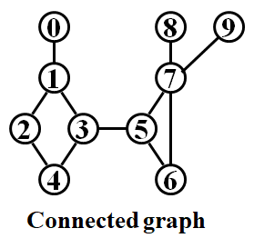
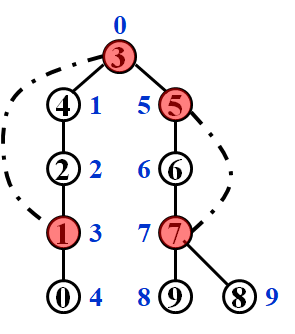

# WEEK 11

### 6.7 Applications of Depth-First Search

```c
/*a generalization of preorder traversal*/
void DFS(Vertex V)
{   
    visited[ V ] = true;  /*mark this vertex to avoid cycles*/
    for ( each W adjacent to V )
        if ( !visited[ W ] ) DFS( W );
} /*T = O(|E|+|V|) as long as adjacency lists are used*/
```

#### Undirected Graphs

```c
void ListComponents(Graph G)
{   
    for ( each V in G ) 
        if ( !visited[ V ] ) 
        {
			DFS( V );
            printf("\n");
        }
}
```

#### Biconnectivity

- $v$ is an **articulation point** if $G'=DeleteVertex(G, v)$ has **at least 2** connected components.
- $G$ is a **biconnected graph** if $G$ is connected and has no articulation points.
- A **biconnected component** is a maximal biconnected subgraph.




> Note : No edges can be shared by two or more biconnected components.  Hence $E(G)$ is partitioned by the biconnected components of $G$.

Finding the **biconnected components** of a connected undirected $G$ :

> - Use **depth first search** to obtain a spanning tree of $G$
>
>   
>
>   
>
>   - Depth first number($Num$) 先序编号
>   - Back edges(背向边) = $(u,v)\notin$ tree and $u$ is an ancestor of $v$.
>
>   > Note : If $u$ is an ancestor of $v$, then $Num(u)<Num(v)$.
>
> - Find the articulation points in $G$
>   - The root is an articulation point if it has at least 2 children.
>   - Any other vertex $u$ is an articulation point if $u$ has at least 1 child, and it is impossible to move down at least 1 step and then jump up to $u$‘s ancestor

- 对于深度优先搜索生成树上的每一个顶点$u$，计算编号最低的顶点，称之为$Low(u)$
  $$
  Low(u)=\min\{Num(u),\min\{Low(w)|w\,is\,a\,child\,of\,u\},\min\{Num(w)|(u,w)\,is\,a\,back\,edge\}\}
  $$

```pseudocode
/*Assign Num and compute Parents*/
void AssignNum(Vertex V)
{
	Vertex W;
	Num[V] = Counter++;
	Visited[V] = True;
	for each W adjacent to V
		if(!Visited[W])
		{
			Parent[W] = V;
			AssignNum(W);
		}
}
```

```pseudocode
/*Assign Low; also check for articulation points*/
void AssignLow(Vertex V)
{
	Vertex W;
	Low[V] = Num[V]; /*Rule 1*/
	for each W adjacent to V
	{
		if(Num[W] > Num[V]) /*Forward edge*/
		{
			Assignlow(W);
			if(Low[W] >= Num[V])
				printf("%v is an articulation point\n", v);
			Low[V] = Min(Low[V], Low[W]); /*Rule 3*/
		}
		else
			if (Parent[V] != W) /*Back edge*/
				Low[V] ＝ Min(Low[V], Num[W]); /*Rule 2*/
	}
}
```

```pseudocode
void FindArt(Vertex V)
{
	Vertex W;
	Visited[V] = True;
	Low[V] = Num[V] = Counter++; /*Rule 1*/
	for each W adjacent to V
	{
		if(!Visited[W]) /*Forward edge*/
		{
			Parent[W] = V;
			FindArt(W);
			if(Low[W] >= Num[V])
				printf("%v is an articulation point\n", v);
			Low[V] = Min(Low[V], Low[W]); /*Rule 3*/
		}
		else
			if(Parent[ V ] != W) /*Back edge*/
				Low[V] = Min(Low[V], Num[W]); /*Rule 2*/
	}
}
```

#### Euler Circuits

##### [Proposition] An Euler circuit is possible only if the graph is connected and each vertex has an *even* degree.

##### [Proposition] An Euler tour is possible if there are exactly *two* vertices having odd degree.  One must start at one of the odd-degree vertices.

> Note:
>
> - The path should be maintained as a linked list.
> - For each adjacency list, maintain a pointer to the last edge scanned.
> - $T=O(|E|+|V|)$

---


## 7 Sorting

### 7.1 Preliminaries

```c
void X_Sort (ElementType A[], int N)
```

- N must be a legal integer.
- Assume integer array for the sake of simplicity.
- ‘>’ and ‘<’ operators exist and are the only operations allowed on the input data.
- Consider internal sorting only. The entire sort can be done in main memory.

---

### 7.2 Insertion Sort

```c
void Insertion(ElementType A[], int N)
{ 
	int j, P; 
	ElementType Tmp; 

	for ( P = 1; P < N; P++ ) 
    { 
		Tmp = A[ P ];  /*the next coming card*/
		for ( j = P; j > 0 && A[ j - 1 ] > Tmp; j-- ) 
			A[ j ] = A[ j - 1 ]; 
        	/*shift sorted cards to provide a position for the new coming card*/
		A[ j ] = Tmp;  /*place the new card at the proper position*/
	}/*end for-P-loop*/
}
```

- The worst case : Input A[ ] is in reverse order
  $$
  T(N)=O(N^2)
  $$

- The best case : Input A[ ] is in sorted order
  $$
  T(N)=O(N)
  $$

---

### 7.3 A Lower Bound for Simple Sorting Algorithms

#### [Definition] An *inversion* in an array of numbers is any ordered pair$(i,j)$ having the property that $i<j$ but $A[i]>A[j]$

- Swapping two adjacent elements that are out of place removes **exactly one** inversion.

- $T(N,I)=O(I+N)$ where $I$ is the number of inversions in the original array.

#### [Theorem] The average number of inversions in an array of $N$ distinct numbers is $N(N-1)/4$

#### [Theorem] Any algorithm that sorts by exchanging adjacent elements requires $\Omega(N^2)$ time on average

---