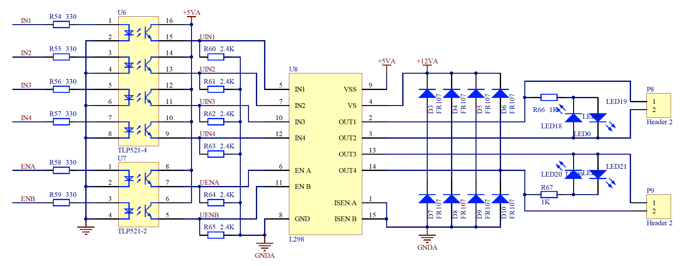

# 小车检测电路和电机驱动电路测试

实验日期：2023/10/23

地点：东3-406

## 实验目的

1. 了解智能小车结构和工作原理。
2. 掌握光电检测的原理和测量方法。
3. 了解直流电机驱动电路工作原理和测试方法。
4. 学会参照原理图测量和调试PCB板。

### 实验器材

1. 万用表（HY63）

2. 实验室配备小车

   

## 实验一：红外光电检测电路测试

### 测试方案

1. 分析红外光电检测电路参数设计。
2. 缺省高度（2CM），白底/黑底/其它表面下，光电管反射电压测量比较（至少测试2组光电管）。
3. 计算并确定区分黑白地面的比较电压值，总结光电检测轨道对地面的最低要求。
4. 不同高度（2至6CM），光电管反射电压测量比较，总结光电检测轨道对安装高度的要求。
5. 观察环境光亮对光电检测电路的影响。

### 测试过程与结果

1. 分析电路

   

   
<I>fig1 OPTO5内部电路</I>

   我们主要讨论R17的阻值，R19的阻值和W5为什么为大电阻（10k）。

2. 使直流电压源输出稳定15V电压，给小车供电。

3. 将小车的红外探测仪置于不同表面，使用万用表6V电压档测量电路各参数。

   ##### 【1.1 分析红外光电检测电路参数设计】

   | Led05  | 11脚输入/V | 10脚输入/V | 13脚输出/V | 灯   | V~R19~/V | V~R20~/V | V~R17~/V | V~R18~/V | 5V实际输入电压/V | 3.3V实际输入电压/V |
   | ------ | ---------- | ---------- | ---------- | ---- | -------- | -------- | -------- | -------- | ---------------- | ------------------ |
   | 桌面白 | 0.200      | 1.992      | 0.153      | 亮   | 1.253    | 3.168    | 3.708    | 4.721    | 4.933            | 3.329              |
   | 桌面黑 | 3.655      | 1.992      | 3.320      | 暗   | 0.000    | 0.000    | 3.709    | 1.340    | ~                | ~                  |

   * **R19与R20**

     这两个电阻位于发光电路之中。R19作为LED灯的限流电阻，R20作为LED的并联电阻。
     $$
     \begin{array}{l}
     I_{19}=\dfrac{U_{R_{19}}}{R_{19}} = 1.253/680mA=1.84mA\\
     U_{LED}=V_{I}-U_{R_{19}}=3.329-1.253=2.076V
     \end{array}
     $$
     
     
     
     
<I>fig2 发光二极管I-V特性曲线</I>

     
     根据[上述图表](https://www.electronics-tutorials.ws/diode/diode_8.html)，同时根据我们的二极管为绿色二极管可知，当选用3.3V的发光二极管时，已经能够较好地体现发光特性，电流以毫安级别通过。
     
     **R20**作为并联电阻，搜索资料得知，在LED两端并联大电阻，当有反向电流流过时，能稳定LED两端电压，避免所有分压在一个LED灯上，导致LED灯反向击穿；同时，能够很好的释放LED内部存储的能量，使得LED灯快速熄灭。
     
   * **W5，10脚输入电压**
   
     W5采用10kΩ大电阻，在控制电位压降的同时，也很好地控制进入比较器的电流大小，，一般要将输入比较器的电流控制在10mA以下。
   
   * **红外检测电路部分R17，R18**
   
     **R17**作为红外发光二极管的限流电阻，控制流过二极管的电流大小。
     $$
     I_{R_{17}}=U_{R_{17}}/R_{17}=3.708/150=24.72mA
     $$
     同样根据fig2，可以看到，将红外发光二极管维持在20mA左右的电流通过，能使其更好地发挥作用。
   
     **R18**作为检测支路上的电阻，与光电二极管构成了一个为11脚提供电位的之路。
     $$
     \begin{array}{l}
     1. 当光电二极管接收红外光线，产生电流时，等于光电二极管导通：\\
     I_{R_{18}}=U_{R_{18}}/R_{18}=4.721/10k=0.47mA\\
     U_d=U_s-U_{R_{18}}=0.2V\\
     \\
     2. 当光电二极管未接收到红外光线，等于光电二极管截止：\\
     I_{R_{18}}=U_{R_{18}}/R_{18}=0.13mA\\
     U_d=U_s-U_{R_{18}}=3.655V\\
     \end{array}
     $$
     当然，接收到的红外光线越少，光电二极管两端电压越大，11脚电位越高。
   
   * **比较器的使用**
   
     11脚电位比10脚电位低，则输出低电压，稳定在0.153V。
   
     11脚电位比10脚电位高，这输出高电压，稳定在3.320V。

| LED06 | 11脚输入/V | 10脚输入/V | 13脚输出/V | 灯   | V~R19~/V | V~R20~/V | V~R17~/V | V~R18~/V |
| ----- | ---------- | ---------- | ---------- | ---- | -------- | -------- | -------- | -------- |
| 白    | 0.193      | 1.965      | 0.152      | 亮   | 1.249    | 3.169    | 3.712    | 4.711    |
| 黑    | 3.201      | 1.965      | 3.320      | 暗   | 0        | 0        | 3.713    | 1.728    |

测量LED06阻值两端的电压与LED05所得结果基本相似。

##### 【1.2 不同表面，光电管反射电压测量】

##### 【1.3 区分黑白地面的比较电压值】

根据实验结果，可以得到以下结论：反射表面对红外线吸收能力越强，光电管反射电压越高。

随着反射表面对红外线能力的吸收增强，光电管两端电压增加，当超过另外一只引脚的输入电压后，比较器输出相反的性质。

4. 将红外探测仪置于白色表面不同高度处（通过小车下面垫置书本实现），测量光电管反射电压。

##### 【1.4不同高度（2至6CM)，光电管反射电压测量比较】

* 当光电管离地越来越高，所能吸收的红外光线越来越少，两端电压越来越大。
* 当光电管高度大约为3.5～3.7cm左右时，光电管两端电压逐渐靠近1.992V（另一只脚的电压），此时从比较器从输出低电压转变为高电压，在这个电压值以下，指示LED灯发光，以上则熄灭。
* 在实际使用中，为了避免高度对测量结果的影响，当一只脚的引脚为2V左右，应该将光电管置于<2.5cm的位置。当然，也要根据具体的另一只脚的电位，具体调整光电管离地高度。

##### 【1.5 观察环境光亮对光电检测电路的影响】

* 可见，环境对实验有一定的影响，当其影响在1%左右，所以可以忽略不计。
* 在昏暗环境下，去除了日光中的红外线对光电管的影响，从而使得其引脚11两端电压略微升高
* 在明亮的条件下，新增加的光源中的红外线对光电管造成一定影响，使得引脚11两端电压略微下降（0.001V的偏差可视为车辆上的不精确，可以忽略）。

## 实验二：测量直流电机正转和反转时的VA特性

### 测试方案

测量不同输入直流电压时，经过小车上的电机的电流。

### 测试过程与结果

1. 拆下小车电源线，将其与直流输入电压源、万用表60mA电流档串联，60mA的电流档内阻约为10Ω左右，对曲线的影响较小
2. 调节直流稳压源的电压，记录万用表读数
3. 交换输入电压源正负极，测量电机反转时的VA特性。

* 直流电压源从高到低变化时，电流逐渐较小，同时也可以观察到，电动机的转速慢慢减小。
* 当电压源电压过小时，电动机停转，同时电流急剧上升，此时不再对外输出机械能，而是等效为一个电阻，只输出热能。

## 实验三：电机驱动模块功能验证

### 测试方案

对集成H桥各端口输入不同情况下的电压，检验芯片各端口的输出特性，验证电机的转动情况。

### 测试过程与结果

1. 分析PCB板上的电路图。

<I>fig3 电机控制电路电路图</I>

该电路分为三个模块：

* **光电控制电路**

  通过IN1，IN2等各接口输入电压，当输入高电位后，控制灯光发亮，光电管接收到光信号导通，集成H桥芯片中的IN1脚变为高电位。

  这样子利用光电控制的好处在于，低电流控制高电流，将控制电路与高电压、大电流驱动电路分开，避免高电压、高电流出问题后，造成控制电路的损坏。

* **集成H桥驱动芯片**

  有输入端4四个，其中IN1、IN2和OUT1、OUT2控制一个电机的两端，IN3、IN4和OUT3、OUT4控制另外一个电机。

* **电机部分**

  电机有两个端口，两端的电压差驱动电机的转动。

2. 将电板接入电源，根据引脚图连接电路

   

   
<I>fig4 引脚输入图</I>

将输入脚ENA总控制开关，IN1、IN2等输入引脚与3.3V或者GND脚连接，以控制输入电位的高低。

3. 利用万用表测量各电位电压，记录数据。

   

   * 输入IN1，IN2，输入端的高电压对应了OUT1和OUT2的高电压。
   * 当输出端OUT1、OUT2对应的电压有一定的电压差时，电机转动。
   * ENA类似于总开关，当输入为高电压时，芯片正常工作；输入为低电压的时候，芯片不工作，两输出脚输出较低电压，但并没有非常低（1.3V左右，相比于0.17/0.71的低电压）。

## 实验四：电机开环控制时小车运行状态观测

### 测试方案

观察电机正转/反转时，小车的运动情况。

### 测试过程与结果

1. ENA输入高电压。调节IN1、IN2、IN3、IN4的输入逻辑以控制电机正反转。
2. 观察小车的运转情况。

* 当两端均正转后，由于两端的电机并不一定完全一致，所以在实际情况中，两电机均正转时，并不如设想一般直走，而是有微微的偏移，在我们实验过程中，小车微微左转，可见左边电机的转速略微慢于右边。在后续编程小车的时候，需要对电路进行一定的改进，使得输出电压能够使小车正走。
* 左右电机一正一反时，小车绕两轮线段的中心旋转。
* 左右电机中一个为正，一个停转时，这基本上绕停转的轮转。