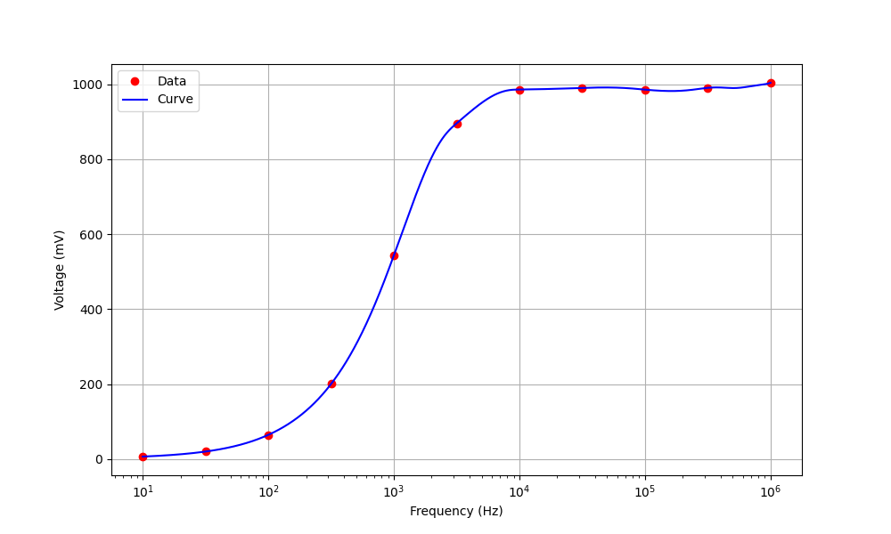

# 常用仪器使用练习实验

实验日期：2023/9/18

地点：东3-406

## 实验目的

1. 认识和学会选择常用无源电子器件（主要是电阻与电容）
2. 掌握常用电子仪器的使用（万用表、直流稳压电源、示波器、信号源、ADCL-I模拟数字电子技术实验箱）

## 基本实验内容

## 实验1：万用表使用

### 实验器材

1. 万用表（HY63）
2. ADCL-I模拟数字电子技术实验箱中的点解电容、电阻、电位器
3. 直流稳压电源
4. 连接线

### 实验方案

1. 用万用表测出任意二个电阻（R）的阻值，并与其色环所指示的电阻值进行比较。
2. 检查并验证电位器（M） 中心头的功能。
3. 查看电解电容器(CD）上的规格和极性标记，并用万用表检查电解电容器的漏电阻（注意万用表笔的极性），测出任意二个电容器的漏电阻值。
4. 调节稳压电源输出 ＋/-12V，用万用表测量并验证。

### 测试过程和结果

#### （一）万用表测电阻

##### 测试过程

1. 打开万用表并选择电阻测量模式，将红色连接线连结到Ω测量口，黑色链接COM输入口。
2. 选择一个电阻，调节档位至相应档位。
3. 将红黑表笔分别插入电阻对应的插孔。
4. 读取液晶屏读数，并记录读数。
5. 选取不同的电阻，重复2～4步。

##### 测试结果

这些电阻为五道色环对应读数

| 电阻标称阻值             | 标称允许误差 | 测量值  | 实际误差 | 是否在容许误差内 |
| ------------------------ | ------------ | ------- | -------- | ---------------- |
| 2KΩ（红黑黑棕200*10^1^） | ±1%          | 1.992KΩ | 0.40%    | 是               |
| 510Ω(绿棕黑黑510*10^0^)  | ±1%          | 505.8Ω  | 0.82%    | 是               |

##### 结果分析

使用万用表欧姆档所测量的电阻阻值与标称阻值略有偏差，但均在允许误差范围内。

-----------

#### （二）电位器（M） 中心头的功能

##### 测试过程与测试结果

1. 打开万用表并选择电阻测量模式，将红色连接线连结到Ω测量口，黑色链接COM输入口。

2. 选择合适的量程，由于我们选择的是10KΩ的电位器，所以将欧姆表调为60KΩ档位。

3. 将黑色表笔插入电位器位于中心的孔，红表笔插入两旁的孔。

   

4. 旋转电位器旋钮，发现万能表示数发生变化。

   我们观察到阻值从8.71KΩ，变至10.15KΩ。

   

   

5. 调换红表笔至另一端的插孔，发现读书变为0，反方向旋转电位器，示数增大。

6. 将红黑表笔插入电位器两端接口，发现示数即为之前所得最大值10.15KΩ。

###### 结果分析

旋转电位器，能够改变电位器的阻值。中心头应该起到调节短路部分电阻的作用，从而使得电位器阻值发生变化。

----------

#### （三）测量电容漏电阻

理想电容在充满电的情况下，应该完全绝缘，但实际情况并非如此，仍有一定量的电流通过，说明此时电容存在一个电阻，这个电阻被称为漏电阻。从以上分析也可以知道，电容的漏电阻应该非常大，所以选取的万用表欧姆最大档进行测量。在测验过程中，也选择过较小档位，但是，很快就会出现OL显示，说明电容的漏电阻非常大。

##### 测试过程

1. 打开万用表并选择最大欧姆档（60MΩ）测量模式，将红色连接线连结到Ω测量口，黑色链接COM输入口。
2. 将红表笔接在电解电容正级，黑表笔接在负极，等待电表示数稳定以后，读出示数。
3. 更换一个电阻，重复上述步骤2，得到多个电容的漏电电阻。

##### 测试结果与分析

| 电容量/最大工作耐压 | 测试结果     | 分析                                                         |
| ------------------- | ------------ | ------------------------------------------------------------ |
| 100µF/25V           | 未知，>8.3MΩ | 由于万用表中的阻值也非常大，充电时间非常长，示数一直在增大，所以未知实际漏电电阻为多少 |
| 1000µF/25V          | >8.61MΩ      | 等待电容充完电后，万用表示数，保持稳定，该大电容的示数也一直在增大，但增大速度小于100µF的电容，根据t=CR，可以猜想，所需要的充电时间更长，充电速度更慢，因此相应的欧姆表示数跳大的速率也比较小。 |

-------

#### （四）调节稳压电源输出 ＋/-12V

##### 测试过程与测试结果

1. 打开直流稳压源，切换至channel2，旋转Voltage按钮，直至显示12V（这里要慢慢地旋转，否则会以为示数并没有变化）
2. 将万用表切换至60V电压档，将红表笔与电源正极连接，黑表笔与负极连接，按输出按钮，测得读数12.09V，此时电源的电流示数自动跳为0A
3. 再按一次输出按钮，停止电源输出，交换红黑表笔，再按输出按钮，此时，万用表显示-12.09V

##### 结果分析

想要输出-12V，实际上只需要交换正常的输出方式即可

-------

## 实验2：示波器和信号源的联合使用I

### 实验器材

1. 示波器（1000 X-Series）
2. 信号源（ SDG2000X）
3. 连接线（包含10:1 无源探头）

### 实验方案

1. 用机内“探头补偿信号” 对示波器进行自检，并记录波形，顷率，周期，幅值，上升下降沿时间等。
2. 信号源设置波形，示波器进行测量

### 测试过程与结果

#### （一）探头补偿信号自检

1. 打开示波器电源，将10:1无源探头连接线连接在channel1的口和demo输出端。
2. 按`AutoScale`按钮，将波形稳定地显示在屏幕上。
3. 点按`Meas`按钮进行数据测量。

| 波形 | 频率      | 峰峰值 | 周期     | 上升沿时间 | 下降沿时间 |
| ---- | --------- | ------ | -------- | ---------- | ---------- |
| 方波 | 1.0002kHz | 2.61V  | 999.78µs | 1.95µs     | 1.95µs     |

#### （二）信号源设置波形，示波器进行测量

##### 操作过程

1. 打开信号源和示波器电源，使用连接线将两台机器相连。我们组选择使用信号源1和输入端2进行实验。
2. 在信号源处进行操作，选择所需的信号类型，例如正弦波。
3. 调整信号源的频率和振幅，以产生所需的信号，并按`output`按键输出信号。
4. 使用示波器观察信号源产生的信号波形，利用`AutoScale`按钮，等待示波器调节好波形，并利用`Horizontal` `Vertical`部分的旋钮，将波形调至合适的显示尺寸，如果波形仍然不稳定，调节`Trigger`部分按键（触发模式和触发电平）得到想要的稳定的波形。
5. 点按`Meas`按钮进行数据测量。
6. 更换信号源信号，重新测量。

##### 数据记录与分析

| 信号源输出电压及频率                     | 峰峰值 | 有效值   | 周期     | 频率      |
| ---------------------------------------- | ------ | -------- | -------- | --------- |
| 25kHz 正弦波 80mV，偏移量 20mV           | 88mV   | 28.545mV | 39.973us | 25.017kHz |
| 1kHz 方波5V，偏移口，占空比40%           | 6.03V  | 2.4837V  | 1.0000ms | 1.0000kHz |
| 2kHz 锯齿5V，偏移1V，对称性20%           | 5.03V  | 1.4080V  | 501.1us  | 1.9955kHz |
| IkHz脉冲3V，偏移1V，占空比50%，边沿t50ns | 3.62V  | 1.5232V  | 1.0000ms | 1.0000kHz |

可见，信号源输出有一定误差，当然示波器检测也有一定的误差，导致测量值与所设想不同。

--------

## 实验3：示波器和信号源的联合使用II

### 实验器材

1. 示波器（1000 X-Series）
2. 信号源（ SDG2000X）
3. 连接线
4. 0.01µF的电容
5. 10kΩ的电阻U~R~

### 实验方案

实验电路图如上。调节信号源为正弦函数，并且将信号频率分别调至10, 10^2^, 10^3^, 10^4^, 10^5^, 10^6^kHz，并将示波器探测头两端并联在阻值R处，利用自带的测试工具，测量出U~R~的有效值，并绘图，得出结论。

### 实验过程

1. 利用连接线将电路图连接完毕。
2. 调节频率，并按`Output`按钮。
3. 观察示波器波形，使用上一个实验中的调节方法，至波形稳定，并测量出实际的有效值大小。
4. 调至不同频率，重复上述实验。

实验过程中发现，当频率为10Hz时，示波器中显示的波形噪声非常大（如上图显示），因此，使用了trigger按键中，降低噪声的按钮，从而能够较好地测量出有效值，而非显示屏数字一直上下跳动。

### 实验结果

| 频率（Hz）       | 10    | 10^1.5 | 100   | 10^2.5 | 1000  | 10^3.5 | 10^4  | 10^4.5 | 10^5  | 10^5.5 | 10^6   |
| ---------------- | ----- | ------ | ----- | ------ | ----- | ------ | ----- | ------ | ----- | ------ | ------ |
| 电压有效值（mV） | 6.727 | 20.133 | 64.68 | 200.49 | 543.5 | 895.9  | 986.1 | 990.4  | 985.8 | 990.6  | 1004.1 |

根据以上数据，绘制出数据图

### 结论

电阻两端的有效值随着信号源频率的升高先是缓慢上升，然后在10^2^~10^4^区间快速上升，最后趋于平缓，直至近似于电压源的有效值。体现出电容“隔直流，通交流”或者“通高频，阻低频”的特性。

-------

## 探究性实验：万用表电流档

### 实验目的

探究万用表电流档（以6mA和60mA为例）内部阻值对测量结果的影响。

### 实验器材

1. 万用表（HY63）
2. ADCL-I模拟数字电子技术实验箱中的点电阻、电位器
3. 直流稳压电源
4. 连接线

### 实验方案

1. 观察不同电流档档位测电流时的示数，从而定性地探究电流档内部的阻值大小分析。
2. 使用半偏法估测电流档内部的阻值。

### 测试过程与结果

##### （一）探究不同电流档对真值的影响

1. 选择电阻阻值为2kΩ，按照如下电路图进行连接。
2. 调节电源电压为6.00V。
3. 分别使用万用表的6mA和60mA档测量电路中的电流大小。

结果如下：

| 电流表档位                        | 6mA     | 60mA    | 差      |
| --------------------------------- | ------- | ------- | ------- |
| 万用表示数                        | 2.862mA | 2.98mA  | 0.118mA |
| $R_总=\dfrac{U}{I}$，电路内电阻和 | 2096.4Ω | 2013.4Ω | 83Ω     |
| 估算得$R_A=R_总-R$                | 96.4Ω   | 13.4Ω   | 83Ω     |

可以看到，电流档两档的测量相差了0.118mA。所以，如果想利用伏安法测量电阻阻值，得到的电阻值将相差83Ω，所以电流表内阻对测量有非常大的影响。

##### （二）利用半偏法测量电流表内阻

###### 实验过程

1. 将电路连接成下图所示。根据一定的估测，我们选择使用20V电源和最大阻值为1kΩ的电位器。
2. 先将60mA档电流表串入电路，断开S~2~开关，闭合S~1~开关，调节R~H~阻值，直至电流表显示50mA（60mA是最大量程，但是由于是数字电流表，很容易显示OL，所以选择50mA）
3. 再闭合S~2~开关，然后保证R~H~阻值不发生改变的情况下，调节R~B~的阻值，直到电流表显示25mA。
4. 断开电路，由于R~B~不能显示电阻，所以使用了万用表欧姆档测量其电阻，得到结果即可近似为电流表内阻。
5. 将电流表档位调为6mA，重复2～4步，其中第2步中电流表显示改为6mA（实验过程中，发现6mA可以调到所以没有考虑减小），第3步改为3mA。

###### 实验结果

| 电流表档位 | 6mA   | 60mA  |
| ---------- | ----- | ----- |
| 阻值       | 99.8Ω | 11.2Ω |

###### 实验误差分析

该方法存在系统误差，并不能很准确地代表电流表的阻值，但是经过一定改进的方法，使得测量值非常接近于真实阻值，原理如下：

$$
I_1=\dfrac{E}{R_H+R_A}\\
I_{2}=\dfrac{E}{R_H+\dfrac{R_AR_B}{R_A+R_B}}
$$

我们在使用半偏法的时候，假定整体电流并没有发生变化，但实际上，由于新电阻的并联，电路中的总阻值变小，外部电流$I$变大。如果想要$R_B$的阻值等同于$R_A$，那么万用表所显示的电流应该要更大（$I_A=I_B=\dfrac{1}{2}I_2$）。然而实际上，$I_A$的电流仍然为 $\dfrac{1}{2}I_1<\dfrac{1}{2}I_2$，因此，经过$R_B$的电流大于$R_A$，$R_B<R_A$，测量值小于真实值。

但是再分析，

情况1: 

$$
(R_A+R_H)\cdot{I_1}=E
$$

情况2: 

$$
\dfrac{1}{2}I_1\cdot{R_A}+R_H\cdot(\dfrac{1}{2}I_1+I_B)=E
$$

可以列出方程

$$
\begin{cases}
(R_A+R_H)\cdot{I_1}=E\\
\dfrac{1}{2}I_1\cdot{R_A}+R_H\cdot(\dfrac{1}{2}I_1+I_B)=E
\end{cases}         
$$

解得，

$$
\begin{cases}
I_B=\dfrac{E\cdot\dfrac{1}{2}I_1}{E-IR}\\
R_B=R_A-\dfrac{I_1\cdot{R_A^2}}{E}=\dfrac{1}{1+\dfrac{R_A}{R_H}}\cdot{R_A}
\end{cases}
$$

根据（5）中的2式，可以看出，当$R_A<<R_H$时，$R_B≈R_A$。

所以，在已经确定电流表阻值和电流的情况下，扩大$R_H$的阻值显得非常必要。我们可以通过扩大电压源电压的方法，来增大

$R_H$的阻值，所以电压源选择了20V。

以60mA为例，分析其中误差：
$$
R_A=\dfrac{R_B\cdot{R_H}}{R_H-R_B}\\
相对误差：
1-\dfrac{R_B}{R_A}=\dfrac{R_B}{R_H}≈2.88\%
$$
由于约为10Ω左右，所以相差0.3Ω左右的阻值，在可接受范围内。

而6mA的误差只会更小，所以可以考虑选用半偏法进行测量。

最后我们发现，60mA档的6mA档内部的阻值相差十倍。因此在平时选用合理档位测量电路中的电流时应该妥善选择量程。

结合电流表的组装，即将一个微小电流表和分流电阻并连的结构可知，量程越大相对应的阻值越小。

-------

## 示波器显示李萨如图像

### 实验目的

学会利用示波器上的`Acquire`键，调节出两个信号源合并之后的李萨如图像。

### 实验器材

1. 示波器
2. 信号源
3. 连接线

### 测试过程和结果

1. 打开信号源和示波器，并用连接线将两台机器相连（本组采用Channel1对Channel1，Channel2对Channel2）。
2. 然后调制信号源输出波形均为1kHz的正弦波，然后点按输出键。
3. 按示波器中的`AutoScale`按钮，然后发现两列波稳定地显示在屏幕上。

4. 点按`Acquire`按钮，然后将时间模式调为XY显示，随后，发现示波器界面并没有变成预想的直线，后意识到，输出的波形并没有同相位，因此只要在信号源中点按`同相位`即可。
5. 调制不同相位差及频率之比的波形，重复2～3步。

### 实验结果

