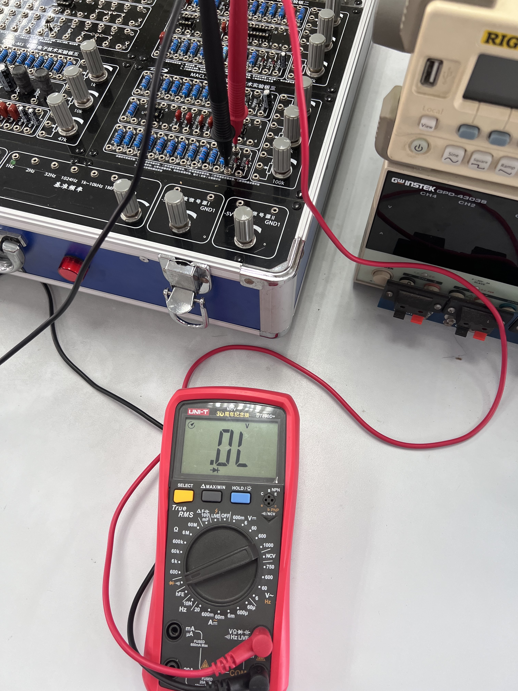

# 半导体⼆极管特性测试


实验日期：2023/9/26

地点：东3-406


## 实验目的

1. 掌握半导体⼆极管特性测试
2. 学习MULTISIM电路仿真软件的使⽤
3. 进⼀步熟悉电⼦仪器的使⽤

## 基本实验内容

### 实验器材

1. 万用表（HY63）
2. ADCL-I模拟数字电子技术实验箱中的半导体二极管【1N4007的整流二极管，5V/1W的稳压二极管】
3. 连接线
4. 示波器（1000 X-Series）
5. 信号源（ SDG2000X）

### 实验方案

本实验首先掌握判断二极管好坏的方法。接着采用三种方法绘制二极管VA特性曲线。具体流程如下：

1. ⽤万⽤表粗略判别⼆极管好坏。

2. 采⽤逐点测量法测量⼆极管的VA特性。

3. 采⽤扫描测量法测量⼆极管的VA特性，并双踪观察信号源与⼆极管两端电压（注意其击穿值）。

   采⽤扫描测量法测量稳压管的VA特性，并双踪观察信号源与⼆极管两端电压（注意其击穿值）。

4. 应⽤MULTISIM软件仿真⼆极管的VA特性。

--------


## 实验一：应⽤万⽤表初步测试⼆极管的好坏

### 测试过程与结果

1. 认识万用表测量二极管档


2. 将黑表笔插入`COM`口，红表笔插入二极管测试对应二极管测试插口，并将档位调至二极管测量档位。由于蜂鸣器档位和二极管是同一档位，点按左上角`Select`按钮，切换至二极管档位。

3. 将万用表红表笔接入1N4007正级，黑色接负极，此时万用表显示二极管导通电压。如下图所示，测得1N4007的正向导通电压约为0.568V。

   

4. 将红黑表笔交换，测量方向电压，如下图所示，显示OL，超出量程。

   

5. 利用相同方法测量稳压二极管，得到相似结果

   

   

### 结果分析

首先通过万用表可以很好地对二极管进行检测，如检验其是否被击穿。同时可以看到，在同样的测量条件下，稳压二极管比整流二极管正向导通电压要高。可以与课上所给的VA特性曲线相联系，万用表所提供的电压为三伏，稳压二极管导通后，电压将保持0.7V左右，而整流二极管的曲线类似于大电阻，因而万用表显示的电压值在0.568V。

------------


## 实验二：逐点法测量二极管VA特性曲线

### 实验方案

采用以下电路，利用欧姆定律对二极管在每一点电压下的阻值进行测量。最后利用excel对数据进行处理，绘制曲线。


由于万用表的安培表阻值在该测试条件下（mA级别），视为短路；而相反，电压表的阻值足够大，可以视为开路，所以实验中只使用电压表来进行测量，将电压表并联在R~1~两端。并且利用电压源的示数，通过计算得出二极管两端电压与电流。

### 测试过程与结果

1. 连接电路，并将电压源输出值调为0。

   

2. 将万用表并联在电阻两端，测得电压示数。将此示数和电压源示数，一起记录到excel表格中。

3. 逐渐增大电压源输出电压，并重复步骤2。

4. 使用excel处理数据，并且绘制曲线，在变化较为剧烈处，增加多组数据测量，从而得到更为光滑、准确的曲线。

### 数据处理与分析

| 电压源输出电压（V） | R1两端电压（V） | 二极管两端电压（=A#-B#） | 电流（=B#/1000） |
| ------------------- | --------------- | ------------------------ | ---------------- |
| 0                   | 0               | 0                        | 0                |
| 0.3                 | 0.0014          | 0.2986                   | 0.0000014        |
| 0.403               | 0.0134          | 0.3896                   | 0.0000134        |
| 0.452               | 0.0302          | 0.4218                   | 0.0000302        |
| 0.502               | 0.0554          | 0.4466                   | 0.0000554        |
| 0.55                | 0.085           | 0.465                    | 0.000085         |
| 0.602               | 0.1209          | 0.4811                   | 0.0001209        |
| 0.703               | 0.1979          | 0.5051                   | 0.0001979        |
| 0.803               | 0.281           | 0.522                    | 0.000281         |
| 0.903               | 0.3678          | 0.5352                   | 0.0003678        |
| 1.102               | 0.5481          | 0.5539                   | 0.0005481        |
| 1.202               | 0.645           | 0.557                    | 0.000645         |
| 1.3                 | 0.739           | 0.561                    | 0.000739         |
| 1.551               | 0.976           | 0.575                    | 0.000976         |
| 1.751               | 1.169           | 0.582                    | 0.001169         |
| 1.851               | 1.265           | 0.586                    | 0.001265         |
| 1.951               | 1.362           | 0.589                    | 0.001362         |
| 2.151               | 1.557           | 0.594                    | 0.001557         |
| 2.451               | 1.851           | 0.6                      | 0.001851         |
| 2.751               | 2.147           | 0.604                    | 0.002147         |
| 2.951               | 2.344           | 0.607                    | 0.002344         |
| 3.551               | 2.938           | 0.613                    | 0.002938         |
| 4.551               | 3.931           | 0.62                     | 0.003931         |
| 5.551               | 4.928           | 0.623                    | 0.004928         |
| 7.65                | 7.02            | 0.63                     | 0.00702          |
| 9.55                | 8.92            | 0.63                     | 0.00892          |
| 11.049              | 10.42           | 0.629                    | 0.01042          |


-------


## 实验三：扫描法测量二极管VA特性曲线

### 实验方案

1. 将电路连接成下图所示。由于信号源与示波器的接地设置，装置只能设置为如图所示，所有的接地线应该连接在一起。
2. 并将信号源设置为1kHz，10Vp的锯齿波。通过信号源的XY显示，展示VA特性曲线直观样式。由于$U_{diode}=U_{ch1}-U_{ch2},I_{diode}=\dfrac{U_{ch1}}{51Ω}$，因此，XY曲线一定程度上反映了最终结果的图线。

3. 后通过matlab等数据处理，生成正确的曲线。


### 测试过程与结果

1. 连接电路（二极管选择1N4007整流二极管，电阻选择51Ω），调节信号源、示波器，观察图样。

2. 利用示波器的USB接口，将图样信息和数据保存。

3. 利用Matlab处理信息，生成图像。

   Matlab代码如下：

```matlab
% 读取数据
data = readmatrix('./Lab2/数据/111.csv');

% 获取vd和id列
v1 = data(:, 2);
v2= data(:, 3);
vd=v1-v2;
id=v2/51*1000;
plot(vd, id);

%生成平滑曲线
smoothed_vd = smooth(vd, 0.1, 'loess'); 
smoothed_id = smooth(id, 0.1, 'loess');
hold on;
plot(smoothed_vd, smoothed_id, 'b-', 'LineWidth', 0.2);
legend('原始数据', '光滑曲线');
xlabel('电压（V）');
ylabel('电流（mA）');
legend('实验数据','VA特性曲线');
```

4. 将二极管更换为稳压二极管，重复上述步骤。

### 结果分析

#### 整流二极管


观察到以下几个特殊的地方：

1. 截止时，电流不完全为0，由于R~1~两端存在一个非常小的电压，该曲线在截止部分的电流不为0。

2. 该曲线在导通与截止部分，存在两条曲线，上面那条曲线一般认为是理想情况下的VA特性曲线。而下面那条曲线说明，二极管存在一个反向的电流。再经过数据分析可知，在截止与导通部分，当二极管两端电压逐渐增大时，即由截止切换到导通模式时，电流增大；而当电压减小时，即由导通切换为截止模式时，存在一个反向电流。后经过资料查询可知，二极管存在一个特性：

   **二极管方向恢复电流（Reverse Recovery Current）** 在二极管由导通状态转变为截止状态时，电流反向流动的现象。当二极管从正向导通状态切换到反向截止状态时，载流子需要一定时间来清除。在这个短暂的时间内，二极管中的电流会反向流动，这就是方向恢复电流。方向恢复电流的大小和持续时间取决于二极管的特性和工作条件。

#### 稳压二极管


可以观察到，稳压二极管的截止电压约为5.2V左右，与标称的5V/1W相匹配，同时可以观察到，稳压二极管相比于整流二极管，在两端电压增大的情况下，能保持一个较为稳定的电压值，约为0.76V左右。

------


## 实验三：仿真⼆极管的VA特性

### 实验方案

利用Multisim平台搭建电路，利用扫描法绘制二极管曲线。

Multisim平台一定需要一个接地端，同时示波器的接地端并不影响电路中的电位，因而实验电路如下：


示波器A接口为二极管两端电压，B接口为R1两端电压。利用示波器的B/A按钮，定性地显示VA特性曲线，再利用Matlab处理输出的数据。

### 测试过程与结果

1. 打开Multisim平台，选择器件，并将器件连接为上图所示。
2. 双击信号源和示波器，将信号源调为1kHz每秒，振幅分别为1V和700V，示波器视图为B/A。
3. 打开图像视图，导出图像为csv格式。
4. 利用Matlab处理csv中的数据。

根据不同曲线的特点，采用了以下两种方式进行数据拟合：

#### 1V，没有为负数的点，因而采用了指数的拟合方式

```matlab
data = readmatrix('./Lab2/数据/1V.csv');
vd = data(:, 1);
vr = data(:, 2);
id = vr * 0.1;

% 使用fit函数进行数据拟合
fitType = fittype('a * exp(b * x)'); % 选择适当的拟合函数
fitOptions = fitoptions('Method', 'NonlinearLeastSquares'); % 选择拟合方法
fitOptions.StartPoint = [1, -0.1]; % 初始拟合参数猜测

% 进行数据拟合
fitResult = fit(vd, id, fitType, fitOptions);

% 绘制拟合曲线
plot(fitResult,vd, id);
xlabel('电压（V）');
ylabel('电流（mA）');
legend('VA特性曲线');
```

#### 700V，由于数据点非常多，直接输出即位较光滑的曲线

```Matlab
% 读取数据
data = readmatrix('./Lab2/数据/700V_2.csv');

% 获取vd和id列
v1 = data(:, 1);
v2= data(:, 2);
vd=v1;
id=v2*0.1;
plot(vd, id);
xlabel('电压（V）');
ylabel('电流（mA）');
legend('实验数据','VA特性曲线');
```

### 结果分析

#### 1V，主要分析二极管由导通到截止这一段的特点


#### 700V，主要分析1N4007截止电压的特性


可以看出，由导通到截止这一部分，二极管的性质并不是非常稳定，所以曲线几乎填满了该段区域。

## 探究性实验：信号源内部电阻

### 引入


观察上面的黄色曲线，会发现，当二极管导通后，峰值电压骤降。而分析可知，Channel1所测的是信号源两端电压，而电压骤降说明了信号源内部有电阻，进行分压，导致其峰值减小。现测量信号源两端的电阻大小。

### 实验方案

采用以下电路，利用欧姆定律对其进行测量。通过测量峰值电压的变化，得出信号源内部电阻大小


### 测试过程与结果

1. 将示波器接口两端与信号源两端连接。测出原本输出的电压幅值，$V_{p1}=10.5V$。

   

2. 连接方案中的电路图。

   

3. 测出此时的电压峰值为，$V_{p2}=5.23V$

   

4. 再次测量信号源两端电压，发现保持在10.5V，因此可以将信号源两端电压视为10.5V。

### 结果分析

$$
I_R=\dfrac{V_{p2}}{R}=5.23V÷51Ω=0.102A\\
R_S=\dfrac{V_{p1}-V_{p2}}{I_R}=5.27V÷0.102A=51.7Ω
$$

计算得到，信号源内阻为51.7Ω，查阅说明书，得知Channel1输出的内阻在50Ω左右，因此可知测量基本准确。

信号源内部有50Ω左右的阻值，所以，以后在定量测量的时候，需要将内阻考虑在内，以免影响最后结果的准确性。
