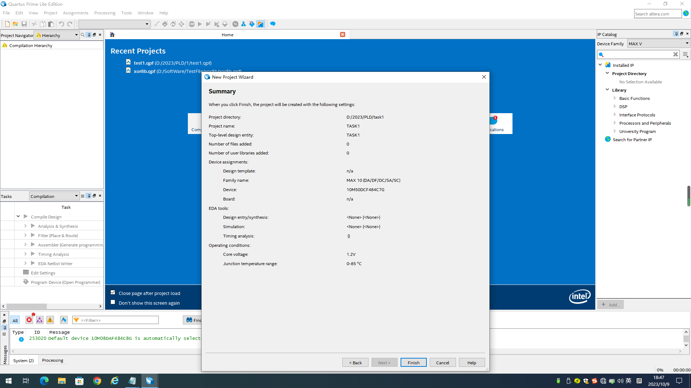
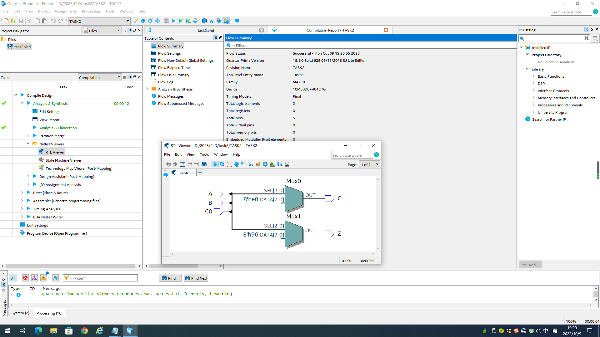

# 数字电路逻辑设计


实验日期：2023/10/9

地点：东3-406


## 实验目的

1. 了解数字电路基础知识
2. 掌握简单数字逻辑电路的设计
3. 学习FPGA开发工具

## 实验内容

用QUARTUS软件和DE10开发板设计并实现如下逻辑功能

1. 输入是三位二进制数A，B，C，要求当输入是2或3的倍数时输出等于逻辑1，其它情况，输出等于0。

2. 设计并实现一位二进制全加器（输入是一位二进制加数、被加教和低位进位，共3个逻辑变量）。

3. 【探究】某客厅四周有4个房间，每个房间门口有一个开关，客厅中间有一盏灯A。试设计一个逻辑电路，要求每个开关都能控制

   灯A的亮灭，并在DE10开发板上模拟此逻辑电路的功能。

## 实验器材

1. QUARTUS软件
2. DE10开发板
3. 电脑

## 实验一：判断2或3的倍数

### 1. 分析真值表

| num  | A    | B    | C    | Z    |
| ---- | ---- | ---- | ---- | ---- |
| 0    | 0    | 0    | 0    | 1    |
| 1    | 0    | 0    | 1    | 0    |
| 2    | 0    | 1    | 0    | 1    |
| 3    | 0    | 1    | 1    | 1    |
| 4    | 1    | 0    | 0    | 1    |
| 5    | 1    | 0    | 1    | 0    |
| 6    | 1    | 1    | 0    | 1    |
| 7    | 1    | 1    | 1    | 0    |

由于总情况较少，所以选择打表的方式列写代码。

### 2. 利用QUARTUS INTEL FPGA软件自带的Multisim软件先进行模拟

#### 逻辑设计输入 task1.vhd

```vhdl
---------库说明与库引用------------
library IEEE;
use IEEE.std_logic_1164.all;
use IEEE.std_logic_unsigned.all; 
use IEEE.numeric_std.all;
use IEEE.std_logic_arith.all;
---------------------------------


---------实体定义Task1------------
entity Task1 is
    port (  A,B,C: in std_logic;
            Z: out std_logic);
end Task1;
---------------------------------
    
    
----------结构体定义 BEHAV---------    
architecture BEHAV of Task1 is

begin
----------进程语句 P1---------------
P1:process(A,B,C)
variable tmp:std_logic_vector(2 downto 0); -- 定义变量tmp（std_logic_vector）记录ABC的输入 
begin
	tmp:=A&B&C;-- 将ABC的输入值连接
	--case语句 根据不同情况输出不同的Z值
	case tmp is
	when "000" => Z<='1';
	when "001" => Z<='0';
	when "010" => Z<='1';
	when "011" => Z<='1';
	when "100" => Z<='1';
	when "101" => Z<='0';
	when "110" => Z<='1';
	when "111" => Z<='0';
	when others => Z<='0';
	end case;
end process;        
---------------------------------

end BEHAV ;
---------------------------------
```

#### 逻辑设计仿真 test_tb.vhd

```vhdl
---------库说明与库引用------------
library IEEE;
use IEEE.std_logic_1164.all;
use IEEE.std_logic_unsigned.all; 
use IEEE.numeric_std.all;
use IEEE.std_logic_arith.all;
---------------------------------

------实体定义TEST_tb仿真元件--------
entity TEST_tb is
end TEST_tb;
---------------------------------

----------结构体定义 BEHAV---------  
architecture BEHAV of TEST_tb is

----------引用元件Task1---------
component Task1 is
	port (  A,B,C: in std_logic;
            Z: out std_logic);
end component;
signal A,B,C,Z: std_logic;--定义实参，方便后续控制输入输出

begin
U1: Task1 port map (A=>A,B=>B,C=>C,Z=>Z);--端口映射，将ABC的值输入到元件Task1中
P1: process
begin -- 仿真
	A<='0';B<='0';C<='0';wait for 10ns;
	A<='0';B<='0';C<='1';wait for 10ns;
	A<='0';B<='1';C<='0';wait for 10ns;
	A<='0';B<='1';C<='1';wait for 10ns;
	A<='1';B<='0';C<='0';wait for 10ns;
	A<='1';B<='0';C<='1';wait for 10ns;
	A<='1';B<='1';C<='0';wait for 10ns;
	A<='1';B<='1';C<='1';wait for 10ns;
end process;
end BEHAV;
```

#### 仿真结果


根据波形图结果，可知，该元件的代码编写正确，可以进行下一操作。

### 3. 生成编程文件

1. 新建project

   

2. 导入关于元件的文件task1.vhd

   

3. 编译生成文件，并导入DE10芯片

   点按步骤如下：

   * Analysis&Synthesis，可在RTL Viewer中查看逻辑线路
   * Fitter
   * Assemble

   

   * pin planner，进行线脚安排
     * ABC以开关的形式输入输出
     * Z以LED的方式显示

   

### 实验成果


## 实验二：二进制全加器

### 1. 分析真值表


### 2. 仿真模拟

#### 逻辑设计输入 task2.vhd

```vhdl
library IEEE;
use IEEE.std_logic_1164.all;
use IEEE.std_logic_unsigned.all; 
use IEEE.numeric_std.all;
use IEEE.std_logic_arith.all;
---------定义实体--------------------
entity Task2 is
    port (  A,B,C0: in std_logic;
            C,Z: out std_logic);
end Task2;

---------定义结构体--------------------
architecture BEHAV of Task2 is
begin
P1:process(A,B,C0)
variable tmp:std_logic_vector(2 downto 0);--变量tmp记录ABC0的输入值
begin
	tmp:=A&B&C0;
	case tmp is -- case语句根据ABC0不同的值输出不同的C与Z
	when "000" => C<='0';Z<='0';
	when "001" => C<='0';Z<='1';
	when "010" => C<='0';Z<='1';
	when "011" => C<='1';Z<='0';
	when "100" => C<='0';Z<='1';
	when "101" => C<='1';Z<='0';
	when "110" => C<='1';Z<='0';
	when "111" => C<='1';Z<='1';
	when others => C<='0';Z<='0';
	end case;
end process;
end BEHAV ;
```

#### 逻辑设计仿真 test_tb.vhd

```vhdl
library IEEE;
use IEEE.std_logic_1164.all;
use IEEE.std_logic_unsigned.all; 
use IEEE.numeric_std.all;
use IEEE.std_logic_arith.all;

entity TEST_tb is
end TEST_tb;


architecture BEHAV of TEST_tb is

component Task2 is
    port (  A,B,C0: in std_logic;
            C,Z: out std_logic);
end component;

signal A,B,C0,Z,C: std_logic;

begin
U1: Task2 port map (A=>A,B=>B,C0=>C0,Z=>Z,C=>C);
P1: process
-----------主要的仿真部分-------------------------------------------------
begin
	A<='0';B<='0';C0<='0';wait for 10ns;
	A<='0';B<='0';C0<='1';wait for 10ns;
	A<='0';B<='1';C0<='0';wait for 10ns;
	A<='0';B<='1';C0<='1';wait for 10ns;
	A<='1';B<='0';C0<='0';wait for 10ns;
	A<='1';B<='0';C0<='1';wait for 10ns;
	A<='1';B<='1';C0<='0';wait for 10ns;
	A<='1';B<='1';C0<='1';wait for 10ns;
end process;
end BEHAV;
```

#### 仿真结果


与预期一致，所以可以进行下一步操作

### 3. 生成编程文件

1. 编译输出，得到以下逻辑图

2. pin planner

   

   * A, B, C0对应三个开关
   * C与Z对应两盏LED灯

### 实验成果


上图对应A=0, B=0, C0=0的情况，输出C=0，Z=0的情况。


上图对应A=0, B=1, C0=0的情况，输出C=0，Z=1的情况。


上图对应A=1, B=1, C0=0的情况，输出C=1，Z=0的情况。


上图对应A=1, B=1, C0=1的情况，输出C=1，Z=1的情况。

## 实验三：开灯关灯的探究性实验<font color="red">  !注意：这个部分我写的些许有点错误，直接单数开关开则打开的思路即可</font>

### 1. 分析电路逻辑

ABCD作为四个开关，任意的改变状态都将改变电灯的状态，不同于上面的电路，该电路没有真值表。

### 2. 仿真模拟

#### 设计元件 task3.vhd

```vhdl
library IEEE;
use IEEE.std_logic_1164.all;
use IEEE.std_logic_unsigned.all; 
use IEEE.numeric_std.all;
use IEEE.std_logic_arith.all;
------------定义实体Task3-----------------------------------
entity Task3 is
    port (  A,B,C,D: in std_logic;
            Z: out std_logic);
end Task3;

architecture BEHAV of Task3 is

begin
---------关键部分：process-----------------------------------
P1:process
---------定义变量 记录开关A，B，C，D，Z先前的状态----------------
variable mA:std_logic:='0';
variable mB:std_logic:='0';
variable mC:std_logic:='0';
variable mD:std_logic:='0';
variable mZ:std_logic:='0';
variable tmp:std_logic:='0';

begin
if (mA /= A) then  --如果A开关状态发生改变，下方各个结构同理
mA:=A; mZ:=not mZ;Z<=mZ; --改变mA的值，并且输出与Z的记录值相反的值
end if;
if (mB /= B) then 
mB:=B; mZ:=not mZ;Z<=mZ;
end if;
if (mC /= C) then 
mC:=C; mZ:=not mZ;Z<=mZ;
end if;
if (mD /= D) then 
mD:=D; mZ:=not mZ;Z<=mZ;
end if;

end process;

end BEHAV ;
```

#### 仿真task3_tb.vhd

```vhdl
library IEEE;
use IEEE.std_logic_1164.all;
use IEEE.std_logic_unsigned.all; 
use IEEE.numeric_std.all;
use IEEE.std_logic_arith.all;

entity TEST_tb is
end TEST_tb;

architecture BEHAV of TEST_tb is

component Task3 is
    port (  A,B,C,D: in std_logic;
            Z: out std_logic);
end component;

signal A,B,C,D,Z: std_logic;

begin
U1: Task3 port map (A=>A,B=>B,C=>C,D=>D,Z=>Z);
------------仿真过程-------------------------------------------
P1: process
begin
	A<='0';B<='0';C<='0';D<='0';wait for 10ns;
	A<='0';B<='0';C<='0';D<='1';wait for 10ns;
	A<='1';B<='0';C<='0';D<='1';wait for 10ns;
	A<='0';B<='0';C<='0';D<='1';wait for 10ns;
end process;
end BEHAV;
```

#### 仿真结果


任意改变ABCD四个开关中任意状态，Z就会输出与原来相反的结果，仿真结果正确。

### 3. 生成编程文件

1. 编译输出

   

2. Pin Planner

   * ABCD对应四个开关
   * Z对应一个LED灯

### 实验成果

<video src="../assets/111.mp4"></video>

[实验结果视频](..\assets\111.mp4)

结果分析，由于这个代码的问题，也就是在芯片最开始执行结构体部分的代码时，由于mA与A并不一定相匹配，所以刚刚开始，Z的灯可能混乱闪烁。但是一段时间后，也就是当所有mA，mB，mC，mD都已经与现实情况相匹配以后，就能够正常显示。

