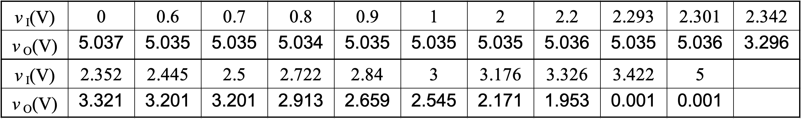
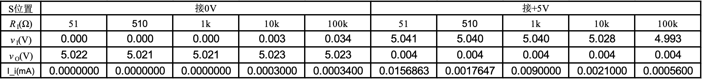
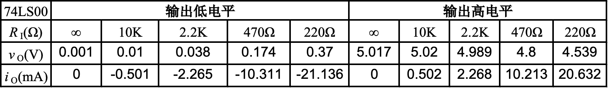
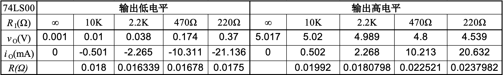

## 三极管和门电路特性测试


实验日期：2023/10/9

地点：东3-406


## 实验目的

1. 掌握半导体三极管特性测试。
2. 掌握门电路电气特性测试。
3. 学习MULTISIM电路仿真软件的使用。

## 实验一：万用表测量三极管

### 实验器材

1. 万用表（HY63）
2. 三极管
3. 连接线

### 实验方案

1. 判别三极管类型，E\B\C三极，测量放大倍数。
2. 测量VCE=0 ; 1V ; 5V条件下的输入特性。
3. 测量IB =2.5uA ; 5uA ; 7.5uA;10uA条件下输出特性。

### 实验过程与结果

#### 一、判别三极管类型

* 将三极管从右到左三只脚命名为a,b,c，利用万用表二极管测试级，测量三极管三只脚的极性。

  

  

根据以上表格可以判断，该三极管中间的端口为b基极，且为NPN型三极管。

* 接下来判断E和C极

  

将万用表切换到HFE档，通过对三极管的放大倍数的测量，判断三极管的e和c极。已知正常的ß应该在100～300之间。

将三极管中间的极脚插入b口，两端分别插入e和c。可见当示数显示为249时，e,b,c脚插入正确，放大倍数ß=249。从而可判断三极管的三只脚的极性：当平面对向自己时，从左到右三只脚分别为e,b,c。

#### 二、采用逐点法测量三极管输入VA特性

##### （1）固定V~CE~下，I~B~与V~BE~的关系

1. 将电路连接为下图

   

   <center>fig1 固定VCE下的实验电路图</center>

2. 调整V2的大小，即调整V~CE~的大小分别为0V和15V。调整直流输出源V1的大小，用万用表测量R1两端电压，从而得出V~BE~和I~B~的大小。

3. 利用Matlab绘制伏安特性曲线。

```matlab
% 使用xlsread函数从Excel文件中读取数据
data1 = readtable('./1016all.xlsx', 'Sheet','0V','Range', 'C2:D17');
data2 = readtable('./1016all.xlsx', 'Sheet','15V', 'Range','C2:D19');

% 提取电压和电流数据
vbe1 = data1{:, 1};
ib1 = data1{:, 2};
vbe2 = data2{:,1};
ib2 = data2{:,2};

% 绘制伏安特性曲线
plot(vbe1, ib1, 'o'); % 绘制数据点和连接线
title('固定VCE下三极管输出VA曲线'); % 添加标题
xlabel('V_{BE}(V)'); % 添加x轴标签
ylabel('I_B(uA)'); % 添加y轴标签
grid on; % 添加网格线

% 对曲线进行平滑处理
smoothed_ib1 = smooth(ib1, 5, 'loess'); 
hold on; % 在同一图中叠加平滑曲线
plot(vbe1, smoothed_ib1, 'b-', 'LineWidth', 1); % 绘制平滑曲线

%绘制曲线2
hold on;
plot(vbe2, ib2, 'o'); % 绘制数据点和连接线
grid on; % 添加网格线

% 对曲线进行平滑处理
smoothed_ib2 = smooth(ib2, 5, 'loess'); % 使用rloess平滑算法
hold on; % 在同一图中叠加平滑曲线
plot(vbe2, smoothed_ib2, 'r-', 'LineWidth', 1); % 绘制平滑曲线
legend('原始数据(0V)', '曲线（0V下）','原始数据(15V)', '曲线（15V下）');
```

###### 实验结果与分析

实验数据如下：

<center>VCE=0V</center>


<center>VCE=15V下</center>


<center>fig2 三极管VA特性曲线</center>

##### （2）固定I~B~ 下，I~C~与V~CE~的关系

1. 将电路图连接为下图

   

<center>fig3 固定Ib下的实验电路图</center>

2. 设定V1的大小，通过测量R1两端的电压，得出I~b~的电流大小，并在接下来的实验中不再改变V1，由于V2对I~b~的改变非常小，在此实验中忽略不计。
3. 调节V2，测量R2两端电压，通过计算得出V~CE~和Ic的大小。
4. 绘制伏安特性曲线。

###### 实验结果与分析

<center>Ib=2.5uA</center>


<center>Ib=5uA</center>


<center>Ib=7.5uA</center>


<center>Ib=10uA</center>


<center>fig4 绘制VA特性曲线</center>

###### 一些特殊点的分析


<center>fig5 I_b=2.5uA下的VA曲线</center>

我们发现，当I~b~=2.5uA时ce的压降使得Ic到达饱和区时，放大电流随着压降增大而减小。


<center>fig6 I=10uA下的VA曲线</center>

而当I~b~=10uA时，放大电流随着V~CE~增加增大。这种现象，可能也恰好反映了基极电流会随着CE两端电压的大小变化而发生变化，但是所造成的变化并不明显，所以上述实验可以通过保持V1不变控制I~b~不变。


## 实验二：采用MULTISIM逐点仿真三极管输入VA特性

### 仿真过程

1. 利用MULTISIM软件搭建以下电路：

   

<center>fig7 控制VCE不变下的实验电路</center>


<center>fig8 控制Ib不变下的实验电路</center>

2. 利用软件自带的仿真功能`仿真`->`直流扫描`功能，改变所要调节的参数，获得所要的特性曲线。


<center>fig9 固定Vce=15V，改变V1的值，获得的扫描曲线</center>

3. 利用matlab进行数据处理，获得最终值。

   固定Vce

```matlab
data1 = readmatrix('./1016/1_0V.csv','NumHeaderLines',1);
% 提取电压和电流数据
vbe1 = data1(:, 5);
ib1 = data1(:, 2);

% 对曲线进行平滑处理
smoothed_ib1 = smooth(ib1, 5, 'loess'); 
plot(vbe1, smoothed_ib1, 'b-', 'LineWidth', 1); % 绘制平滑曲线
title('固定VCE下三极管输出VA曲线'); % 添加标题
xlabel('V_{BE}(V)'); % 添加x轴标签
ylabel('I_B(uA)'); % 添加y轴标签
grid on; % 添加网格线

data2 = readmatrix('./1016/2_15V.csv','NumHeaderLines',1);
% 提取电压和电流数据
vbe2 = data2(:,5);
ib2 = data2(:,2);
% 对曲线进行平滑处理
smoothed_ib2 = smooth(ib2, 5, 'loess'); % 使用rloess平滑算法
hold on; % 在同一图中叠加平滑曲线
plot(vbe2, smoothed_ib2, 'r-', 'LineWidth', 1); % 绘制平滑曲线
legend('V_{CE}=0V','V_{CE}=15V');
```

   

### 实验结果


## 实验三：测试与非门逻辑功能

### 实验器材

1. 万用表（HY63）
2. 74LS00与非门
3. 连接线

### 测试过程与结果

1. 连接电路为下图，注意7脚接地和14脚接高电平

   

   <center>fig10 连接电路</center>

2. 点按按钮，改变输入两端电压。
3. 利用万用表测量引脚电压。

### 实验结果


## 实验四：与非门传输特性测量

### 实验器材

1. 示波器（1000 X-Series）
2. 信号源（ SDG2000X）
3. 74LS00与非门
4. 连接线
5. 万用表（HY63）

### 测试方案与结果

#### （1）逐点输入直流电压，测量其传输特性。

1. 连接电路

   

   <center>fig11 测试电路</center>

2. 调节2脚的电位，使用万用表测量2脚以及输出端电压。

3. 记录数据，并根据数据绘制图线。

   

   

#### （2）输入0至5V变化的电压，利用扫描法测量传输特性

1. 连接电路。

   

   <center>fig12 测试电路</center>

2. 调节信号源为0V～5V锯齿波，对称性为50%，频率为10Hz。

3. 调节示波器至显示清晰稳定图像。

   

4. 切换观察选项为XY显示。

   

### 结果分析

* 根据XY显示，实际上，从高电位变到低点位，临界值偏大；而当低点位变到高电位过程中，临界值偏小。所以，在进行万用表测量时，正反两次调节电压所获数据不同属于是正常现象。

* 根据示波器读数，当电位在2.3V到3.5V之间时，输入并不是准确的高电位抑或低电位，此处的引脚输出也并不是准确的高电位/低点位。因此在实际使用过程中，应该避免引脚输入处于这个值之间。


## 实验五：与非门输入电流测量

### 实验器材

1. 74LS00与非门
2. 连接线
3. 万用表（HY63）

### 测试过程与结果

1. 连接电路

   

2. 利用万用表测量电压，并记录数据

   

### 结果分析

* 当2脚接低点位时，与非门内部的电压高于外界电压，导致有电流通过。
* 当2脚接高电位时，与非门也相当于一个内阻，并不能完全反映高电位电压，而是进行一定的分压。不过，由于电流非常小（在1e-5A的数量级），往往可以将与非门当作无穷大内阻；但是如果外接电阻非常大（1e5Ω数量级）的时候，需要考虑在内。

## 实验六：

### 实验器材

1. 74LS00与非门
2. 连接线
3. 万用表（HY63）

### 测试过程与结果

1. 连接电路

   

   <center>输出高电平&nbsp;&nbsp;&nbsp;&nbsp;&nbsp;&nbsp;&nbsp;&nbsp;&nbsp;&nbsp;&nbsp;&nbsp;&nbsp;&nbsp;&nbsp;&nbsp;&nbsp;&nbsp;&nbsp;&nbsp;&nbsp;&nbsp;&nbsp;&nbsp;&nbsp;&nbsp;&nbsp;&nbsp;&nbsp;&nbsp;&nbsp;&nbsp;&nbsp;&nbsp;&nbsp;&nbsp;&nbsp;&nbsp;&nbsp;&nbsp;输出低电平</center>

   200Ω作为保护电阻，保护电路

2. 用万用表欧姆档测量R~L~阻值，并将R~L~调节为合适大小。后连接电路利用万用表测量电压，并记录数据。

3. 计算出集成门电路的输出负载电流，在坐标系中画出输出端负载特性曲线。

   * *注意：每次测量电阻*R*L的值时须断电，并将R~L~两端中的任意一端从电路中断开，以免连接的电路影响电阻的测量值。*

### 实验结果与分析




可以看到与非门输出在外端串联电阻时，尤其是小电阻，输出并不是标准的高电平或者低电平。与非门内部呈现一定的定值电阻特性（由两段曲线呈现直线可以看出）。经过一定的计算，可以得出与非门内部的电阻可以近似估计为0.02Ω。



