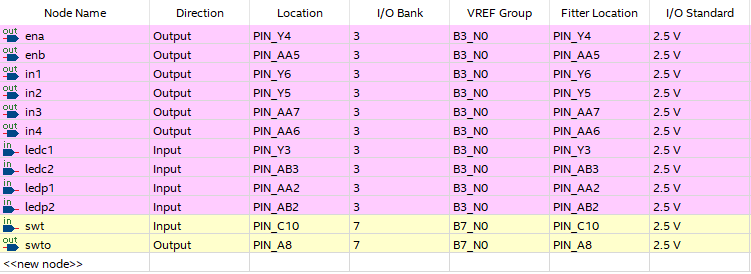

# 智能小车控制


实验日期：2023/10/30

地点：东3-406


## 实验目的

1. 复习之前所学知识：FPGA板的编程，小车各控制芯片的连接。
2. 编写程序，使小车能够沿着轨道运行。

## 实验器材

1. 智能小车一台
2. 编程电脑
3. 连接线
4. 电源

## 实验方案

1. 编写程序，并仿真。
2. 将各功能模块芯片连接。
3. 利用Quartus软件将辨析的好的程序传入FPGA板。
4. 连入电源，测试小车。

## 测试过程与结果

1. 测量轨道部分数据，选择合适的红外检测管，作为本次试验作为判定的光电管。

   * 轨道经测量，约为两指宽。所以，选择中间两盏小灯作为沿轨道行进判定，和间隔一个旁边的小灯作为转弯判定。

   

   <center><I>fig1 光电管示意图（蓝色为选择的光电管）</I></center>

   * 分析输出端口电位

     根据上一次实验，得知地面为黑色，比较器出高，灯熄灭；地面为白色，比较器出低，灯发光。

2. 编写程序，并进行编译仿真。

   根据第一步的分析，我们需要一个以下有5个接口，7个输出口的逻辑芯片。

   

   <center><I>fig2 设计逻辑示意图</I></center>

   * 开关设计，利用FPGA板上的开关键Switch0，来控制实体的运作与否。

     * 当开关打开，LED0发光，ENA，ENB输出高电位
     * 当开关关闭，LED0熄灭，ENA，ENB输出低电位

     ```vhdl
     if (swt='1') then
     	swto<='1';
     	ena<='1';
     	enb<='1';
     else
     	swto<='0';
     	ena<='0';
     	enb<='0';
     end if;

   * 小车直线循轨

     * 四个探测器，从左到右分别为inp1, inc1, inc2, inp2

     * 左轮为in1，in2控制，右轮为in3，in4控制

       当左轮转动时，in1输出1，in2输出0

       当左轮转动时，in3输出1，in4输出0

     

     ```vhdl
     -------------直行循轨-------------------------------
     when "0110"=> in1<='1';in2<='0';in3<='1';in4<='0';
     when "0010"=> in1<='1';in2<='0';in3<='0';in4<='0';
     when "0100"=> in1<='0';in2<='0';in3<='1';in4<='0';
     ```

   * 小车遇到岔路判断

     * 主要岔路判断过程，小车在行进过程中，最旁边的灯判断了在左/右遇到岔路的情况
     
     
     
     * 如果在遇到岔路过程中，中间的两盏灯出现了一亮一灭的情况，具体如下图（左边遇到岔路的情况，右边遇到岔路同理）所示，则应该一定地修正轨迹。
     
     
     
     ```vhdl
     -------------岔路判断-------------------------------
     when "0111"=> in1<='1';in2<='0';in3<='1';in4<='0';
     when "0011"=> in1<='1';in2<='0';in3<='0';in4<='0';
     when "0101"=> in1<='0';in2<='0';in3<='1';in4<='0';
     
     when "1110"=> in1<='1';in2<='0';in3<='1';in4<='0';
     when "1010"=> in1<='1';in2<='0';in3<='0';in4<='0';
     when "1100"=> in1<='0';in2<='0';in3<='1';in4<='0';
     ```
     
   * 小车直角转弯

     
     
     当小车回到轨道后，由于光电管并不一定稳定运行，所以利用之前的发光判断，小车会自行沿着轨道左转或者右转。
     
   * 小车停止运行

     当小车四个光电管均位于停车处的黑框时，即tmp=0000时，小车停止运行

     ```vhdl
     when "0000"=> in1<='0';in2<='0';in3<='0';in4<='0';
     when "1111"=> in1<='0';in2<='1';in3<='0';in4<='1';
     ```

   #### 全代码

   ```vhdl
   library IEEE;
   use IEEE.std_logic_1164.all;
   use IEEE.std_logic_unsigned.all; 
   use IEEE.numeric_std.all;
   use IEEE.std_logic_arith.all;
   
   
   entity controller is
       port (
   	ledc1,ledc2,ledp1,ledp2,swt: in std_logic;
           ena,enb,in1,in2,in3,in4,swto: out std_logic);
   end controller;
   
   
   architecture runner of controller is
   
   begin
   P1:process(ledc1,ledc2,ledp1,ledp2)
   variable tmp:std_logic_vector(3 downto 0);
   begin
   tmp:=ledp1&ledc1&ledc2&ledp2;
   case tmp is
   when "0000"=> in1<='0';in2<='0';in3<='0';in4<='0';
   when "1111"=> in1<='0';in2<='1';in3<='0';in4<='1';
   
   when "0110"=> in1<='1';in2<='0';in3<='1';in4<='0';
   when "0010"=> in1<='1';in2<='0';in3<='0';in4<='0';
   when "0100"=> in1<='0';in2<='0';in3<='1';in4<='0';
   
   when "0111"=> in1<='1';in2<='0';in3<='1';in4<='0';
   when "0011"=> in1<='1';in2<='0';in3<='0';in4<='0';
   when "0101"=> in1<='0';in2<='0';in3<='1';in4<='0';
   
   when "1110"=> in1<='1';in2<='0';in3<='1';in4<='0';
   when "1010"=> in1<='1';in2<='0';in3<='0';in4<='0';
   when "1100"=> in1<='0';in2<='0';in3<='1';in4<='0';
   
   when "1000"=> in1<='0';in2<='0';in3<='1';in4<='0';
   when "1001"=> in1<='0';in2<='0';in3<='0';in4<='0';
   when "0001"=> in1<='1';in2<='0';in3<='0';in4<='0';
   when "1101"=> in1<='0';in2<='0';in3<='0';in4<='0';
   when "1011"=> in1<='0';in2<='0';in3<='0';in4<='0';
   when others =>in1<='X';in2<='X';in3<='X';in4<='X';
   
   end case;
   end process;
   
   P2: process(swt)
   begin
   if (swt='1') then
   	swto<='1';
   	ena<='1';
   	enb<='1';
   else
   	swto<='0';
   	ena<='0';
   	enb<='0';
   end if;
   end process;
   end runner;
   ```

3. 连接各功能芯片模块。

   

   根据以上示意图，先物理上连接各引脚的输入输出。

   后在Quartus软件上，对FPGA进行pin planner

   

   在Quartars中编译文件，成功运行并导入FPGA板中。

4. 连入电源，测试小车。

## 测试结果

1. 直角转弯时非常困难的一部分，我们发现，小车有概率地在直角转弯处停下，后观察光电管情况，发现，一些时候，tmp可能出现“0001”或者“1000”的情况，即最旁边的引脚在轨道内，而其他光电管偏离轨道。于是，对程序进行修改，

   ```vhdl
   when "1000"=> in1<='0';in2<='0';in3<='1';in4<='0';
   when "0001"=> in1<='1';in2<='0';in3<='0';in4<='0';
   ```

   修改后，小车能够顺利转弯。

2. 小车能依照轨道进行运动。

## 结果分析

即要从逻辑上分析小车运动的情况，也要根据实验中具体出现的问题进行调整。这也说明，在未来的实验中，不光光要从理论上严谨分析，也要从具体实际中实践，修改，然后完善。
