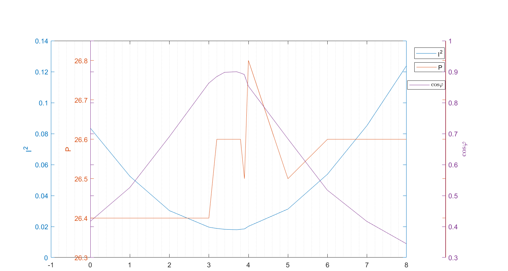

# Lab2 功率测量和功率因数提高

3220104119 冯静怡 2024/3/24

## 一、 实验目的

1. 学习日光灯管的工作原理，了解镇流器、启辉器的作用；
2. 了解功率因数的概念，学会对功率因数进行补偿

## 二、 实验要求

1. 保持日光灯两端电压不变，测量I-C，P-C；
2. 作出I^2^、P、cosφ与补偿电容C的关系曲线；
3. 求I^2^－C曲线的有理经验公式；
4. 用P－C曲线求单位电容的等效电导g；
5. 推算电网电压三次谐波分量的大小；
6. 测量灯管、镇流器以及总负载的等效参数；
7. 解释或研究实验过程中遇到的异常现象。

### 三、实验方案与实验原理

​	连接日光灯管电路为下图所示，利用三表法(功率表，电流表，电压表)测量电路等效阻抗；调节并联电容C的大小，记录U、I、P的数据，计算功率因数，从而得到最佳电容补偿方案。


​	由于试验台的瓦特表能够同时测量电流电压及众多参数，包括功率因数，所以本实验电路只需要使用瓦特表一个电表即可。


日关灯及镇流器可以等效为一个阻抗为$Z=R+jwL$的元件，计算如下：
$$
\begin{align}
\dot I_总&=\dot I_C+\dot I_L\\
&=-\frac{\dot U}{j\frac1{wC}}+\frac{\dot U}{R+j\omega L}\\
&=Re(\dot I_L)+j[-Im(\dot I_L)+\dot UwC]
\end{align}\\
$$
由上式可知，电容产生的电流可以很好地弥补电感产生的电流，减小总体的输入电流，增大功率因数角；电容的取值有一个特定的范围，若超过该取值，则功率因数过补偿。

若将所有元件表示为电导的形式，则会得到更加简洁的表达式：


$$
\dot I_{Cx}=I_R+jI_L+gC_x\dot U+jwC_x\dot U\\
\Rightarrow I_{Cx}^2=(I_R+gC_xU)^2+(I_L+wC_xU)^2\\
$$

$I^2$的曲线，可由C_x的相关曲线进行二次拟合，即：
$$
I_{Cx}^2=aC_x^2+bC_x+I_{C0}^2\\
\begin{cases}
a=(g^2+w^2)U^2\\
b=2(gI_R-wI_L)U
\end{cases}
$$
理论上，电路的整体功率不会随着电容的增加而增加，但是实际上，电容越大，功率消耗越大，因此引进参数$g$，相当于电容并联一个与电容大小成正比的电阻，$g$的大小可以用P的一次线性拟合得到：
$$
\because P-P_0=UI_g\\
\therefore P=(gU^2)C_x+P_0
$$

## 四、实验过程

1. 将调节旋钮逆时针旋转到底，归零。
2. 在断电的情况下按照上图连接电路，先不将电容接进电路中。
3. 对电路通电，调节自耦变压器，点亮灯管。
4. 当灯管亮起，并在180V左右一闪一闪，说明灯管本身无损坏，将电压调节至220V，准备开始进行实验。
5. 先记录无电容的情况下，即电容C=0，情况下的电表读数；后调节电容的大小，记下各个点的读数，实验过程中，电压的大小在缓慢改变，变化幅度在$\pm0.3V$​左右。

### 数据记录

| C       | U         | I         | W        | Var     | VA       | PF      | phi      |
| ------- | --------- | --------- | -------- | ------- | -------- | ------- | -------- |
| 0       | 220.3     | 0.289     | 26.4     | 58      | 63.6     | 0.417   | 65.3     |
| 1       | 220       | 0.229     | 26.4     | 42.7    | 50.3     | 0.526   | 58.2     |
| 2       | 219.9     | 0.174     | 26.4     | 26.9    | 38.2     | 0.69    | 46.2     |
| 3       | 220.2     | 0.14      | 26.4     | 11.7    | 30.6     | 0.863   | 30.3     |
| 3.2     | 220.4     | 0.137     | 26.6     | 8.5     | 30.1     | 0.884   | 27.7     |
| 3.4     | 220.2     | 0.135     | 26.6     | 5.2     | 29.7     | 0.898   | 26       |
| **3.7** | **220.3** | **0.134** | **26.6** | **0.4** | **29.5** | **0.9** | **25.3** |
| 3.8     | 220.3     | 0.135     | 26.6     | 1       | 29.7     | 0.896   | 333.6    |
| 3.9     | 220.3     | 0.136     | 26.5     | 2.6     | 29.8     | 0.891   | 333.2    |
| 4       | 220.6     | 0.142     | 26.8     | 7.3     | 31.2     | 0.854   | 328.5    |
| 5       | 220       | 0.177     | 26.5     | 22.2    | 38.9     | 0.684   | 313      |
| 6       | 220.2     | 0.232     | 26.6     | 38.1    | 51.3     | 0.518   | 301.3    |
| 7       | 220.1     | 0.292     | 26.6     | 53      | 63.8     | 0.417   | 294.5    |
| 8       | 220.1     | 0.352     | 26.6     | 67.3    | 77.3     | 0.345   | 290.1    |

### 绘制图线

在Matlab中绘制$I^2-C,P-C,\cos\varphi -C$，如图所示：



将三条图线使用三个笛卡尔坐标系重合的方式，绘制在同一张图中：

* 可以看到$I^2$和功率因数，变化趋势一致，在某一电容值位置分别取到最小值和最大值。
* 功率变化非常奇怪，似乎没有规律，主要原因是，功率变化并不明显，图表的y坐标变化范围为[26.3,26.8]使得较小的变化被放大。
* 经实验可知，当$C=3.7\mu F$，能够取到最大功率因数补偿（在C的精确度为0.1uF的情况下）

### 二次曲线拟合

对$I^2-C$曲线由理论分析部分可知，可进行二次拟合，拟合如下：


二次曲线拟合结果:  $y = 0.005297x^{2} - 0.03704 x + 0.08334$​

通过Matlab计算最小值得到：

```matlab
% 定义幂函数  
fun = @(x)0.005297*x^2 - 0.03704*x + 0.08334;  
  
% 使用 fminsearch 求解局部最小值  
x0 = 0; % 初始猜测值  
x_min = fminsearch(fun, x0);  
y_min = fun(x_min);  
  
disp(['极小值点 x = ', num2str(x_min)]);  
disp(['极小值 y = ', num2str(y_min)]);  
```

```shell
>> findmin
极小值点 x = 3.4963
极小值 y = 0.018588
```

* 即，当电容取$3.4963\mu F$时，能够取到电流最小值0.136A，则计算得到功率因数为$\cos\varphi\approx\frac{26.5}{220\times 0.136}=0.88$​，此时功率因数补偿最有效。

* 但同时可以发现，理论上功率因数补偿可以到1；但是根据拟合结果，此时功率因数补偿无法增加到一，可能是由于没有

### P-C曲线拟合求g值

在理论分析中估计P值是在U保持不变的情况下进行，但是实际上U有所变化，因此对数据进行处理，即进行$P/(U/U_{0})^2$处理，使得P在相同的U下进行讨论：

| C    | 0        | 1    | 2        | 3        | 3.2      | 3.4     | 3.7     | 3.8     | 3.9      | 4        | 5    | 6       | 7        | 8        |
| ---- | -------- | ---- | -------- | -------- | -------- | ------- | ------- | ------- | -------- | -------- | ---- | ------- | -------- | -------- |
| U    | 220      | 220  | 220      | 220      | 220      | 220     | 220     | 220     | 220      | 220      | 220  | 220     | 220      | 220      |
| W    | 26.32815 | 26.4 | 26.42402 | 26.35207 | 26.50354 | 26.5517 | 26.5276 | 26.5276 | 26.42787 | 26.65441 | 26.5 | 26.5517 | 26.57583 | 26.57583 |

对P的数值进行描点，并得到一次拟合曲线为：$y=0.02951x+26.43$


即：

* $P_0=26.43W$，当没有电容并入时，光日光灯管产生的功率为25.43W
* P中间的一些数值大大远离拟合曲线，原因是这些数据与其余数据不是同一时间测量，是在测完整数值电容之后对图线进行的弥补，所以功率值大大增加。
* 根据理论计算得知：$g=\frac{a}{U^2}=6.09\times 10^{-7} \Omega^{-1}\cdot\mu F^{-1}=0.609\Omega^{-1}\cdot F^{-1}$​

### 讨论三次谐波的影响

由上述结果已经可以推知，交流电源输入成分并不时非常好，含有高次谐波分量，使得电容不能完全补偿功率因数

现观察高次谐波对功率因数的影响：

已知在单50Hz的作用下，电流与电容的结果为
$$
I_{Cx}^2=aC_x^2+bC_x+I_{C0}^2\\
\begin{cases}
a=(g^2+w^2)U^2\\
b=2(gI_R-wI_L)U
\end{cases}
$$
则若电路中有三次谐波，则该式变为
$$
I_{Cx}^2=aC_x^2+bC_x+I_{C0}^2\\
\begin{cases}
a=(g^2+w^2)U_1^2+(g^2+9w^2)U_3^2\\
b=2(gI_R-wI_L)U_1+2(gI_R-3wI_L)U_3\\
\end{cases}
$$
可以计算得三次谐波的大小为：（其中由 $y = 0.005297x^{2} - 0.03704 x + 0.08334$，得到$a=0.005297(A/\mu F^2)$）
$$
U_3^2=\frac{a-(g^2+\omega^2)U^2}{8\omega^2}=658.73V^2\\
U_3=25.67V
$$
使用示波器记录输入电压的CSV数据格式，并使用Matlab对输入的电压数据进行FFT分析：


得到如图所示的电压数据，可以看到在除了50Hz的基波之外，3、5、7次谐波均有较大的分量，计算三次谐波分量为：


根据FFT图像，若一次谐波的有效值大小为220V，则三次谐波的有效值大小应与各自显示的FFT大小成正比，则三次谐波的大小为：$220\times\frac{18830.6}{1538750}=26.9V$，计算结果与上述三次谐波计算结果基本一致，可知该电压有较大的谐波分量。

### 日光灯管参数

日光灯管接入分别如下电路图，使用三表法测量整流器和日关灯管的参数


实验数据记录如下：

|          | U     | I     | W    | Var  | VA   | PF    | phi  |
| -------- | ----- | ----- | ---- | ---- | ---- | ----- | ---- |
| 整流器   | 193.6 | 0.288 | 12.4 | 53.6 | 55.3 | 0.225 | 76.9 |
| 日光灯管 | 62.8  | 0.287 | 15   | 2.9  | 18   | 0.832 | 33.7 |

计算整流器和日光灯管在50Hz下的等效阻抗：
$$
Z_整=674.2\angle -76.9^\circ \Omega\\
Z_灯=218.8\angle -33.7^\circ \Omega\\
Z_L=Z_整+Z_灯=847.0\angle-66.7^\circ
$$
则根据理论，C的阻抗大小应该为：
$$
C=\frac1{2\pi f\times\Im(847\angle-66.7^\circ)}=3.45\mu F
$$

## 二、 总结

### 各方法结果统计

| 方法                           | 补偿电容大小   | 实验结果说明                                                 |
| ------------------------------ | -------------- | ------------------------------------------------------------ |
| 直接测量法（取电流最小值的点） | $3.7\mu F$左右 | 实验结果精度不高，但是是最为直接的方法，也是最为准确的方法；完全考虑了高次谐波对实验结果的影响 |
| 统计数据，二次曲线拟合法       | $3.4963\mu F$  | 该方法理论与实际数据相结合，通过曲线拟合（统计规律）的方式近似得到电流最小值点。 |
| 测量日光灯管等效参数，理论分析 | $3.45\mu F$    | 该测量方法仅仅考虑了基波的影响，完全没有考虑高次谐波对实验结果造成的影响 |

### 异常现象

1. 电容由大变小时，会发出类似于电火花迸发的声音

   原因：电容存储电量为$Q=CU$，当电容变小，两端电压不变，电容快速放电，因而会产生砰砰声，比较危险。

2. 电容无法弥补功率因数至1

   原因：存在较大的高次谐波。


