# Lab4 混沌发生器

3220104119 冯静怡 2024/04/11

## 一、 实验目的

1. 掌握非线性电阻伏安特性曲线的测量方法；
2. 了解混沌现象以及产生混沌的电路基本结构；
3. 了解相轨迹（李萨如图形）的原理和测试方法；
4. 以电容电压为输出，分析电位器不同取值时电容电压相轨迹的形状。

## 二、 实验原理


混沌发生器的基本图例如上。该电路能够发出自激振荡，在测量点Ch2和Ch1处产生有规律的电压变化。

### 负阻抗变换器


当运放未饱和时:
$$
\begin{cases}
i_1=\frac{U_1-U_o}{R_1}\\
i_2=\frac{U_2-U_o}{R_2}\\
U_1=U_2
\end{cases}
\Rightarrow
\begin{bmatrix}
U_1\\
i_1
\end{bmatrix}
=
\begin{bmatrix}
1 & 0\\
0&\frac{-R_2}{R_1}
\end{bmatrix}
\begin{bmatrix}
U_2\\
-i_2
\end{bmatrix}
$$
此时伏安特性曲线斜率为:
$$
\frac1{k_1}=\frac{U_1}{i_1}=\frac{U_2}{\frac{R_2}{R_1}i_2}=\frac{R_1U_2}{R_2i_2}=-\frac{R_1R_L}{R_2}
$$
当运放饱和后(以$U_1>U_2=\frac{R_L}{R_2+R_L}U_s$),以饱和电压为13.5V计算
$$
U_1-U_s=i_1R_1\\
k_2=\frac1{R_1}
$$


对于第一级负阻变换器电路有:
$$
k_1=-\frac1{3.3}\\
k_2=\frac1{20}\\
V_{T1}=\frac{R_L}{R_2+R_L}U_s=1.912V
$$
对于第二级负阻变换器有:
$$
k_1=-\frac1{2.2}\\
k_2=\frac1{0.2}\\
V_{T2}=\frac{R_L}{R_2+R_L}U_s=12.375V
$$
对于两个U~1~端并联的负阻抗变换器:
$$
U=U_1\\
i={i_{11}+i_{12}}
$$

$$
\Rightarrow k=
\begin{cases}
-0.768\ (|U|<1.912)\\
-0.405\ (1.912<|U|<12.375)\\
2.05\ (|U|>12.375)
\end{cases}
$$

$$
i=
\begin{cases}
-0.768u\ (|U|<1.912)\\
-0.405u-0.694\ (1.912<|U|<12.375)\\
2.05u-31.074\ (|U|>12.375)
\end{cases}
$$

(实验过程中i的单位均为mA,电压单位均为V)

## 三、 实验过程

### 伏安特性测量

1. 使用Orcad搭建仿真电路.


| k3   | k1     | k2     | V~T1~ | V~T2~ |
| ---- | ------ | ------ | ----- | ----- |
| 3.25 | -0.759 | -0.409 | 1.75  | 12.2  |

以上单位均为mA/V

3. 搭建实际测量电路图

   实验中所使用的Vcc和Vee记录如下:

   | +15V   | -15V    |
   | ------ | ------- |
   | 15.03V | -15.10V |

   输入20Vpp，1kHz输入电压;使用隔离通道接入CH1和CH2,调整CH2为原来的1/10，避免隔离通道超过限制．使用电阻为330Ω作为电流的取样电阻。

   


4. 使用matlab分析数据:

   ```matlab
   % 遍历每个唯一的V值，计算对应的I的平均值
   for i = 1:length(uniqueV)
       % 找出与当前V值相同的所有索引
       sameVIndices = sortedV == uniqueV(i);
       % 计算这些索引对应的I的平均值
       avgI(i) = mean(sortedI(sameVIndices));
   end
   ```

   

   | k3    | k1     | k2      | V~T1~ | V~T2~ |
   | ----- | ------ | ------- | ----- | ----- |
   | 2.178 | -0.776 | -0.4073 | 2     | 10    |

#### 实验总结

|          | k3    | k1     | k2      | VT1   | VT2    |
| -------- | ----- | ------ | ------- | ----- | ------ |
| 理论计算 | 2.05  | -0.768 | -0.405  | 1.912 | 12.375 |
| 仿真     | 3.25  | -0.759 | -0.409  | 1.75  | 12.2   |
| 实际实验 | 2.178 | -0.776 | -0.4073 | 2     | 10     |

* 各段斜率所得值基本一致，仿真中，输入电压大于15V的一段输出斜率与理论实际的偏差均较大，可能是仿真过程中设置有所不同的原因。
* 各种情况下的电路, 由于运放输出电压不同,使得转折电压也不同,但是该电压并不会影响斜率.

### 自激振荡

1. 自激振荡的电路图如下所示，LC并联从而得到一个RLC并联（两级复阻抗变换器可视其中一组为电阻）振荡电路，由于运放并不稳定，小小的电压扰动经过LC并联振荡电路正反馈放大后产生正弦波，由于运放的输出有电压限制，并且电路中的负反馈其一定的作用使得最终波形经LC筛选之后稳定
   $$
   f_0=\frac1{2\pi\sqrt{LC}}=5.03\times10^3Hz
   $$
   


2. 得到如下图的自激振荡仿真结果

   
   
   测量得到FFT频谱图
   
   
   
   
   
   测得频率为4.98kHz。
   
   
   
3. 搭建实际实验电路，示波器显示结果如图


#### 实验结论：

| C=0.1uF, L=10mH下 | f/kHz | V~p~/V       |
| ----------------- | ----- | ------------ |
| 理论              | 5.03  | $\approx$15V |
| 仿真              | 4.98  | 14.957       |
| 实际实验          | 4.76  | 13.2         |

* 振荡频率基本一致，输出幅值受输入电源影响有所不同
* 输出的波形并非标准正弦波，而是有一定畸变，在输出电压最高处可以看到曲线有一定形变.可以说明,电路在最后所形成的波形由电容充放电完成(此时两级负阻抗变换器输出均达到最大电压,不再起到负反馈作用,而是形成一个滞回比较器), 但是通过电容的电流并未减小到0,所以电容两端电压继续增加, 直到电容电流为0.

### 混沌电路


#### $R=1.2\Omega$	线性关系

按照理论计算可得$f_0=3.92kHz$

| 仿真                                                         | 理论                                 |
| ------------------------------------------------------------ | ------------------------------------ |
|  |  |
|  | 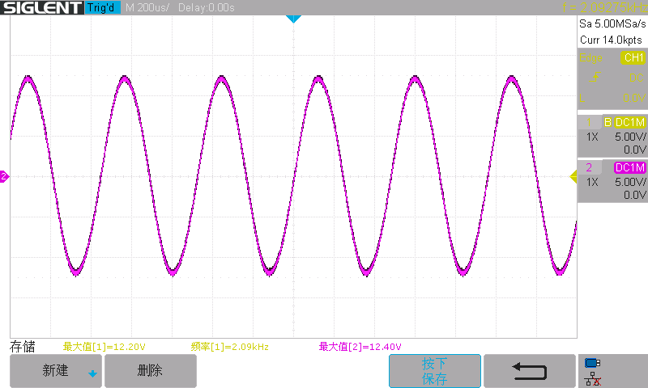   |
| $f_0=3.77kHz$                                                | $f_0=2.09kHz$                        |

#### $R=1.274k\Omega$	线性与极限环之间状态

| 仿真                                                         | 实验                               |
| ------------------------------------------------------------ | ---------------------------------- |
|  | 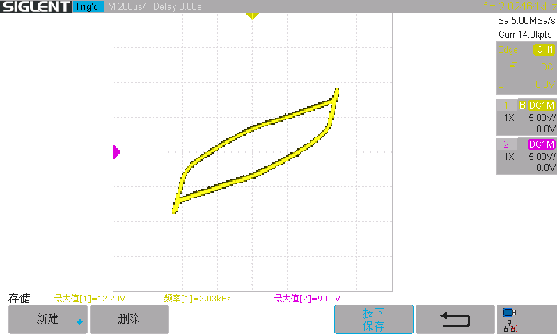         |
|  | 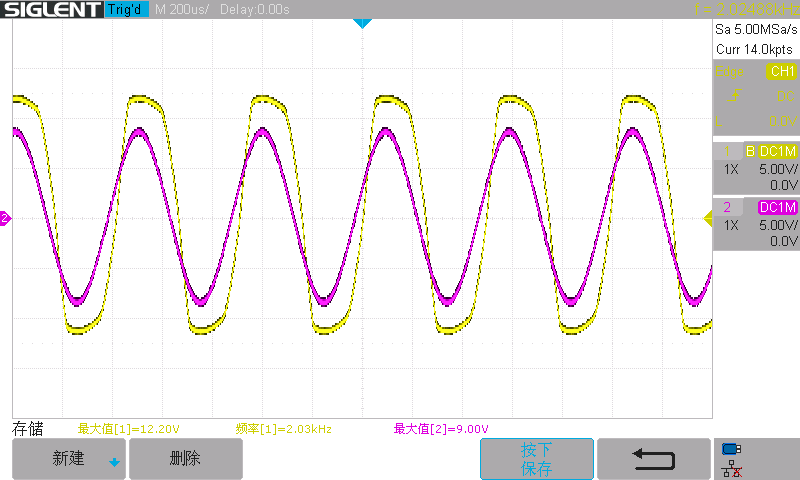 |
| $f_0=3.75kHz$                                                | $f_0=2.03kHz$                      |

#### R=1.784k   极限环

| 仿真                                                         | 实验                               |
| ------------------------------------------------------------ | ---------------------------------- |
| R=1259                                                       | R=1784                             |
|  | 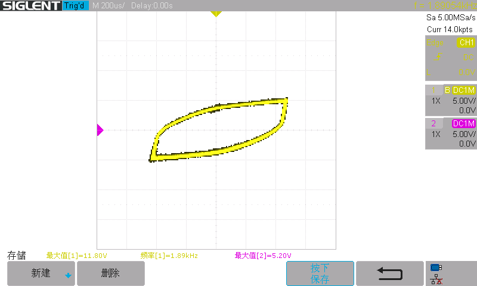         |
|  | 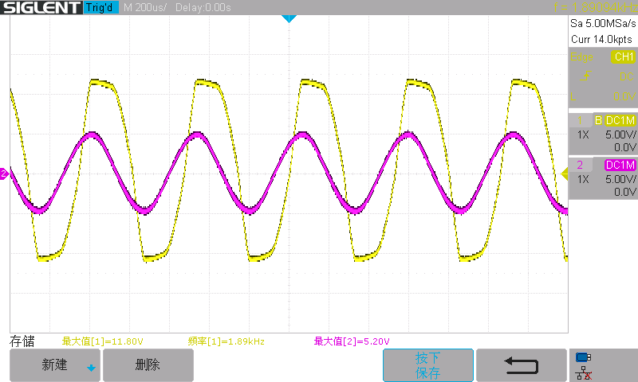 |

#### R=1.853k 双吸引子

| 仿真                                                         | 实验                                                         |
| ------------------------------------------------------------ | ------------------------------------------------------------ |
| R=1600                                                       | R=1853                                                       |
| 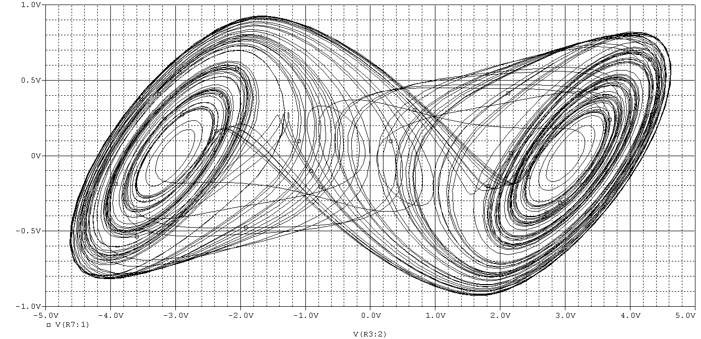 |  |
|  |  |

#### R=1.921k\Omega 多周期

| 仿真                                                         | 实验                               |
| ------------------------------------------------------------ | ---------------------------------- |
| $R=1759$                                                     | $R=1921$                           |
| 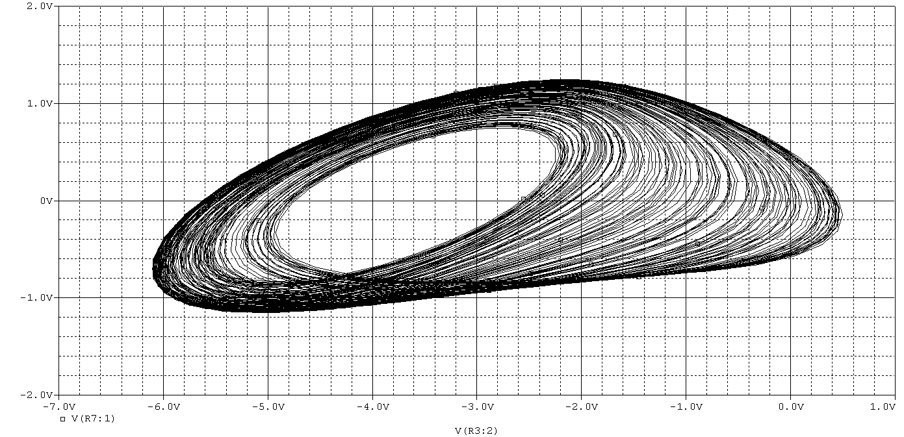 | 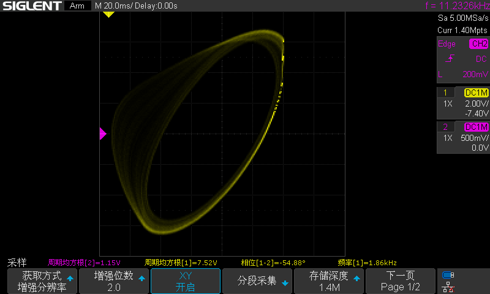         |
| 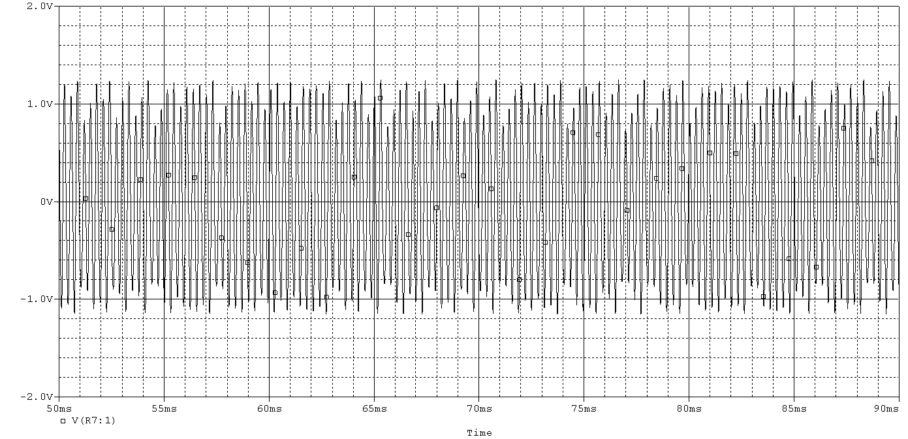 | 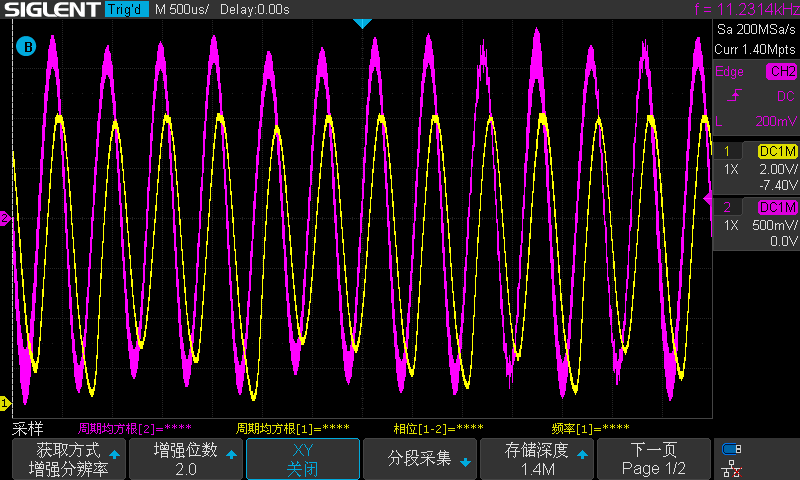 |

#### R=1.923k 三周期

| 仿真                                                         | 实验                               |
| ------------------------------------------------------------ | ---------------------------------- |
| $R=1761.25k\Omega$                                           | $R=1923\Omega$                     |
|  | 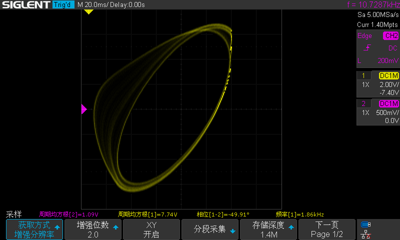         |
|  | 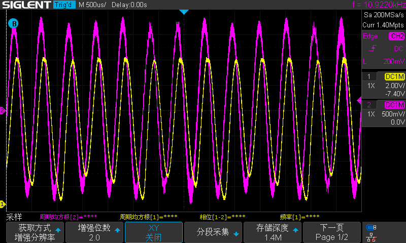 |


#### R=1.943k 两周期

| 仿真                                                         | 实验                               |
| ------------------------------------------------------------ | ---------------------------------- |
| $R=1783k\Omega$                                              | $R=1943k\Omega$                    |
|  | 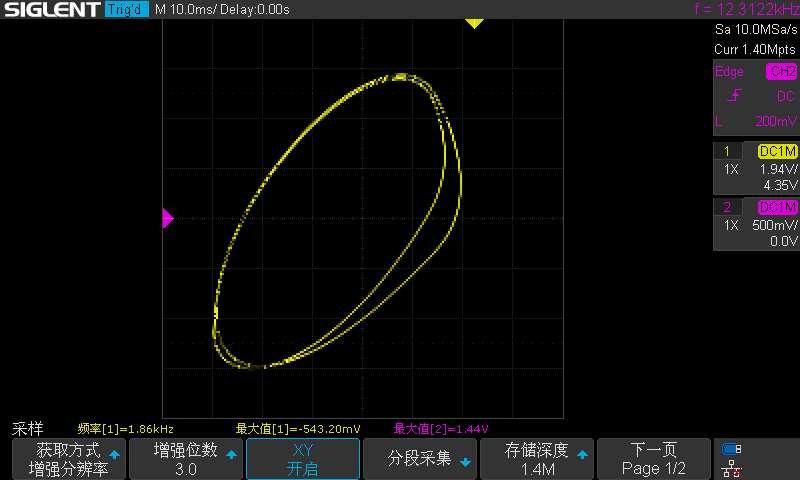         |
|  | 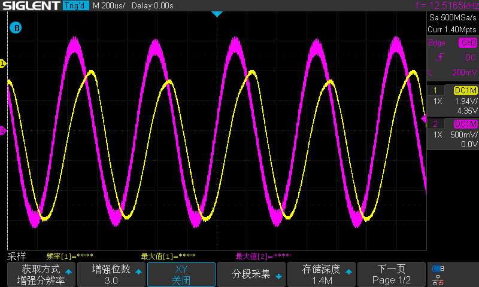 |


#### R=1.978k 单周期

| 仿真                                                         | 实验                               |
| ------------------------------------------------------------ | ---------------------------------- |
| $R=1799k\Omega$                                              | $R=1978k\Omega$                    |
|  | 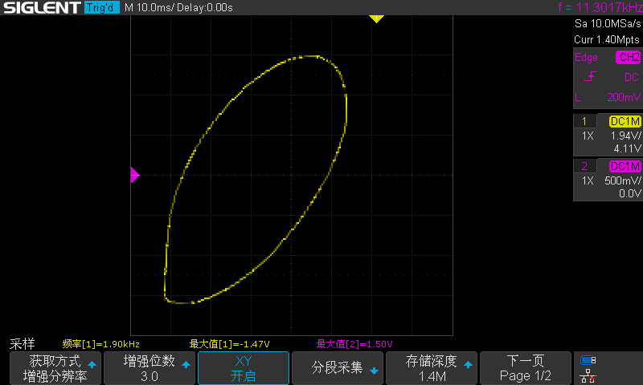         |
|  | 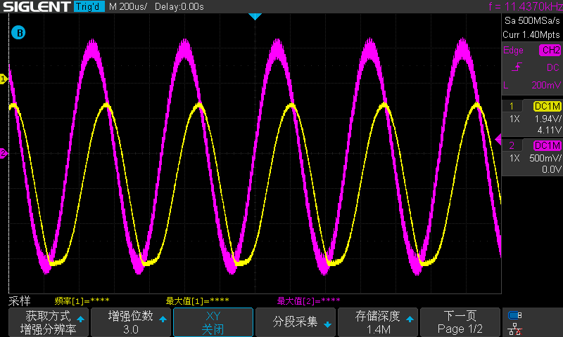 |

#### 实验结论:

* 实验过程中可以明显感受到混沌图案的李撒如凸性变换.
* 该电路产生的相位曲线由自激振荡产生, 但是能够趋于稳定
* 这些电路有一定的周期重复性质, 但是想要达到周期限制条件有一定的困难性; 比如说调节三倍周期范围电路被限制在一个很小的范围内,在仿真过程中很难得到完美的三倍周期曲线.