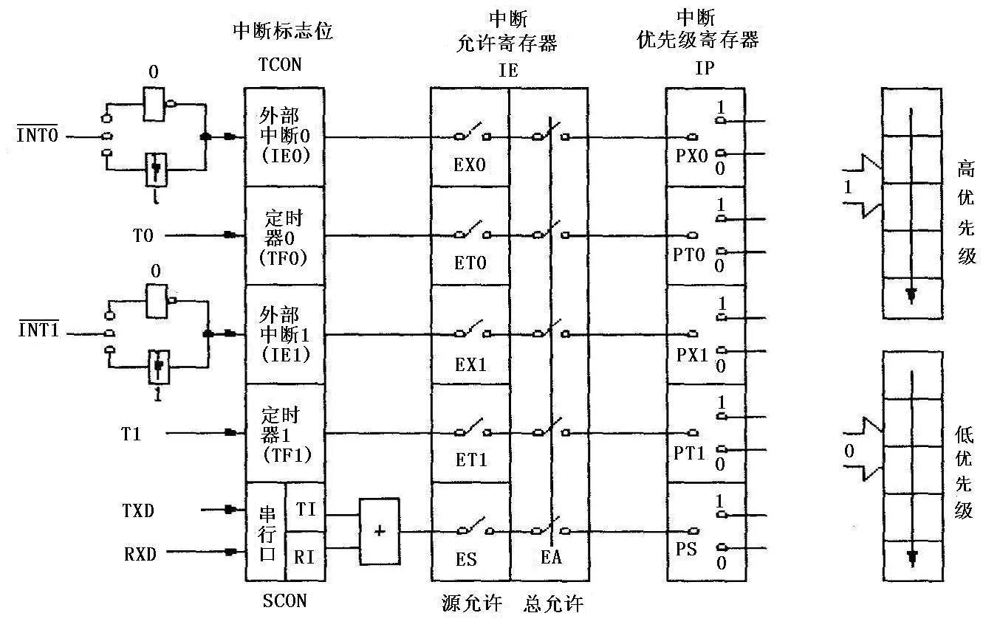
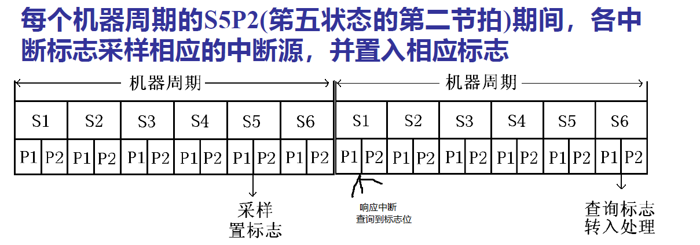

## 中断矢量地址

| 中断源 | 中断矢量地址 |
| ------ | ------------ |
| /INT0  | 0003H        |
| T0     | 000BH        |
| /INT1  | 0013H        |
| T1     | 001BH        |
| RI、TI | 0023H        |

## 中断控制

| 88                   | 8F                                         | 8E                          | 8D          | 8C                     | 8B                                      | 8A                                                           | 89                                       | 88                                 |
| -------------------- | ------------------------------------------ | --------------------------- | ----------- | ---------------------- | --------------------------------------- | ------------------------------------------------------------ | ---------------------------------------- | ---------------------------------- |
| TCON定时控制寄存器   | TF1（T1定时器溢出）                        | **TR1**（定时器运行控制位） | TF0硬件复位 | **TR0**                | **IE1**（/INT1向CPU申请中断下降沿控制） | **IT1**(/INT1中断申请触发方式控制位【IT=0,低电平有效，IT=1下降沿有效】（至少一个机器周期）) | IE0                                      | IT0                                |
| 89H                  | 无                                         | 位                          | 地址        |                        |                                         |                                                              |                                          |                                    |
| TMOD                 | GATE（=0，通过TR控制；=1，使用外中断控制） | C//T(=0，定时器，=1计数器)  | M1          | M0                     | GATE                                    | C//T                                                         | M1                                       | M0                                 |
| 98                   | 9F                                         | 9E                          | 9D          | 9C                     | 9B                                      | 9A                                                           | 99                                       | 98                                 |
| SCON串行口控制寄存器 | SM0                                        | SM1                         | SM2         | REN                    | TB8                                     | RB8                                                          | ***TI***(串行口发送中断请求标志)软件清零 | ***RI***（串行口接受中断请求标志） |
| A8                   | AF                                         | AE                          | AD          | AC                     | AB                                      | AA                                                           | A9                                       | A8                                 |
| IE中断允许控制寄存器 | **EA**中断允许总控制                       |                             |             | **ES**穿行终端允许控制 | **ET1**定时器中断允许控制               | **EX1**外部中断允许控制                                      | **ET0**                                  | **EX0**                            |
| B8                   | BF                                         | BE                          | BD          | BC                     | BB                                      | BA                                                           | B9                                       | B8                                 |
| IP中断优先级         |                                            |                             |             | PS                     | PT1                                     | PX1                                                          | PT0                                      | PX0                                |

1. 低优先级中断请求不能打断高优先级的中断服务。高优先级中断请求可以打断低优先级的中断服务。
2. 在中断服务程序运行中，不响应同级的其它中断请求。
3. 在主程序运行中，同级的多个中断请求同时出现时，响应次序为： 外中断 0→ 定时中断 0 → 外中断 1→ 定时中断 1 →串行口中断 。

中断后、执行返回指令前，撤除中断请求，必须保证在中断响应后把中断请求信号从低电平强制改变为高电平。

## 中断响应过程和响应时间



中断响应过程

1. 硬件自动生成 LCALL addr16
2. PC压栈

不立即响应

1. CPU有更高级的中断服务
2. 查询中断请求的机器周期不是当前指令的最后一个机器周期，确保指令完整执行
3. 当前执行的是 RETI 或访问 IE 、 IP 的指令


## 程序设计

1. 初始化
2. 终端类型确定
3. 优先级设定
4. 中断允许程序

## 定时器

### TMOD = 0 13位定时器


### TMOD=1 16位定时器


### TMOD=2


### TMOD=3 8位+8位


此时，T1方式下

TMOD=1/0


TMOD=3


### WatchDog

$$
t= 12\times 2^{11}/f_{osc}
$$

| 87H  | D7   | D6   | D5   | D4      | D3   | D2   | D1             | D0   |
| ---- | ---- | ---- | ---- | ------- | ---- | ---- | -------------- | ---- |
| PCON | SMOD |      |      | **WLE** | GF1  | GF0  | **PD**掉电方式 | IDL  |

引脚 /EW（外部引脚）低电平时，WatchDog允许

WLE=1， T3被软件装入，装入后自动清除

T3 0FFH：定时器数值

```assembly
MOV TMOD,
MOV TH1,
MOV TL1,
SETB TR1,
;start interrupt
SETB ET1
SETB EA
```


