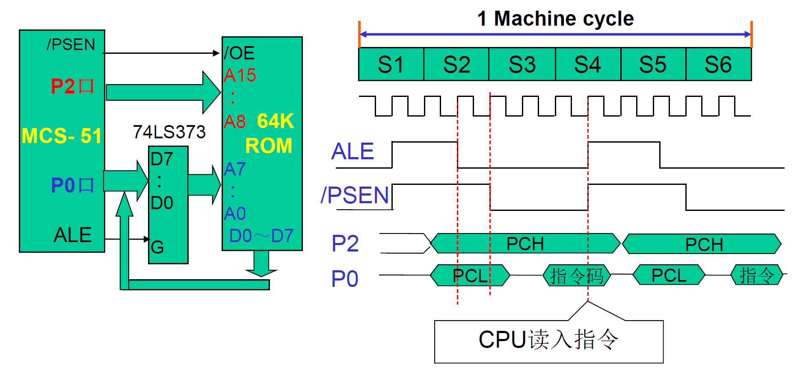
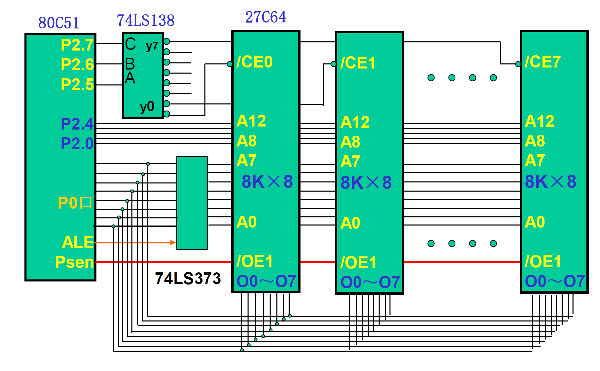
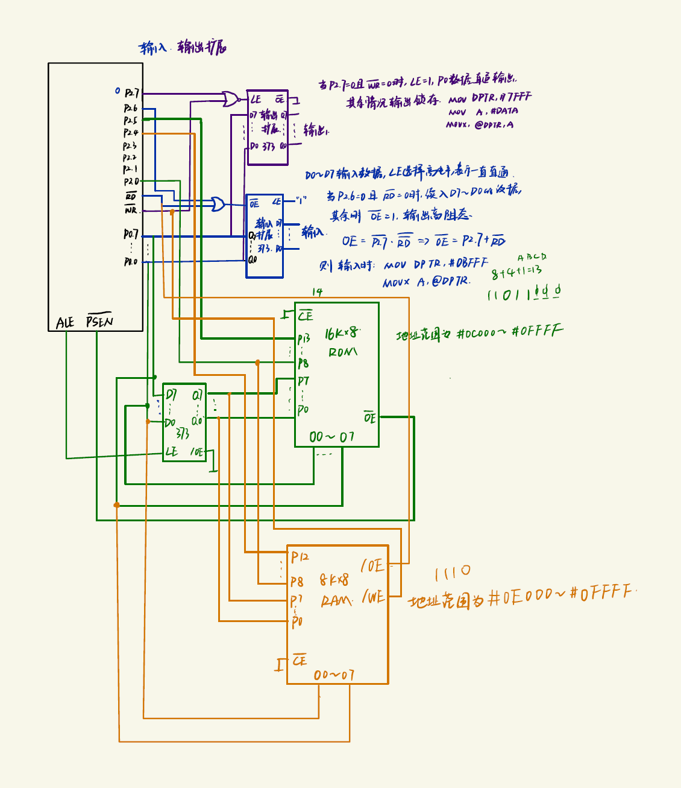

## ROM



1. 指令大致流程

   * /EA=0，使用外部程序寄存器
   * S1P2，ALE=1，直通
   * S2P2，ALE下降沿为0，锁存P0口输出内容，随后P0变为输入模式
   * S3P1，/PSEN下降沿为0，P0读取指令
   * S4P2，/PSEN上升沿为1，指令存入微机指令寄存器

2. 373锁存器

   **D0-7**，存储P0口数据

   /**OE**，**=0**，数据输入/输出；=1，高阻态

   **G**，=1，数据直通，=0，数据锁存

3. 27C64，8KB存储器

   **/CE** chip enable，3-8控制

   **/OE** output enable, /PSEN控制



## RAM

MOV A, @Ri ; 256B扩展

MOV @Ri,A

MOV A,@DPTR ;64KB扩展

#### `MOV A,@DPTR`

读取操作


#### `MOV @DPTR, A`

1. 得到指令ROM操作
2. S5P1, ALE=1，输出DPTR地址
3. S5P2，ALE下降沿为0，锁存P0的值
4. S1，/WR=0，P0口送A中数据；ALE丢失一次脉冲，不读取程序
5. S4P1，/WR上升沿为1，数据输出并存储


38译码器，实现多块RAM芯片选通

*

## IO口扩展


使用377时，

/G=0使能，CK上升沿直通数据；/G=1，锁存

```assembly
MOV DPTR,#7FFFH ;地址指针指向 74LS377, P2.7清零，
MOV A ,#DATA 	;将输出数据送 A
MOVX @DPTR,A 	;输出数据	制造一个上升沿
; 或
CLR	P2.7
MOV R0,#0FFH	;地址指针指向 74LS377
MOV A ,#DATA	;将输出数据送 A
MOVX @R0,A 		;输出数据
```

使用373时，当P2.7和/WR都为0，芯片直通；其余则锁存。

## 输入


P2.7和/RD都为0，则输入数据

