## 3.1 Allowed and Forbidden Energy Bands

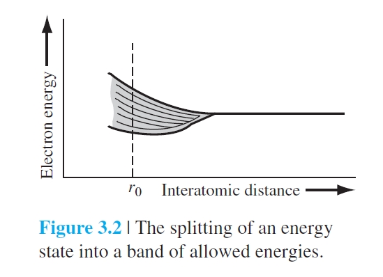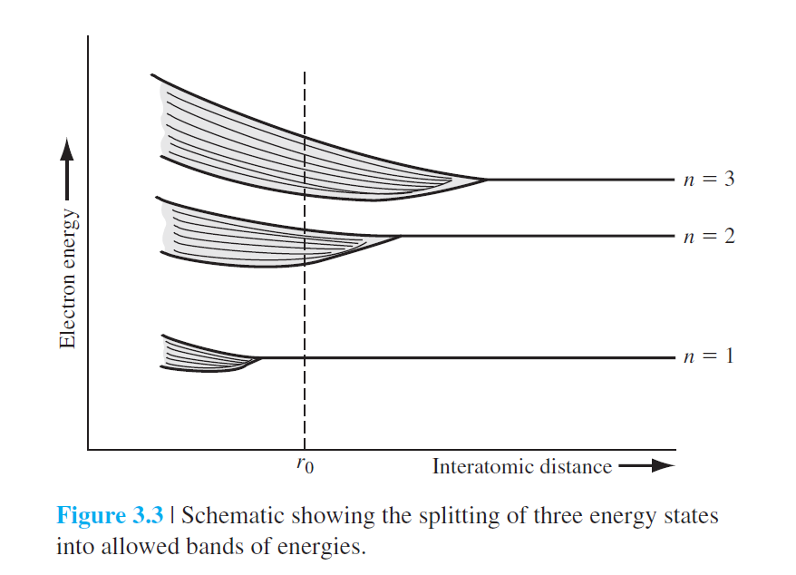

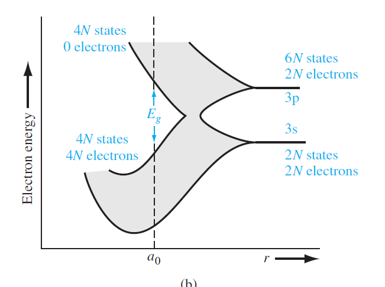

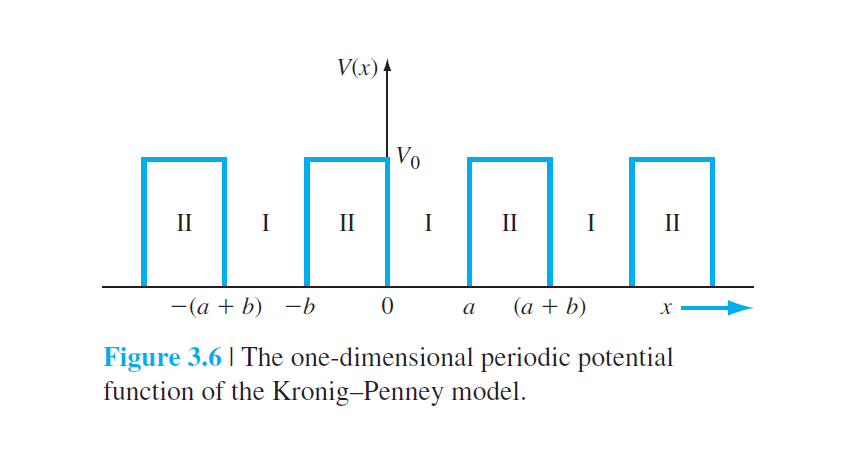

### 3.1.3 The $k$-Space Diagram

the k comes from that all one-electron wave functions, for problems involving periodically varying potential energy functions, must be of the form $\psi(x)=u(x)e^{jkx}$
$$
P'\frac{\sin\alpha a}{\alpha a}+\cos \alpha a=\cos ka\\
P'=\frac{mV_0ba}{\hbar^2}
$$
Equation gives the relation between the parameter $k$ total energy
$E$ (through the parameter $\alpha$), and the potential barrier $bV_0$. 

We assume that $V_0=0$, then we acquire
$$
\cos \alpha a=\cos ka\\
or\quad
\alpha =k
$$
$\alpha$ is given by$\sqrt{\frac{2mE}{\hbar^2}}=\frac{p}{\hbar}=k$, so we obtain the relationship between $k$ and $E$
$$
E=\frac{k^2\hbar^2}{2m}
$$
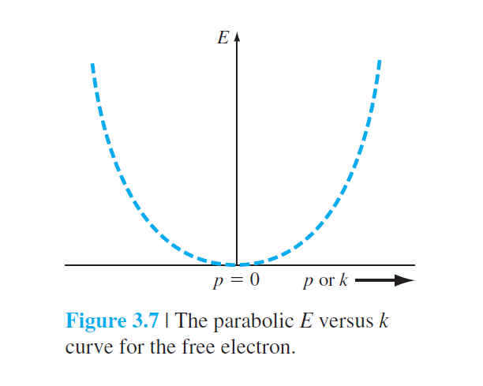

Now, we consider the relation between $E$ and $k$ form Equation for the particle in the single-crystal lattice.

define the left side of the Equation as
$$
f(\alpha a)=P'\frac{\sin\alpha a}{\alpha a}+\cos\alpha a
$$
to the right side, we also have,
$$
f(\alpha a)=\cos ka
$$
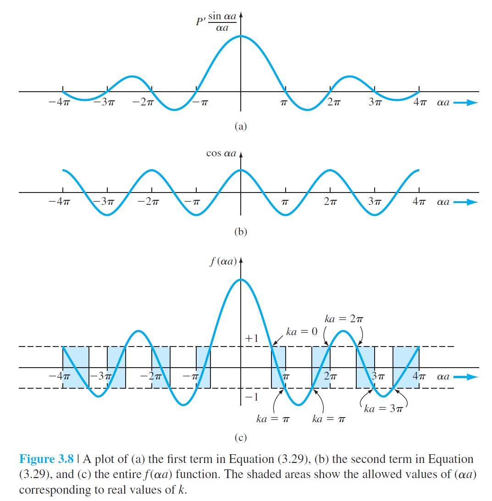

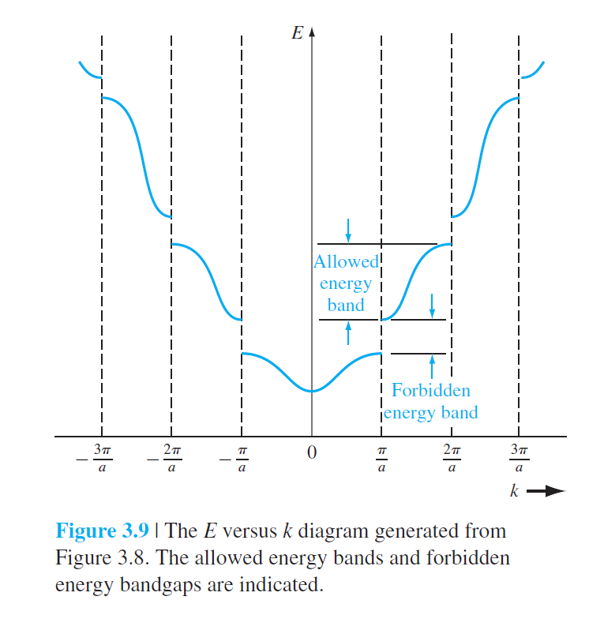

the right side can also be written as $\cos ka=\cos(ka+2n\pi)=\cos(ka-2n\pi)$ 

then we gain

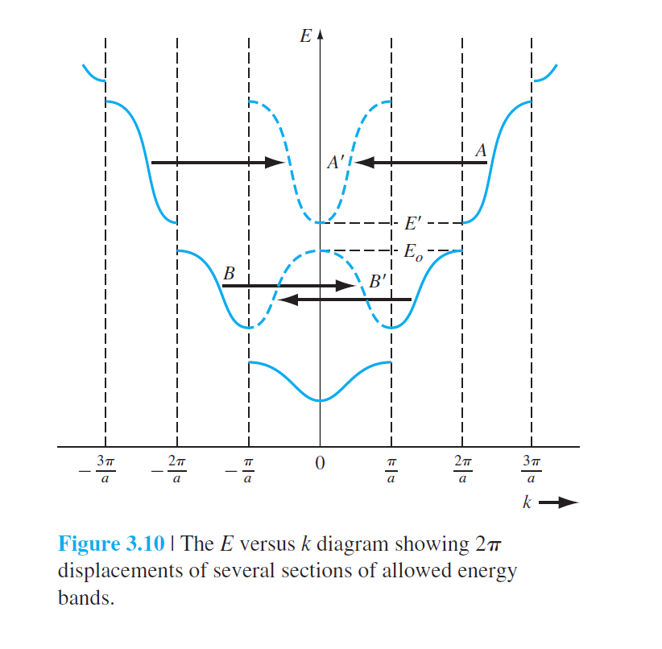

## 3.2 Electrical Conduction In Solids

### 3.2.1 The Energy Band and the Bond Model

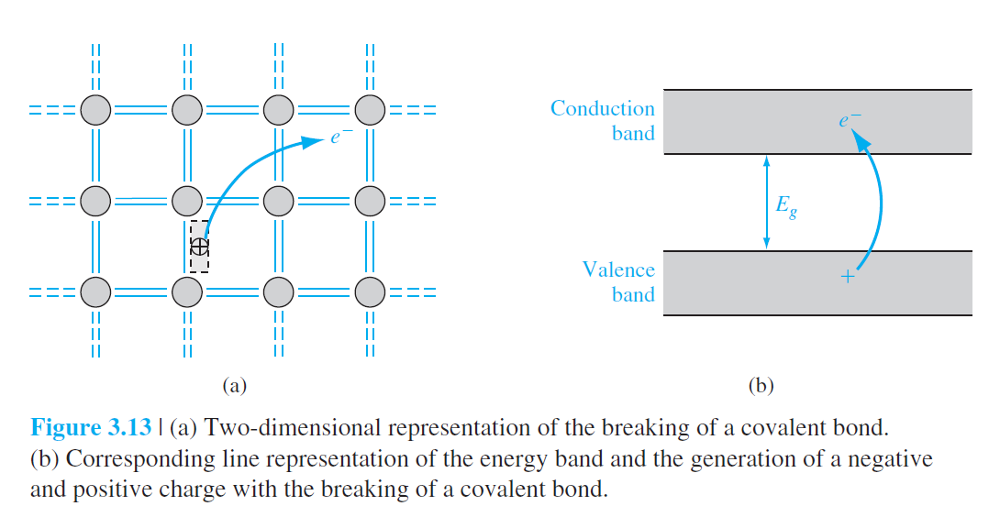

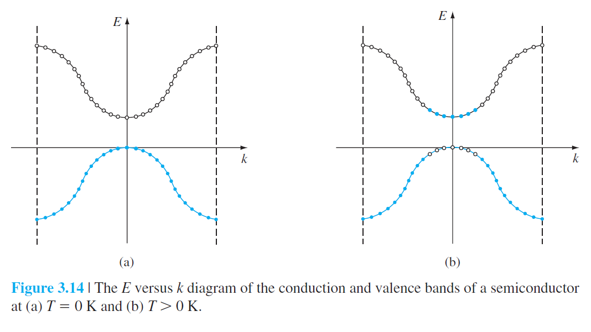

### 3.2.2 Drift Current

the drift current density
$$
J=qNv_d\qquad A/cm^2\\
or\quad J=q\sum^N_{i=1}v_i
$$
if a force is applied to a particle and the particle moves.
$$
dE=Fdx=Fv\cdot dt
$$
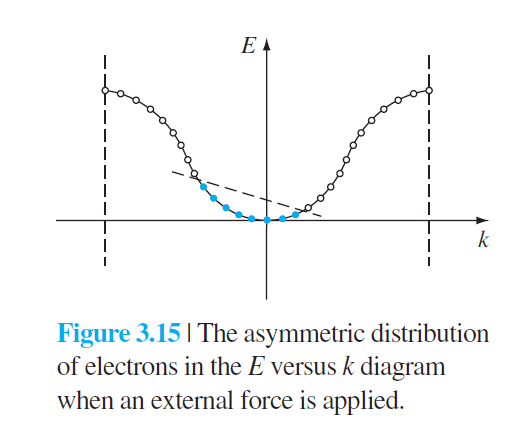

### 3.2.3 Electron Effective Mass

$$
F_{\text{total}}=F_{\text{ext}}+F_{\text{int}}=ma
$$

and we add $m^*$ as effective mass
$$
F_{ext}=m^*a
$$
then back to the Equation, we obtain,
$$
\frac{dE}{dk}=\frac{\hbar^2k}{m}=\frac{\hbar p}{m}\\
\frac1{\hbar}\frac{dE}{dk}=\frac{p}m=v\\
$$
and, if we take the second derivative of $E$ with respect to $k$

