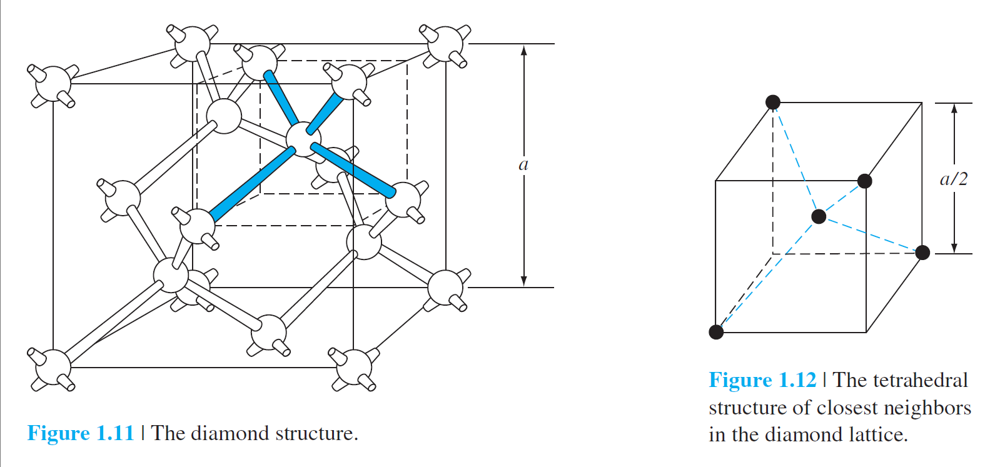

# 1 The Crystal Structure of Solids

## 1.3 Space Lattices

*lattice point* 晶格点

*unit cell* a small volume of the crystal that can be used to reproduce the entire crystal

*primitive cell* the smallest unit cell that can be repeated to form the lattice.

### 1.3.2 Basic Crystal Structures

#### Volume Density of Atoms

1.5 (b)

$$
\begin{gather*}
\frac1{8}\times8+1=2\\
Volume\space Density=\frac{\#atoms\space per\space unit\space cell}{volume\space of \space unit\space cell}={2\over a^3}
\end{gather*}
$$

#### Three lattice types: 

(a) simple cubic, (b) body-centered cubic, (c) face-centered cubic.

### 1.3.3 Crystal Planes and Miller Indices

surface matters a lot

the intercepts of the plane 平面的截距

#### Miller indices 

hkl plane

取截距倒数？the use of infinity is avoided

take the reciprocal（倒数） of the intercepts（截距）

distance between nearest equivalent parallel planes

surface concentration

#### surface density

### 1.3.4 Directions in Crystals

[1,1,1]平面法向量

## 1.4 The Diamond Structure

tetrahedral 四面体

#### zincblende (sphalerite) structure

## 1.5 Atomic Bonding

qualitative understanding

valence electrons 价电子

ions 离子

coulomb attraction 库伦吸引

#### ionic bond 离子键

NaCl

#### covalent bonding 共价键

H~2~

the outer silicon atoms always have valence electrons available for additional covalent bonding - infinite structure

#### metallic bonding 金属键

#### Van der Waals bond 范德华~

nonsymmetry - small electric dipole - interact with each other

## 1.6 imperfections and impurities in solids

electrical parameters

### 1.6.1 imperfections in solids

atomic thermal vibration

##### lattice vibration

thermal energy(function of temperature) - atom randomly fluctuate

##### point defect 

lack of an atom - **vacancy**

多了一个 **interstitial**

* **Frenkel defect**

##### line dislocation

### 1.6.2 impurities in Solids

##### lattice defects

*substitutional* impurities

*interstital* impurities

##### doping (参杂原子)

* impurity diffusion

  high temperature - vacancy - impurity partical move from high concentration to lower - low down the temp

* ion implantation

  low temp - ions be accelerated

  defect: lattice displacement damage

  solve: thermal anneal 热退火

## 1.7 growth of semiconductor materials

### 1.7.1 growth from a melt

#### Czochralski Method（Growth）

seed - the same material in liquid phase - pulled - bigger

#### zone refining（Purify）

At the solid–liquidinterface, there is a distribution of impurities between the two phases. The parameter that describes this distribution is called the **segregation coefficient**: the ratio of the
concentration of impurities in the solid to the concentration in the liquid. 

r-f coil 射频线圈

#### 切割

flat（110）plane

#### polish

chemecal etch

### 1.7.2 Epitaxial Growth

外延生长

single-crystal substrate

*homoepitaxy* one material

*heteroepitaxy* e.g. Growing epitaxial layers of the ternary alloy AlGaAs on a GaAs substrate

#### CVD chemical vapor-phase deposition

chemical reaction release material atom to deposit on the material

#### Liquid-phase epitaxy

melt temp lower than the semiconductor itself

practiced at low temp (III-V)

#### Molecular Beam Epitaxy

vacuum iat temp 0f 400-800

semiconductor and dopant atoms evaporated onto the surface of the substrate

## 1.8 Summary

**substrate** A semiconductor wafer or other material used as the starting material for further semiconductor processing, such as epitaxial growth or diffusion.

**ternary semiconductor** A three-element compound semiconductor, such as aluminum gallium arsenide (AlGaAs).

**elemental semiconductor** A semiconductor composed of a single species of atom, such as silicon or germanium.

