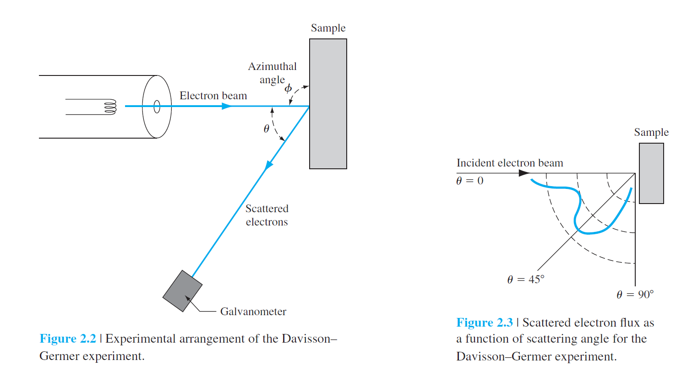
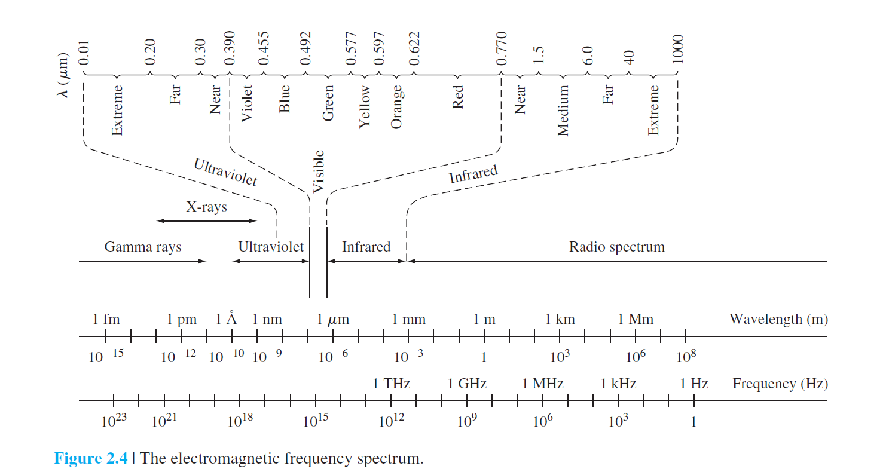
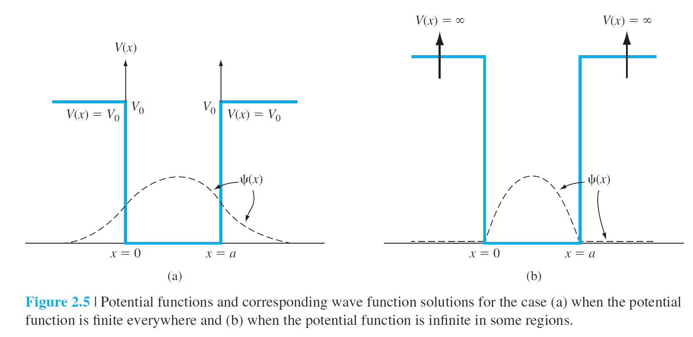
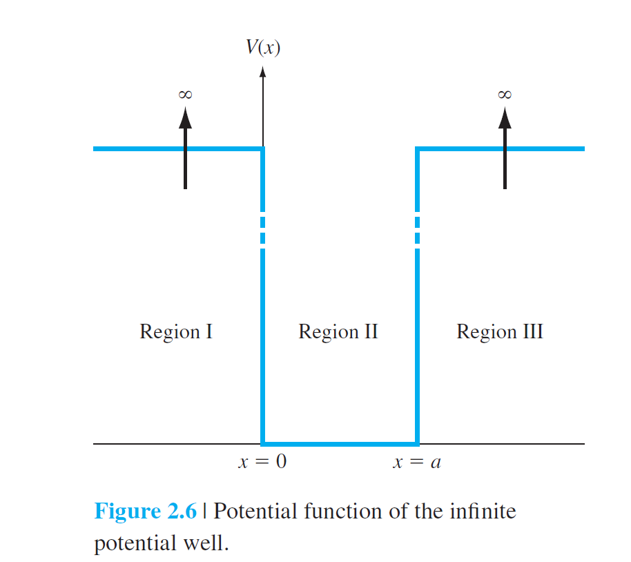
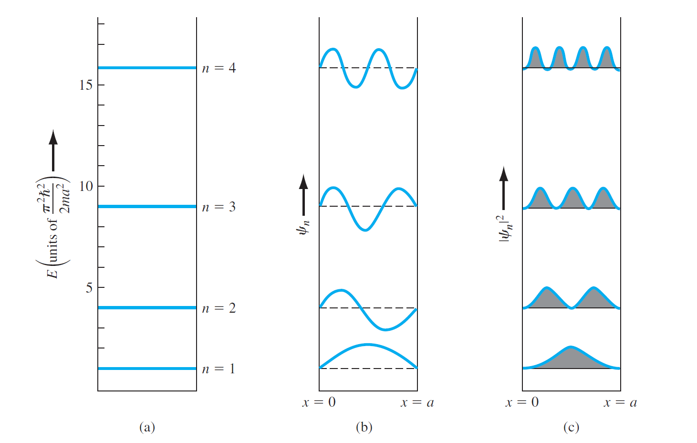

# 2 Introduction to Quantum Mechanics

## 2.0 Preview

In this chapter, we will:

* Discuss a few basic principles of quantum mechanics that apply to semiconductor device physics.
* State Schrodinger’s wave equation and discuss the physical meaning of the wave function.
* Consider the application of Schrodinger’s wave equation to various potential functions to determine some of the fundamental properties of electron behavior in a crystal.
* Apply Schrodinger’s wave equation to the one-electron atom. The result of this analysis yields the four basic quantum numbers, the concept of discrete energy bands, and the initial buildup of the periodic table.

## 2.1 Principles of Quantum Mechanics

### 2.1.1 Energy Quanta

photoelectric effect
$$
E=hv\space (h=6.625\times 10^{-34}J\cdot s)
$$
**photon** the particle- like packet of energy

**work function** The minimum energy required to remove an electron

The **maximum kinetic energy** of the **photoelectron**
$$
T= \frac1{2}mv^2=hv-\Phi
$$

### 2.1.2 Wave -Particle Duality

#### Compton effect

A portion of the x-ray beam was defl ected and
the frequency of the defl ected wave had shifted compared with the incident wave.

#### Brogile wave-particle duality principle

$$
p=\frac{h}{\lambda}
$$

$\lambda$​ *de Broglie wavelength* 

##### Davisson Germer experiment

### 2.1.3 The Uncertainty Principle

#### Heisenberg uncertainty principle

$$
\Delta p\Delta x\ge \hbar\\
\Delta E\Delta t\ge \hbar
$$

to *probability density function*

## 2.2 Schrodinger's Wave Equation

**wave-particle**

### 2.2.1 The Wave Equation

one-dimensional, nonrelativistic Schrodinger's wave equation
$$
\frac{-\hbar}{2m}\cdot\frac{\partial^2\Psi(x,t)}{\partial x^2}+V(x)\Psi(x,t)=j\hbar\frac{\partial\Psi(x,t)}{\partial t}
$$
$\Psi(x,t)$ wave function

$V(x)$ potential function
$$
\Psi(x,t)=\psi(x)\phi(t)\\
(use\ the\ technique\ of\ seperation\ of\ variables)\\
\frac{-\hbar}{2m}\frac1{\psi(x)}\frac{\partial^2\psi(x)}{\partial x^2}+V(x)=j\hbar\frac1{\phi(t)}\frac{\partial\phi(t)}{\partial t}
$$
Since the left side of Equation (2.9) is a function of position x only and the right side of the equation is a function of time t only, **each side of this equation must be equal to a constant**.
$$
\eta=j\hbar\cdot\frac1{\phi(t)}\cdot \frac{\partial\phi(t)}{t}\\
\Rightarrow \phi(t)=e^{-j(\eta/\hbar)t}\\
E=hv=\frac{h\omega}{2\pi}\Rightarrow\omega=\frac{\eta}{\hbar}=\frac{E}{\hbar}\Rightarrow\phi(t)=e^{-j\omega t}\\
\therefore \frac{-\hbar^2}{2m}\cdot\frac1{\psi(x)}\cdot\frac{\partial^2\psi(x)}{\partial x^2}+V(x)=E\\
$$

$$
\Rightarrow \frac{\partial^2\phi(x)}{\partial x^2}+\frac{2m}{\hbar^2}(E-V(x))\psi(x)=0
$$

### 2.2.2 Physical Meaning of the Wave Function

the relation between the function and the electron
$$
\Psi(x,t)=\psi(x)\phi(t)=\psi(x)e^{-j(E/\hbar)t}=\psi(t)e^{-j\omega t}
$$
$\Psi$不代表任何实际的物理含义

$\bold{\left|\Psi(x,t)\right|^2dx}$ the probability of finding the particle between x and $x + dx$ at a given time
$$
\begin{align}
\left|\Psi(x,t)\right|^2&=\Psi(x,t)\cdot\Psi^*(x,t)\\
&=[\psi(x)e^{-j(E/\hbar)t}][\psi^*(x)e^{+j(E/\hbar)t}]\\
&=\psi(x)\psi^*(x)=\left|\psi(x)\right|^2\\
\end{align}
$$

### 2.2.3 Boundary Conditions

$$
\int^{\infin}_{-\infin}\left|\psi(x)\right|^2 dx =1
$$

$E\ and\ V(x) are\ finite$

impose postulate(都是假设)

* $\psi(x)$​​must finite, single valued, and continuous

  > If the probability density were to become infinite at some point in space, then the probability of finding the particle at this position would be certain and the uncertainty principle would be violated.

* $\psi'(x)$​must finite, single valued, and continuous

  > If the total energy E and the potential V(x) are finite
  > everywhere, then from **Equation (8)**, **the second derivative must be finite**, which implies that the first derivative must be continuous. The first derivative is related to the particle momentum, which must be finite and single-valued.

For these cases, the first derivative will not necessarily be continuous, but the remaining boundary conditions will still hold.

## 2.3 Applications of Schrodinger's Wave equation

### 2.3.1 Electron in Free Space

$$
\frac{\partial^2\phi(x)}{\partial x^2}+\frac{2m}{\hbar^2}(E-V(x))\psi(x)=0
$$

If there is no force acting on the particle, then the potential function V(x) will be constant and we must have E>V(x). Assume $V(x)=0$, ​

$(14)\Rightarrow\\$
$$
\frac{\partial^2\phi(x)}{\partial x^2}+\frac{2mE}{\hbar^2}\psi(x)=0\\
$$

$$
\psi(x)=A\ \exp[\frac{jx\sqrt{2mE}}{\hbar}]+B\ \exp[\frac{-jx\sqrt{2mE}}{\hbar}]\\
\Rightarrow \psi(x)=A\ \exp[jkx]+B\ \exp[-jkx]\\
\small{k=\frac{\sqrt{2mE}}{\hbar}}
$$

$$
\therefore \Psi(x,t)=A\exp[j(kx-\omega t)]+B\exp[-j(kx+\omega t)]
$$

**wave function** that a particle moving in free space is represented by a traveling wave.

$A\exp[j(kx-\omega t)]$ 正行波

$B\exp[-j(kx+\omega t)]$ 负行波

假设B=0, 此时物质仅仅由正行波A决定
$$
k=\sqrt{\frac{2mE}{\hbar^2}}=\frac{p}{\hbar}\\
E=\frac{p}{2m}此时把并未考虑相对论效应，只能说E\approx \frac{p}{2m}\\
\small{（当动量p很小，即远小于静止质量能量m_0c^2时）}
$$
利用德布罗意方程
$$
p=\frac{h}{\lambda}\\
k=\frac{2\pi}{\lambda}
$$
A free particle with a well-defined energy will also have a well-defined wavelength and momentum. But it can be found anywhere since $|\Psi(x,y)|^2=AA^*$.

**wave packet** 

### 2.3.2 The Infinite Potential Well

$$
\frac{\partial^2\phi(x)}{\partial x^2}+\frac{2m}{\hbar^2}(E-V(x))\psi(x)=0\\
$$
**E** total energy of the particle. If E is finite, the wave function must be zero $\psi(x)=0$​ in region I and III.

>A particle cannot penetrate these infinite potential barriers, so the probability of finding the particle in regions I and III is zero.

$$
\frac{\partial^2\phi(x)}{\partial x^2}+\frac{2mE}{\hbar^2}\psi(x)=0\\
$$

in region II: V=0
$$
\psi(x)=A_1 \cos kx+A_2\sin kx\\
k=\sqrt{\frac{2mE}{\hbar^2}}
$$
boundary condition: 

* $\psi(x=0)=\psi(x=a)=0$

$$
\therefore A_1=0\\
and\ k=\frac{n\pi}{a}\\
$$

**Negative values of n are not considered** Negative values of n simply introduce a negative sign in the wave function and yield redundant solutions for the probability density function.

而$A_2$的解可以由$\int^{\infin}_{-\infin}\left|\psi(x)\right|^2 dx =1$给出。

如果波函数为实数，则
$$
\because \int_0^a A_2^2\sin^2 kx\ dx=1\\
\therefore A_2=\sqrt{\frac2{a}}
$$

$$
\psi(x)=\sqrt{\frac2{a}}\sin(\frac{n\pi x}{a})\ (n=1,2,3,\cdots)
$$

**standing wave** 驻波

上述方程为驻波解，电子被束缚在这个驻波解中

k的取值只能为n，因此E的取值也只能为限定值（E和k的关系式）

> This result means that the energy of the particle is quantized. That is, the energy of the particle can only have particular discrete values.

$$
E=E_n=\frac{\hbar^2n^2\pi^2}{2ma^2}, where\ n=1,2,3,\cdots
$$

* We may note that as the energy increases, the probability of fi nding the particle at any given value of x becomes more uniform.

### 2.3.3 The Step Potential Function

We will assume that the particles are traveling in the +x direction and that they originated at $x=-\infin$​.

讨论一个比较特殊的案例$E<V_0$

##### in region I

$$
\frac{\partial^2\psi(x)}{\partial x^2}+\frac{2mE}{\hbar^2}\psi(x)=0\\
\Rightarrow \psi_1(x)=A_1e^{jk_1x}+B_1e^{-jk_1x}(x\le 0)\\
\small{(k_1=\sqrt{\frac{2mE}{\hbar^2}})}
$$

incident  入射

reflect  反射

**the flux of incident particles**   $v_i\cdot A_1\cdot A_1^*$ 单位为$\#/cm^2-s$ ，（每平方厘米每秒）

##### in region II

$$
\frac{\partial^2\psi_2(x)}{\partial x^2}-\frac{2m}{\hbar^2}(V_0-E)\psi_2(x)=0\\
\Rightarrow \psi_2(x)=A_2e^{-k_2x}+B_2e^{k_2x}(x\ge 0)\\
\small{(k_2=\sqrt{\frac{2m(V_0-E)}{\hbar^2}})}
$$

##### boundary condition

* $\psi_2(x)$ remain finite, therefore $B_2=0$
  $$
  \psi_2(x)=A_2e^{-k_2x}(x\ge0)
  $$

* $x=0,\psi_1(0)=\psi_2(0)$
  $$
  A_1+B_1=A_2\\
  $$
  
* $\frac{\partial\psi_1}{\partial x}\Big{|}_{x=0}=\frac{\partial\psi_2}{\partial x}\Big{|}_{x=0}\\$
  $$
  jk_1A_1-jk_1B_1=-k_2A_2
  $$

therefore，
$$
B_1=-\frac{k_2^2+2jk_1k_2-k_1^2}{k_1^2+k_2^2}\cdot A_1\\
A_2=\frac{2k_1(k_1-jk_2)}{k_1^2+k_2^2}\cdot A_1
$$

$$
B_1B_1^*=\frac{(k_2^2-k_1^2+2jk_1k_2)(k_2^2-k_1^2-2jk_1k_2)}{(k_1^2+k_2^2)^2}A_1A_1^*
$$

reflection coefficient **R**
$$
R=\frac{v_rB_1B_1^*}{v_1A_1A_1^*}
$$

$$
[in\ region\ I]V=0\Rightarrow T(kinetic\ energy)=E\\
\therefore k_1=\sqrt{\frac{2m}{\hbar^2}(\frac1{2}mv^2)}=\sqrt{m^2\frac{v^2}{\hbar^2}}=\frac{mv}{\hbar}\\
v_i=\frac{\hbar}{m}\cdot k_1\\
$$

Since the reflected particle also exists in region I, the reflected velocity (magnitude) is given by

$$
v_r=\frac{\hbar}{m}\cdot k_1
$$
then,
$$
R=\frac{B_1\cdot B_!^*}{A_1\cdot A_1^*}=1.0
$$
which means, if $E<V_0$ then the particle is reflected.

### 2.3.4 The Potential Barrier and Tunneling

transmission coefficient T 
$$
T=\frac{v_t\cdot A_3\cdot A_3^*}{v_i\cdot A_1\cdot A_1^*}=\frac{A_3\cdot A_3^*}{A_1\cdot A_1^*}\approx 16(\frac{E}{V_0})(1-\frac{E}{V_0})exp(-2k_2a)
$$

## 2.4 Extensions of the Wave Theory to Atoms

### 2.4.1 The One-Electron Atom

the potential function of H
$$
V(r)=\frac{-e^2}{4\pi \epsilon_0 r}
$$

$$
\grad ^2\phi(r,\theta,\phi)+\frac{2m_0}{\hbar^2}(E-V(r))\phi(r,\theta,\psi)=0
$$

$\phi$ can be written in the form of
$$
\phi(r,\theta,\phi)=R(r)\cdot\Theta(\theta)\cdot \Phi(\phi)
$$
 then, we obtain
$$
{\sin^2\theta\over R}\cdot\frac{\partial}{\partial r}(r^2\frac{\partial R}{\partial r})+\frac1{\Phi}\cdot\frac{\partial^2\phi}{\partial \phi^2}+\frac{\sin\theta}{\Theta}\cdot \frac{\partial}{\partial\theta}(\sin\theta\cdot \frac{\partial\Theta}{\partial\theta})+r^2\sin^2\theta\sdot\frac{2m_0}{\hbar^2}(E-V)=0
$$

$$
\frac1{\Phi}\cdot\frac{\partial\Phi}{\partial\phi^2}=-m^2
$$

the solution is
$$
\phi=e^{jmp}
$$
m is integer, $m=0,\pm1,\pm2,\dots$

we can further seperate the variables $\theta$ and $r$ and generate two additional seperation-of-variables constants l and n
$$
\text{the principle quantum number } n=1,2,3,\dots\\
\text{the angular quantum number }l=n-1,n-2,n-3,\dots,0\\
\text{the magnetic quantum number} \abs{m}=l,l-1,\dots,0
$$
the electron energy is,
$$
E_n=\frac{-m_0e^4}{(4\pi\epsilon_0)^2\cdot 2\hbar^2n^2}
$$
