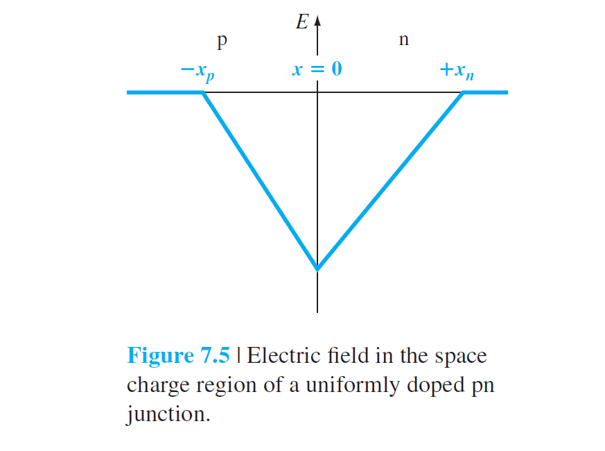
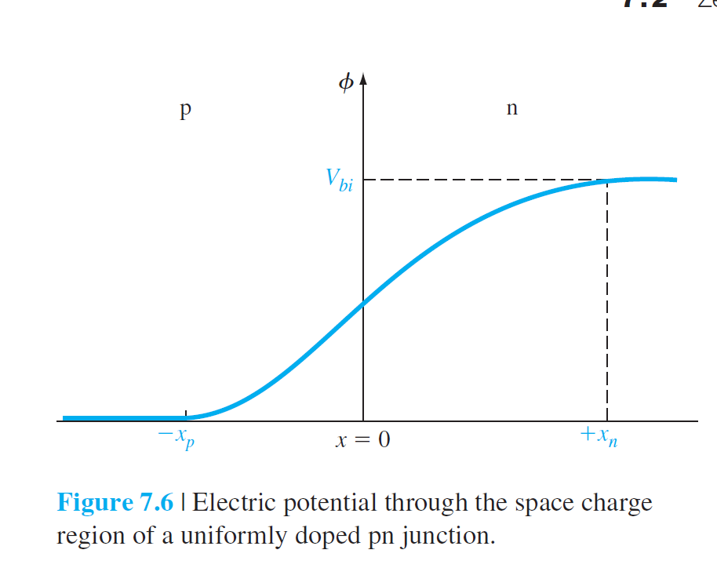
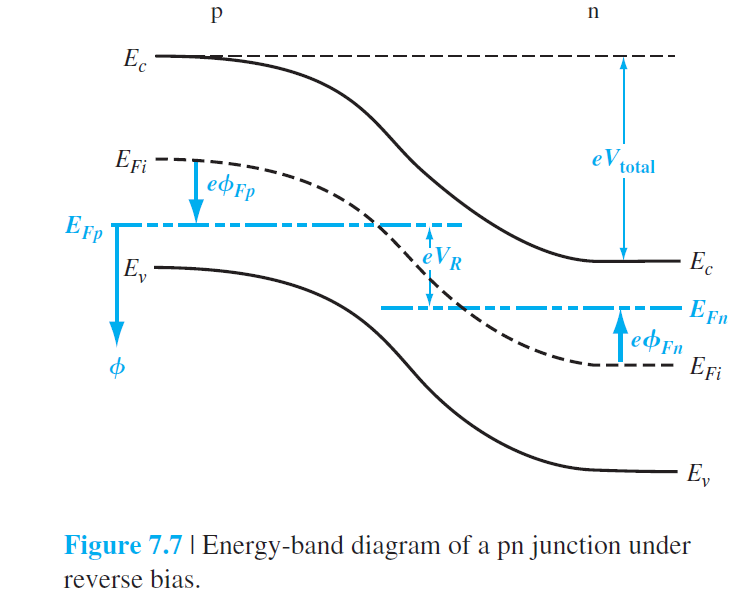
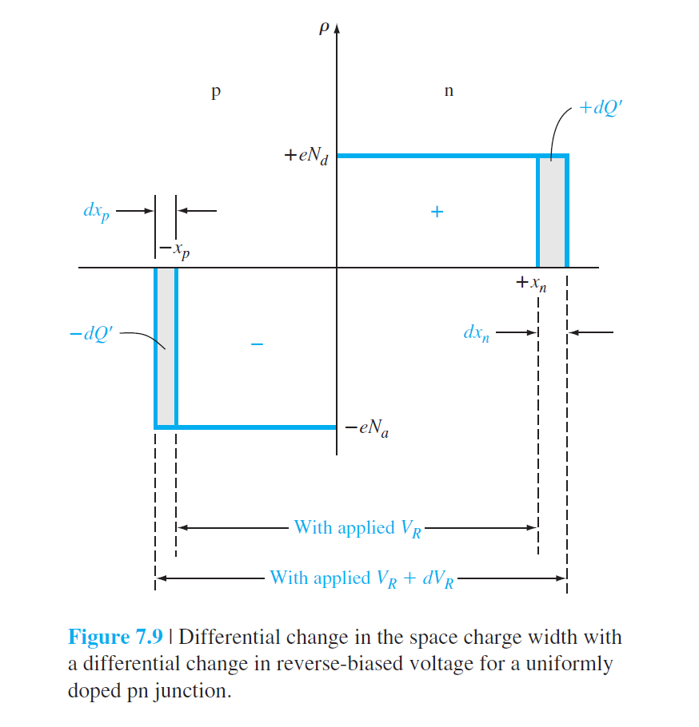
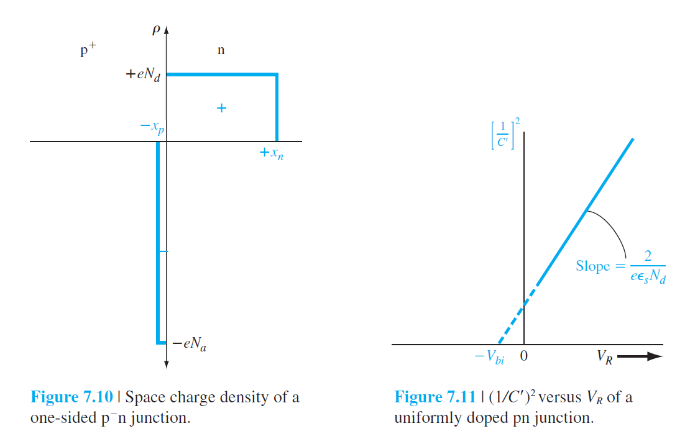

# 7 The pn Junction

## 7.1 Basic Structure of the pn Junction

## 7.2 Zero Applied Bias

$$
n_0=n_i\exp\left[ \frac{E_F-E_{Fi}}{kT} \right]
$$

The potential in the junction:
$$
\phi(x)=-\int E(x)dx=\int \frac{eN_a}{\epsilon_s}(x+x_p)dx\\
=\frac{eN_a}{\epsilon_s}(\frac{x^2}2+x_p\cdot x)+C'_1\\
$$
如果设定$x_p$处为0电势点，则
$$
C'_1=\frac{eN_a}{2\epsilon_s}x_p^2
$$
therefore,
$$
\phi(x)=\frac{eN_a}{\epsilon_s}(x+x_p)^2
$$

## 7.3 Reverse Applied Bias

