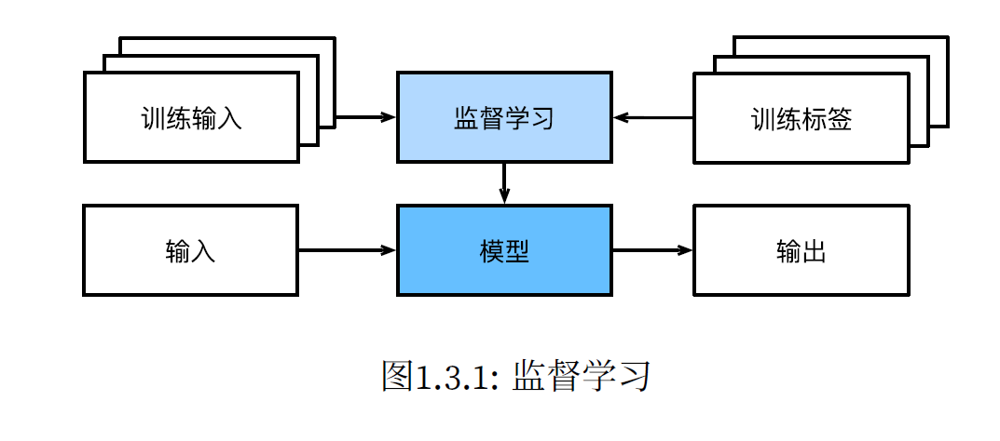

# 1 引言

## 1.2 关键组件

#### 基本内容

* data 
  * training dataset/set
  * test dataset/set
* model（转换数据）
* obejective function（目标函数，量化魔性有效性）
  * 也被称为loss function
    * squared error 平方误差
    * overfitting 过拟合
* algorithm（调整模型参数以优化目标函数）
  * gradient descent（梯度下降）

## 1.3 各种机器学习问题

### 1.3.1 监督学习 Supervised Learning

提供的样本带有标签

##### 回归 Regression

“有多少"

##### 分类 Classification

“是什么”

* multiclass classfication
  * cross-entropy
* hierarchial classification

##### 标记 Label

* multi-label classification

##### 搜索

##### 推荐系统 Recommender System

##### 序列学习 

### 1.3.2 无监督学习 Unsupervised Learning

不含有目标

* 聚类 Clustering
* 主成分分析 Principal Component Analysis
* 因果关系和概率图模型 Causality and probabilistic graphical models
* 生成对抗性网络 Generative adversarial Networks

### 1.3.3 与环境互动

* 离线学习 Offline Learning
* 分布偏移 Distribution Shift

### 1.3.4 强化学习 Reinforcement Learning

**智能体（agent）**在一系列的时间步骤上与环境交互。在每个特定时间点，智能体从环境接收一些**观察（observation）**，并且必须选择一个**动作（action）**，然后通过某种机制（有时称为执行器）将其传输回环境，最后智能体从环境中获得**奖励（reward）**。此后新一轮循环开始，智能体接收后续观察，并选择后续操作，依此类推。*强化学习的目标是产生一个好的**策略（policy）**。*强化学习智能体选择的“动作”受策略控制，即一个从环境观察映射到行动的功能。

* Markov Decision Process 环境可被完全观察
* Contextual Bandit Problem 状态依赖之前的操作
* Multi-Armed Bandit Problem 没有状态，只有一组未知回报的可用动作