# d2l-zh-pytorch

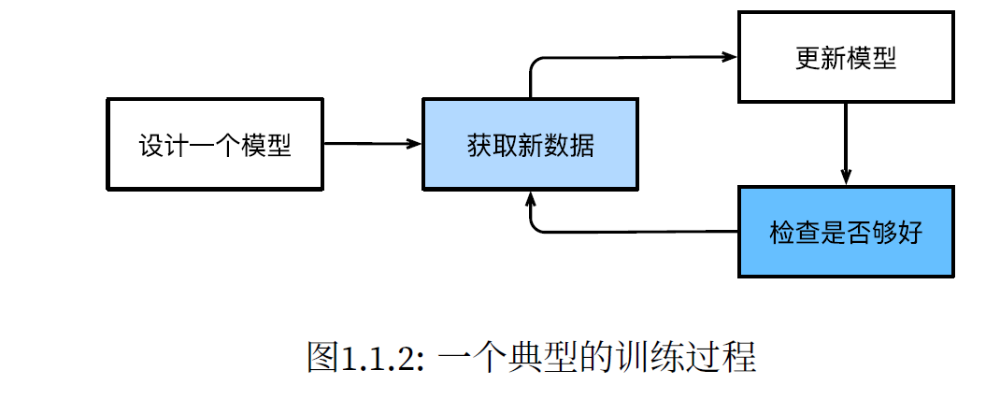

## 1.2 关键组件

#### 基本内容

* data 
  * training dataset/set
  * test dataset/set
* model（转换数据）
* obejective function（目标函数，量化魔性有效性）
  * 也被称为loss function
    * squared error 平方误差
    * overfitting 过拟合
* algorithm（调整模型参数以优化目标函数）
  * gradient descent（梯度下降）

## 1.3 各种机器学习问题

#### 监督学习 Supervised Learning

提供的样本带有标签

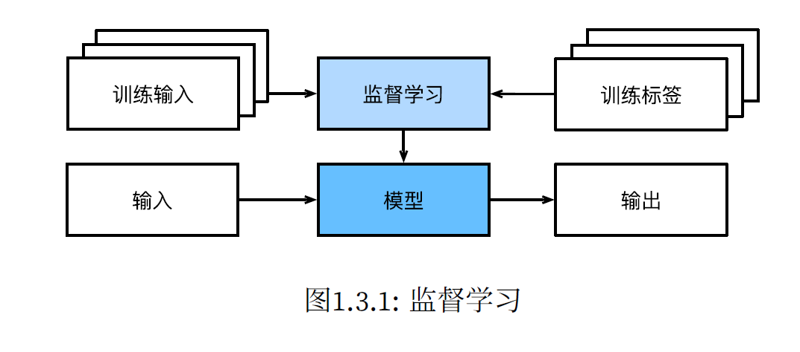

##### 回归 Regression

“有多少"

##### 分类 Classification

“是什么”

* multiclass classfication
* cross-entropy
* hierarchial classification

##### 

## 1.20

### torch.tensor使用

广播机制

降维


```python
torch.tensor()
```


轴（axis）就是张量的维度

torch.arange(a): 生成从0~a-1的一个向量

torch.dot

### 数据预处理：pandas用法

```python
import pandas as pd
import torch

data = pd.read_csv(data_file) #假设已经写好了csv文件，使用pandas的read_csv方法创建数据集
print(data)  

#输出为:
NumRooms Alley Price
0 NaN Pave 127500
1 2.0 NaN 106000
2 4.0 NaN 178100
3 NaN NaN 140000

inputs, outputs = data.iloc[:, 0:2], data.iloc[:, 2]
inputs = inputs.fillna(inputs.mean()) #data有iloc，fillna，get_dummies等方法

X = torch.tensor(inputs.to_numpy(dtype=float))
y = torch.tensor(outputs.to_numpy(dtype=float)) #在处理好数据中的缺失后，从数值转化成tensor
```


### 反向传播：autograd

输出的y是x的多元函数，对$x_i$求偏导的格式为：


例如$y=2X^TX$

y是标量，x是一个向量

```python
import torch
x = torch.arange(4.0)  #输出 tensor([0.,1.,2.,3.])
x.requires_grad_(True) # 等价于x=torch.arange(4.0,requires_grad=True)
x.grad # 默认值是None
y = 2 * torch.dot(x, x)
y.backward()
x.grad  #输出为：tensor([ 0., 4., 8., 12.])
x.grad == 4 * x #输出为: tensor([True, True, True, True]) 

# 再计算另外一个函数的梯度值：
x.grad.zero_()  # 在默认情况下，PyTorch会累积梯度，我们需要清除之前的值
y = x.sum()
y.backward()
x.grad  #输出tensor([1., 1., 1., 1.])

```


## 1.22

引入激活函数的理由：

1.各层级之间的线性操作可以直接等价于一层线性操作

2.由于线性组合相当于是对原始参数矩阵张成的空间进行**伸缩，旋转和剪切**

但是可能真实世界有些原始数据本身就是线性不可分的，必须要对原始空间进行一定的非线性操作(对原空间进行一定的扭曲？)

对于回归问题也可以同样运用高数的思维，把回归看成分类问题的无限细分，当极限存在时，分类也就成为了回归问题。

激活函数应该具有的特征
避免梯度消失的特性，造成网络更新过慢
输出最好关于0对称，这样就不会造成梯度向特定方向移动
激活函数应该为神经网络引入非线性
激活函数应该是可微的，使得满足各层之间梯度下降的计算(至少部分可微)
梯度的计算不应该太复杂，影响网络性能

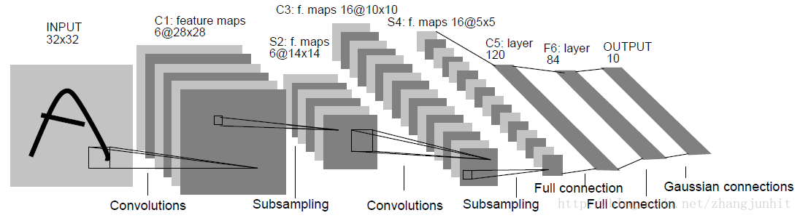


```c
class Model(Module):
    def __init__(self):
        super(Model, self).__init__()
        self.conv1 = nn.Conv2d(1, 6, 5)
        #1，6，5分别表示输入通道数，输出通道数，卷积核大小
        self.relu1 = nn.ReLU()
        self.pool1 = nn.MaxPool2d(2)
        self.conv2 = nn.Conv2d(6, 16, 5)
        self.relu2 = nn.ReLU()
        self.pool2 = nn.MaxPool2d(2)
        self.fc1 = nn.Linear(256, 120)
        self.relu3 = nn.ReLU()
        self.fc2 = nn.Linear(120, 84)
        self.relu4 = nn.ReLU()
        self.fc3 = nn.Linear(84, 10)
        self.relu5 = nn.ReLU()

    def forward(self, x):
        y = self.conv1(x)
        y = self.relu1(y)
        y = self.pool1(y)
        y = self.conv2(y)
        y = self.relu2(y)
        y = self.pool2(y)
        y = y.view(y.shape[0], -1)
        # 此处view操作是为了将y的形状从[b, c, h, w]变为[b, c*h*w]，以便送入全连接层
        # -1的涵义是自适应，即自动计算此处应填多少
        y = self.fc1(y)
        y = self.relu3(y)
        y = self.fc2(y)
        y = self.relu4(y)
        y = self.fc3(y)
        y = self.relu5(y)
        return y
```


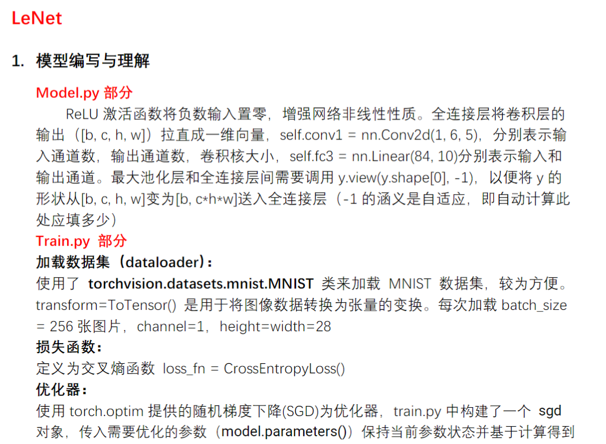


上图是论文中 Transformer 的内部结构图，左侧为 Encoder block，右侧为 Decoder block。红色圈中的部分为 **Multi-Head Attention**，是由多个 **Self-Attention**组成的，可以看到 Encoder block 包含一个 Multi-Head Attention，而 Decoder block 包含两个 Multi-Head Attention (其中有一个用到 Masked)。Multi-Head Attention 上方还包括一个 Add & Norm 层，Add 表示残差连接 (Residual Connection) 用于防止网络退化，Norm 表示 Layer Normalization，用于对每一层的激活值进行归一化。


## 跟李沐学ai

masked  multi-head attention

batch norm 和layer norm的区别

ChatGPT

ChatGPT

Batch Normalization（批归一化，简称 Batch Norm）和 Layer Normalization（层归一化，简称 Layer Norm）是用于神经网络中的正则化技术，它们有一些关键的区别：

1. **归一化的层级：**
   - **Batch Normalization：** 归一化是在每个 mini-batch 中的每个特征维度上进行的。它对每个特征维度进行平均和标准差的归一化，因此可以看作是对 mini-batch 维度和特征维度的归一化。
   - **Layer Normalization：** 归一化是在每个样本的每个特征维度上进行的。它对每个特征维度进行平均和标准差的归一化，因此可以看作是对样本维度和特征维度的归一化。
2. **归一化的计算方式：**
   - **Batch Normalization：** 对于每个特征维度，计算 mini-batch 中所有样本的均值和标准差。使用这些均值和标准差进行归一化。
   - **Layer Normalization：** 对于每个样本的每个特征维度，计算该样本的均值和标准差。使用这些均值和标准差进行归一化。
3. **计算时的依赖关系：**
   - **Batch Normalization：** 在训练时，由于需要计算 mini-batch 的均值和标准差，因此需要使用当前 mini-batch 中的所有样本。在测试时，通常使用训练阶段计算的移动平均值进行归一化。
   - **Layer Normalization：** 在训练和测试时都是独立计算每个样本的均值和标准差，因此不需要使用 mini-batch。
4. **适用场景：**
   - **Batch Normalization：** 在深度神经网络中，特别是卷积神经网络（CNNs）中广泛使用，对于深层网络的训练有助于梯度传播。
   - **Layer Normalization：** 更适用于循环神经网络（RNNs）等不适合使用 mini-batch 归一化的场景，因为 RNNs 的输入序列长度可能不同。

总体而言，Batch Normalization 和 Layer Normalization都是用于加速神经网络训练、防止梯度消失和梯度爆炸的方法，但它们的实现和应用场景有所不同。


残差连接（Residual Connection）是一种神经网络中的建模技术，旨在解决深度神经网络训练过程中的梯度消失和梯度爆炸问题。这一技术最初由何恺明等人提出，并在2016年的论文 "Deep Residual Learning for Image Recognition" 中首次引入。

在残差连接中，网络的某些层（通常是卷积层）的输入直接通过跳跃连接（skip connection）添加到网络的输出中。这样的连接使得网络可以直接学习残差，而不是完整地学习特征映射。残差连接的数学表达如下：

输出=输入+残差输出=输入+残差

具体而言，如果 �(�)*F*(*x*) 表示网络的映射函数（例如卷积层和激活函数的组合），那么残差块的输出为：

输出=�(�)+�输出=*F*(*x*)+*x*

其中，�*x* 是输入。

残差连接的主要优势包括：

1. **解决梯度消失问题：** 通过直接传播残差，梯度可以更轻松地传播回较早的层，从而减轻了梯度消失问题。
2. **简化网络训练：** 使得更深的网络更容易训练，因为网络可以学习将输入直接传递到输出的恒等映射，而不需要对输入进行复杂的变换。
3. **降低特征映射学习的难度：** 网络可以选择性地学习残差，而不是完整地学习特征映射，这有助于更好地捕捉数据中的变化。

残差连接在许多深度学习任务中都取得了显著的成功，并被广泛用于各种架构，如 ResNet、DenseNet 等。


## 注意力函数：scaled dot-product attention

### $$Attention(Q,K,V)=softmax(QK^T / sqrt(d_k)) V$$​

将query和key-value对

output是value的加权和

value的加权和是query和key的相似度算出的

key是名字，query是想查谁的名字，也是一个名字，value是key对应的值


### 关于矩阵乘法：非常便于并行

假设进行了n次query，dk为key的特征维度数，dv为单词特征维数，一般来说dk和dv相同

一般来说Query，Key，Value矩阵的形状一致

Query矩阵 n行dk列

Key矩阵 m行dk列

weight矩阵 n行m列，每一行都是一次query，对应一个单词

value矩阵，m行dv列，每一列是一个单词，dv是单词特征的维度

output矩阵，n行dv列，n次query，输出了


multi-head 多头注意力机制，拆开来再合并

### 在模型中attention机制的三次使用场景

1. 开始输入的时候，一个输入复用为三条线，Q,K,V都是自己本身
2. masked-multihead-attention 来源于上一层decoder的输出，也是复用三次
3. multihead-attention，key-value对来源于decoder，query来源于encoder


如下图，在第一次multi-head-attention之后，实际上整个序列的信息已经通过attention层，把不同的query和position encoding被拆解成独立的部分，和RNN不同


# ResNet 残差网络

很深的神经网络误差变大的问题

不是过拟合造成的

"Identity mapping" 是深度学习领域中一个重要的概念，通常与残差网络（Residual Networks，简称 ResNets）相关。

在深度卷积神经网络中，当模型变得非常深时，训练变得更加困难。梯度消失和梯度爆炸是训练深度网络时常见的问题之一。为了解决这个问题，ResNet 引入了残差块（Residual Block），其中的关键部分就是 "identity mapping"。

**Identity Mapping 的定义：**

在 ResNet 的残差块中，通过引入跳跃连接（skip connection）和 "identity mapping"，使得网络可以直接学习残差（residual）。具体而言，对于一个残差块，其输出可以表示为：

Output=F(Input)+Input

其中，F(Input) 是经过残差块内部操作的结果，Input 是输入。上式中的 "input" 就是 "identity mapping"，它允许模型学习对输入进行恒等映射（即不进行任何变换）。

**作用和优势：**

1. **梯度流动：** "Identity mapping" 使得梯度可以更直接地传播回网络的较早层，有助于缓解梯度消失问题，使训练更加稳定。
2. **模型学习残差：** 通过引入 "identity mapping"，模型可以选择性地学习对输入进行变换，而不是必须学习整个映射。这有助于模型更轻松地适应底层和高层的特征。
3. **网络深度：** ResNet 中的 "identity mapping" 允许构建非常深的网络，而不会导致训练困难。这使得 ResNet 成为处理复杂任务的强大工具。

总体而言，"identity mapping" 在深度学习中的应用是为了提高模型的训练稳定性和深度网络的可训练性。


### mapping 投影   线性映射


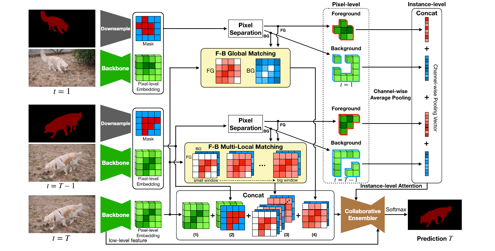

在深度学习中，"downsample" 和 "upsample" 是指改变输入数据的空间分辨率的操作。

1. **Downsample（下采样）：**
   - 下采样是指将输入数据的空间分辨率降低的过程。在图像处理中，这通常通过降低图像的宽度和高度来实现。常见的下采样操作包括池化（Pooling）和步幅大于1的卷积操作。
   - 池化操作中，通常使用最大池化或平均池化，将每个池化窗口内的数值合并为一个单一的值，从而降低空间分辨率。
2. **Upsample（上采样）：**
   - 上采样是指将输入数据的空间分辨率增加的过程。在图像处理中，这通常通过插值操作来实现。常见的上采样操作包括反卷积（Deconvolution）和转置卷积（Transpose Convolution）。
   - 上采样的目标是通过填充额外的像素或特征来增加图像的维度，从而提高空间分辨率。

这两个操作在深度学习中经常用于神经网络的不同层次和任务：

- **特征提取层：** 在卷积神经网络（CNNs）中，下采样通常在卷积层中进行，以减少特征图的空间维度，捕捉更高级的特征。池化操作是常见的下采样方法。
- **特征生成层：** 在某些任务中，如图像分割或生成，上采样用于增加特征图的空间分辨率，使其能够输出与输入相同大小的结果。反卷积或转置卷积是常见的上采样方法。

这些操作在神经网络中的使用可以根据任务和网络结构的需求而变化。

## 1.23


"LR" 在深度学习领域中通常指的是逻辑回归（Logistic Regression），是一种用于二分类问题的模型。对于逻辑回归模型，通常使用二元交叉熵损失函数（Binary Cross Entropy Loss）作为损失函数，而不是传统的均方误差损失。

逻辑回归的损失函数为：

$\text{Binary Cross Entropy Loss} = - \frac{1}{N} \sum_{i=1}^{N} \left[ y_i \log(p_i) + (1 - y_i) \log(1 - p_i) \right]$

其中：

- $N$ 是样本数量。
- $y_i$ 是第 $i$ 个样本的真实标签。
- $p_i$ 是模型对第 $i$ 个样本的预测概率。

优化损失函数的过程通常使用梯度下降法或其变种。梯度下降法的基本思想是通过迭代调整模型参数，使损失函数最小化。

1. **梯度计算：** 计算损失函数对模型参数的梯度。对于逻辑回归，这可以通过反向传播算法计算得到。
2. **参数更新：** 使用梯度下降法或其他优化算法更新模型参数。更新规则通常为 $\theta_{\text{new}} = \theta_{\text{old}} - \alpha \nabla L$，其中 $\alpha$ 是学习率，▽L 是损失函数关于模型参数的梯度。

3. **迭代：** 重复上述步骤，直到满足停止条件，如达到最大迭代次数或梯度接近零。

对于逻辑回归，由于损失函数是凸函数，梯度下降法通常能够收敛到全局最小值。学习率的选择很重要，过大的学习率可能导致不稳定的训练，而过小的学习率可能导致收敛缓慢。

在 PyTorch 中，你可以使用自动微分和优化器来实现梯度下降。例如：

```python
import torch
import torch.nn as nn
import torch.optim as optim

# 定义逻辑回归模型
model = nn.Linear(in_features, out_features)
# 定义损失函数
criterion = nn.BCEWithLogitsLoss()
# 定义优化器
optimizer = optim.SGD(model.parameters(), lr=learning_rate)
# 训练过程
for epoch in range(num_epochs):
    # 前向传播
    outputs = model(inputs)
    # 计算损失
    loss = criterion(outputs, labels)
    # 反向传播
    optimizer.zero_grad()
    loss.backward()
    # 参数更新
    optimizer.step()
```

## SVM原理简析

怎样才是最好的分割：

“分的清，没有含糊不清的点”：各点离平面的距离设为$r_i$,求使得所有$r_i$的最小值最大的一个分割


[理解凸优化 - 知乎 (zhihu.com)](https://zhuanlan.zhihu.com/p/37108430)


[支持向量机（SVM）——原理篇 (zhihu.com)](https://www.zhihu.com/tardis/zm/art/31886934?source_id=1005)


## pytorch自定义数据集使用

## pytorch--transform工具箱及用法

```python
from torchvision import transforms
from PIL import image

img_path = "relative/path/to/image"
img = Image.open(img_path)
print(img)  #<PIL.JpegImage.JpegImageFile image mode=RGB size = 768x512 at 0275820fe60>
tensor_trans = transforms.ToTensor(img)

```


```python
from torch.utils.tensorboard import SummaryWriter
writer = SummaryWriter("logs")

writer.add_image("Tensor_img",tensor_img)
writer.close()
```


#### ToTensor

把PIL Image 或者 numpy.ndarray转换为tensor类型

```python
train_augs = torchvision.transforms.Compose([
torchvision.transforms.RandomHorizontalFlip(),
torchvision.transforms.ToTensor()])

test_augs = torchvision.transforms.Compose([
torchvision.transforms.ToTensor()])
```


#### resize


## torchvision提供的标准数据集和transform结合使用

标准数据集网址：[Datasets — Torchvision 0.16 documentation (pytorch.org)](https://pytorch.org/vision/stable/datasets.html#datasets)

[torchvision — Torchvision master documentation (pytorch.org)](https://pytorch.org/vision/0.9/)

```python
#torchvision官方数据集和transforms联合使用
import torchvision
from torch.utils.tensorboard import SummaryWriter
dataset_transform = torchvision.transforms.Compose([
    torchvision.transforms.ToTensor()
])
train_set = torchvision.datasets.CIFAR10(root = "./dataset",train = True,download=True,transform=dataset_transform)
test_set = torchvision.datasets.CIFAR10(root = "./dataset",train = False,download=True,transform=dataset_transform)
#下载后解压
print(train_set[0])
writer = SummaryWriter("cifar10")  #新建的tensorboard日志的路径文件夹名称
for i in range(10):
    img, target = test_set[i]
    writer.add_image("test_set",img,i)  #图片在tensorboard会话中的名称
```


tensorboard使用：

commandline：`tensorboard --logdir = "mydirname"`

或在vscode中启动tensorboard会话也可


## pytorch-dataloader使用

把dataset中的数据一个个加载到神经网络中

dataloader类属性：

​	dataset，from which to load the data

​	batch_size，每次抓几张牌

​	shuffle ，每个epoch是否重新加载

​	num_workers 主进程加载，=0，>0对windows可能有问题，broken pipes

​	drop_last 舍去最后一份牌，是否保留整数

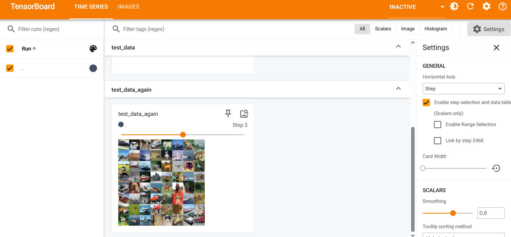

## torch-nn使用

```python
import torch.nn as nn
import torch.nn.functional as F

class Model(nn.Module)
	def __init__(self):
        super(Model,self).__init__()
        self.conv1 = nn.Conv2d(1,20,5)
        self.conv2 = nn,Conv2d(20,20,5)
        
    def forward(self,x)
    	x = F.relu(self.conv1(x))
        return F.relu(self.conv2(x))
```


## torch-sequential 结合CIFAR-10数据集使用


层的参数设置：

```python
	Conv2d(input_channel,output_channel,kernel_size,padding)
    #比如input 的通道数为前后相同方块的大小 为3，output channel为32，kernel_size为5，padding为2
    maxpool2d(size)
```


### 微调 迁移学习

1. 迁移学习将从源数据集中学到的知识迁移到目标数据集，微调是迁移学习的常见技巧。
2. 除输出层外，目标模型从源模型中复制所有模型设计及其参数，并根据目标数据集对这些参数进行微
   调。但是，目标模型的输出层需要从头开始训练。
3. 通常，微调参数使用较小的学习率，而从头开始训练输出层可以使用更大的学习率。


​					                                     VGG 网络结构示意


## 计算机视觉基础知识

我们以图像的每个像素为中心生成不同形状的锚框。
• 交并比（IoU）也被称为杰卡德系数，用于衡量两个边界框的相似性。它是相交面积与相并面积的比率。
• 在训练集中，我们需要给每个锚框两种类型的标签。一个是与锚框中目标检测的类别，另一个是锚框真
实相对于边界框的偏移量。
• 预测期间可以使用非极大值抑制（NMS）来移除类似的预测边界框，从而简化输出。

### 非极大值抑制 NMS

NMS（非极大值抑制，Non-Maximum Suppression）是一种常用于目标检测任务的技术，用于从一组重叠的候选框中选择最符合条件的框。其主要原理是消除多余的、与最终选择框高度重叠的候选框，以确保最终输出的框具有最佳的质量和非重叠性。

以下是NMS的基本原理：

1. **得分排序：** 首先，对所有的候选框按照其得分（置信度或其他评估指标）进行降序排列。通常，得分越高的框越有可能是正确的目标。
2. **选择最高得分框：** 选取得分最高的候选框作为输出，将其加入最终的输出结果集合。
3. **计算重叠面积：** 计算当前选择的框与剩余的候选框的重叠面积。这里常用的是 IoU（Intersection over Union）指标，即两个框相交面积与它们的并集面积之比。
4. **删除重叠框：** 对于与当前选择的框重叠面积超过某个设定的阈值的其他候选框，将其从候选框集合中移除。
5. **重复步骤2至步骤4：** 重复以上步骤，选择下一个得分最高的框，然后删除与它重叠面积超过阈值的其他框。直到所有的候选框都被处理。

这样，NMS 确保了最终输出的框具有较高的得分，并且彼此之间有较低的重叠度。这对于目标检测任务很重要，因为它可以防止在同一个目标上产生多个高度重叠的检测结果，从而提高检测的准确性。


### 单发多框检测 SSD

"单发多框检测"（Single Shot Multibox Detection，SSD）是一种用于目标检测的深度学习架构，旨在实现快速而准确的目标检测。SSD是一种多尺度、多框架的检测方法，能够在一次前向传播中检测图像中的多个目标。

以下是SSD的主要特点和原理：

1. **多尺度特征图：** SSD 在卷积神经网络中引入了多个不同尺度的特征图。每个特征图对应于网络的不同层，具有不同的感受野和分辨率。这样可以使网络在不同尺度上对目标进行检测。
2. **多框框架：** 对于每个尺度的特征图，SSD 通过预定义的一系列锚框（anchor boxes）来检测不同形状和尺寸的目标。每个锚框与网络的每个空间位置相关联，通过卷积层的预测来输出目标的位置和类别信息。
3. **损失函数：** SSD 使用多任务损失函数，同时考虑位置回归和类别分类。位置回归损失关注锚框的位置精度，而类别分类损失关注预测的目标类别。
4. **非极大值抑制（NMS）：** 在SSD的输出中，采用非极大值抑制来移除高度重叠的框，以提高检测的准确性。NMS通过保留具有最高置信度的框，并消除与其高度重叠的其他框。
5. **实时性能：** SSD设计旨在实现实时目标检测。通过一次前向传播，SSD可以在图像中检测多个目标，并提供目标的位置和类别信息。

SSD的设计使得它在准确性和速度之间取得了平衡，使其成为在实际应用中广泛使用的目标检测框架之一。它适用于各种尺寸和形状的目标，并且在复杂的场景中表现良好

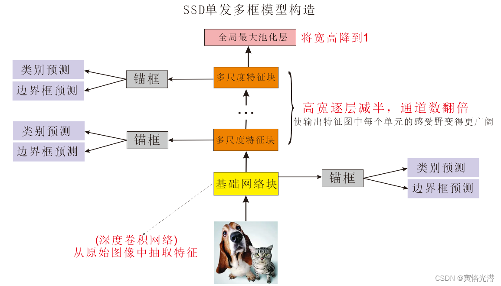


## 1.24 多模态模型

### gradio

特化的AI前端界面，语法非常轻量级，采用很多block搭建交互式的web UI

### 强化学习

# *huggingface*

Zero-shot image classification is a **computer vision task to classify images into one of several classes, without any prior training or knowledge of the classes**. Zero shot image classification works by transferring knowledge learnt during training of one model, to classify novel classes that was not present in the training data.

### CLIP：openai的clip模型，Contrastive Language-Image Pre-training

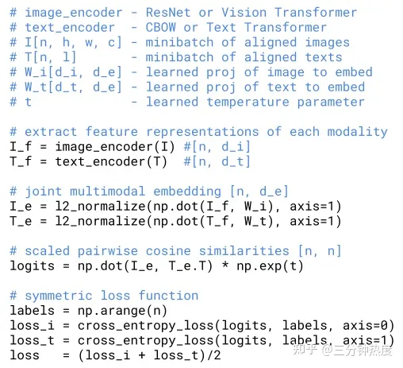

### GLIP简介：Grounded Language-Image Pre-training

目前的视觉识别任务通常是在一个**预先定义好的类别范围**内进行的，这样限制了其在真实场景中的扩展。CLIP的出现打破了这一限制，CLIP利用image-text对进行训练，从而使得模型可以根据文字prompt识别任意类别。关于CLIP的详细介绍可以看我的文章：[深度解读CLIP：打破文字与图像之间的壁垒](https://zhuanlan.zhihu.com/p/618490277)。CLIP适用于分类任务，而GLIP尝试将这一技术应用于**目标检测**等更加复杂的任务中。

# 


在多模态网络（Multimodal Network）中，通常会使用类似于单模态网络的结构，但在设计上进行了一些调整以处理多个模态（例如图像、文本、声音等）的输入。其中，backbone、neck 和 head 是网络的不同部分，各自有不同的功能。

1. **Backbone：**
   - **定义：** Backbone 是网络的主干部分，负责提取输入数据的高级特征表示。在多模态网络中，可能存在多个并行的 backbone，每个用于处理不同的输入模态。
   - **功能：** 提取共享的低级和中级特征，以捕捉不同输入模态的共性信息。
2. **Neck：**
   - **定义：** Neck 是连接 backbone 和 head 的中间部分，通常位于网络的中心。它可以包含一系列的层或模块，有助于整合来自不同模态的特征。
   - **功能：** 实现特征的融合或整合，以便更好地处理多模态信息。在 neck 中，可以应用一些融合策略，例如注意力机制、融合层等，以加强不同模态之间的关联性。
3. **Head：**
   - **定义：** Head 是网络的最后部分，负责执行任务特定的输出。在多模态网络中，可能存在多个 head，每个用于处理不同的任务或输出模态。
   - **功能：** 生成最终的任务输出，例如分类、回归或生成任务的结果。每个 head 可以专注于处理与其任务相关的特征表示。

总体而言，backbone 负责提取共享的特征，neck 负责整合多模态特征，而 head 则专注于执行具体的任务。多模态网络的设计需要考虑如何在这三个部分中合理地处理不同模态的信息，以实现对多模态输入的有效建模。不同的应用场景和任务可能需要不同的架构设计。


### grounding DINO：根据文字提示检测任意目标


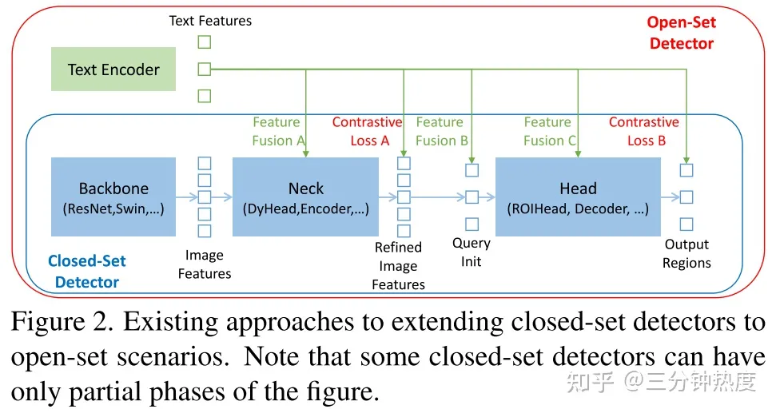

- **Phasa A**: 设计了结合self-attention、text-to-image cross-attention、image-to-text attention的特征enhancer应用在Neck中；
- **Phasa B**: 设计了一个language-guided query selection方法用于初始化Head的query；
- **Phasa C**: 设计了一个跨模态的decoder用于Head部分，从而增强query的特征表达。


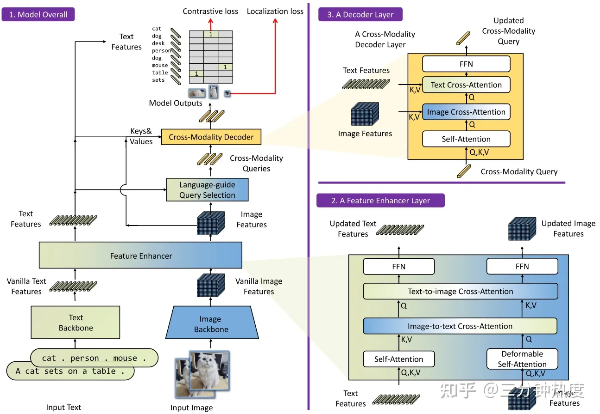


### SAM-track model

“Segment and Track Anything” 利用自动和交互式方法。主要使用的算法包括 SAM（Segment Anything Models）用于自动/交互式关键帧分割，以及 DeAOT（Decoupling features in Associating Objects with Transformers）（NeurIPS2022）用于高效的多目标跟踪和传播。SAM-Track 管道实现了 SAM 的动态自动检测和分割新物体，而 DeAOT 负责跟踪所有识别到的物体。

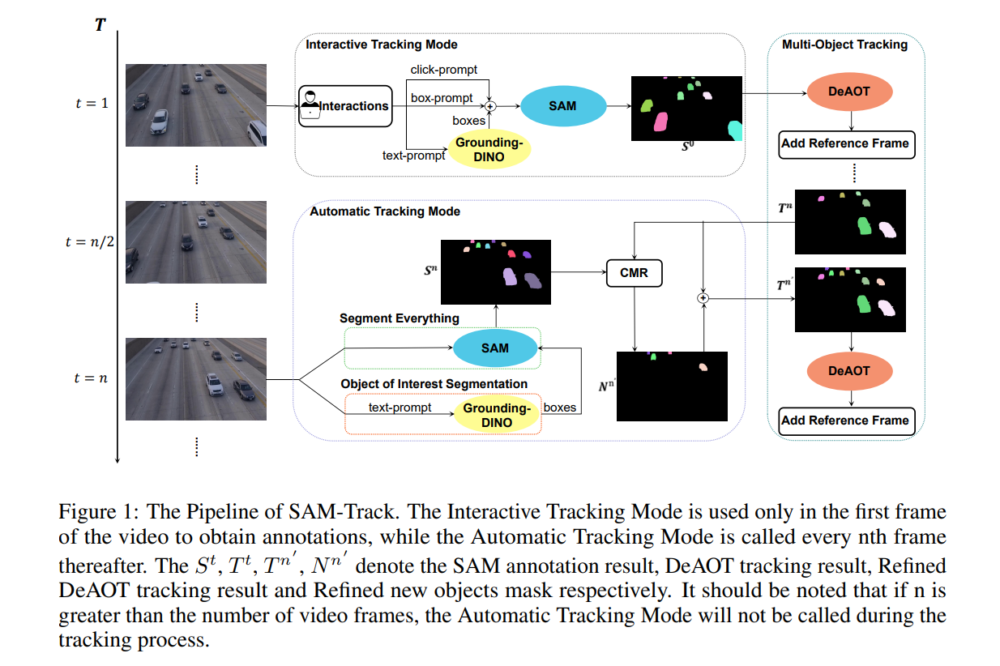

### AOT（associating objects with transformers）网络介绍

[[NIPS21\][CVPR21竞赛冠军] Associating Objects with Transformers for Video Object Segmentation - 知乎 (zhihu.com)](https://zhuanlan.zhihu.com/p/439643263)

DeAOT achieves promising results on various benchmarks. However, as a semi-supervised video segmentation model, DeAOT requires reference frame annotations for initialization, which limits its application.

半监督视频目标分割


## 1.25

### VILT 

vision transformer

把目标检测从视觉端移除？

用预训练的目标检测器去抽取视觉特征的时候会有很多局限性

视觉特征：patch embedding？

模态融合部分非常大

推理时间和训练时间复杂度？

模型推理过程

模型的推理时间指的是使用训练好的机器学习或深度学习模型进行实际预测或推断的时间。在模型训练之后，模型通常需要通过输入数据进行推理，即根据学到的规律或模式对新的未见过的数据进行预测或分类。

推理时间是衡量模型性能的一个重要指标，尤其是在实际应用中，对于需要快速响应的场景，推理时间的效率至关重要。推理时间的快慢受到多个因素的影响，包括但不限于：

1. **模型复杂度：** 复杂的模型通常需要更多的计算资源来执行推理，因此推理时间可能更长。
2. **硬件设备：** 推理时间与使用的硬件设备密切相关。GPU（图形处理单元）通常能够提供比 CPU 更快的推理速度，而专用的硬件加速器（如TPU、FPGA等）可能进一步提高推理性能。
3. **输入数据大小：** 处理更大规模的输入数据可能会增加推理时间，因为模型需要在更多的数据上执行计算。
4. **模型优化：** 通过模型剪枝、量化（Quantization）、深度学习加速库等技术，可以优化模型，减少推理时间。
5. **并发性：** 模型是否能够有效地利用并行计算能力也会影响推理时间。一些框架和库提供了多线程或分布式计算的支持，以提高并发性。

因此，模型的推理时间是在实际部署或使用过程中，模型处理输入数据所需的时间，直接关系到模型在实际应用中的实用性和性能。


CLIP是典型的双塔模型，特征

VE TE MI

VE:  Visual embedding

TE: Text embedding

MI: modality interaction

VQA,VR,VE


VQA（Visual Question Answering）、VR（Visual Reasoning）和VE（Visual Explanation）是三个涉及多模态（图像和文本）的任务，它们在计算机视觉和自然语言处理领域中有着不同的目标和侧重点。

1. **VQA（Visual Question Answering）：**
   - **概念：** VQA 是一种任务，旨在使计算机能够回答关于图像内容的自然语言问题。通常，输入是一张图像和一个与图像相关的问题，输出是该问题的自然语言答案。
   - **应用：** VQA 在图像理解、智能问答系统和视觉场景理解等领域具有广泛应用。它要求系统理解图像内容，理解问题，并生成相应的文本答案。
2. **VR（Visual Reasoning）：**
   - **概念：** VR 是一种任务，旨在通过对视觉场景进行推理来回答更为复杂的问题。与简单的问题答案不同，VR 要求模型通过对图像中的关系、场景和对象进行推理，更深层次地理解视觉信息。
   - **应用：** VR 的应用范围包括智能图像理解、决策支持系统等，要求系统不仅能够识别图像中的对象，还能够进行高级的推理和分析。
3. **VE（Visual Explanation）：**
   - **概念：** VE 是一种任务，旨在通过生成视觉解释来回答问题。除了提供简单的答案外，VE 要求系统生成图像或图形化的解释，以说明为什么给定的答案是正确的。
   - **应用：** VE 在教育、可解释性人工智能等领域具有应用潜力。通过生成解释，系统可以更好地与用户交互，并提高对模型决策的理解。

这些任务都涉及到图像和文本之间的跨模态理解和交互，要求计算机系统能够处理视觉信息和自然语言信息的复杂关系。这些任务在推动计算机视觉和自然语言处理交叉研究的发展，使计算机能够更全面地理解和处理多模态信息。


### ALBEF之前的论文总结：

视觉特征在图像处理中比文本特征要重要

模态融合部分也非常关键

Visual Encoder > Modality Interaction > Text Encoder

目标函数总结：

CLIP使用的 ITC  lost ：image text contrasting

（word patch alignment WPA lost训练起来非常慢）

masked laguage modeling ：MLM lost， 完形填空

image text matching lost： ITM lost


​                                                                       多模态大模型综述（插图）

### ALBEF : ALign BEfore Fuse:在融合文本和图像特征前就对齐特征

vision and language representation learning with momentum distillation

不需要使用bounding box annotation（锚框定位及标注）


momentum distilliation

momentum encoder

自训练模型

何恺明：[MAE(Masked Autoencoders) - 知乎 (zhihu.com)](https://zhuanlan.zhihu.com/p/446761025)
