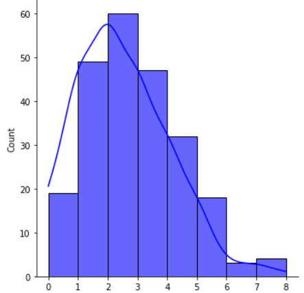
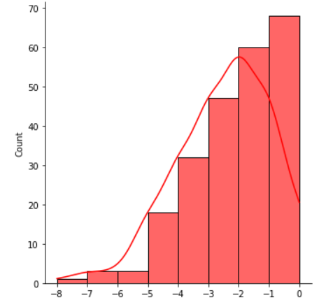

**1. 解释SVM的工作原理。**

SVM，全称支持向量机（Support Vector Machine），是一种有监督学习算法，主要用于解决数据挖掘或模式识别领域中的数据分类问题。

SVM的工作原理是建立一个最优决策超平面，使得该平面两侧距平面最近的两类样本之间的距离最大化，从而对分类问题提供良好的泛化力（推广能力）。这里的“支持向量”是指训练集中的某些训练点，这些点最靠近分类决策面，是最难分类的数据点。

SVM可以处理二类分类问题，也可以扩展到多类分类问题。在二类分类问题中，SVM寻找一个最优超平面，将两类样本分隔开。这个最优超平面需要满足间隔最大化的条件，即两侧距平面最近的两类样本之间的距离最大化。当训练样本线性可分时，通过硬间隔最大化，学习一个线性分类器，即线性可分支持向量机。当训练数据近似线性可分时，引入松弛变量，通过软间隔最大化，学习一个线性分类器，即线性支持向量机。当训练数据线性不可分时，通过使用核技巧及软间隔最大化，学习非线性支持向量机。

SVM使用核函数来处理非线性可分的情况。核函数的定义是K(x,y)=<ϕ(x),ϕ(y)>，即在特征空间的内积等于它们在原始样本空间中通过核函数K计算的结果。通过使用核函数，SVM可以将样本从原始空间映射到一个更高维的特征空间，使得样本在这个特征空间内线性可分。

**2. k-means和k-means++算法有什么区别？**

两者之间的唯一区别是初始化质心的方式。在k-means算法中，质心从给定点随机初始化。这种方法存在一个缺点，即有时这种随机初始化会导致非优化的聚类，这是由于两个聚类的初始化可能彼此接近。

为了解决这个问题，k-means++算法应运而生。在k-means++中，第一个质心从数据点中随机选择。后续质心的选择基于它们与初始质心的分离。一个点被选为下一个质心的概率与该点和已经被选择的最近质心之间的平方距离成比例。这保证了质心均匀地分散开，并降低了收敛到不理想聚类的可能性。这有助于算法达到全局最小值，而不是陷入局部最小值。

**3. 解释机器学习中常用的一些相似性度量。**

一些最常用的相似性度量如下：

- 余弦相似性-通过考虑n维的两个向量，我们计算两者之间夹角的余弦。该相似性度量的范围从[-1，1]变化，其中值1表示两个向量高度相似，而-1表示两个向量彼此完全不同。
- 欧几里得或曼哈顿距离-这两个值表示n维平面中两点之间的距离。两者之间的唯一区别在于两者的计算方式。
- Jaccard相似性-它也被称为IoU或Intersection over union，它广泛用于对象检测领域，以评估预测边界框和地面真实边界框之间的重叠。

**4. 当数据分布右偏和左偏时，均值、中位数和众数会发生什么变化？**

标准正态分布特征：均值=中位数=众数

左偏态特征：众数>中位数>均值

右偏态特征：均值>中位数>众数

右偏分布

左偏分布，

**5. 对于离群值，决策树和随机森林谁的鲁棒性更强。**

决策树和随机森林对离群值都相对稳健。随机森林模型是多个决策树的集成，因此，随机森林模型的输出是多个决策树的聚合。因此，当我们对结果进行平均时，过拟合的可能性就会降低。因此，我们可以说随机森林模型对离群值更具鲁棒性。

**6. L1正则化和L2正则化有什么区别？它们的意义是什么？**

L1正则化：在L1正则化中，也被称为Lasso正则化，其中我们在损失函数中添加模型权重的绝对值之和。

在L1正则化中，那些根本不重要的特征的权重被惩罚为零，因此，反过来，我们通过使用L1正则化技术来获得特征选择。

L2正则化：在L2正则化中，也称为岭正则化，我们将权重的平方添加到损失函数中。在这两种正则化方法中，权重都是不利的，但它们帮助实现的目标之间存在细微的差异。

在L2正则化中，权重不会被惩罚为0，但对于不相关的特征，它们接近于零。它通常用于通过将权重缩小到零来防止过拟合，特别是当有许多特征并且数据有噪声时。

**7. 什么是径向基函数？解释它的用途。**

RBF（径向基函数）是一种用于机器学习的实值函数，其值仅取决于输入和称为中心的固定点。径向基函数的公式如下：

机器学习系统经常将RBF函数用于各种函数，包括：

- RBF网络可以用来逼近复杂函数。通过训练网络的权重以适应一组输入输出对，
- RBF网络可以用于无监督学习来定位数据组。通过将RBF中心视为聚类中心，
- RBF网络可以用于分类任务，通过训练网络的权重，根据输入与RBF节点的距离将输入分组。

它是SVM算法中通常使用的非常著名的内核之一，用于将低维数据映射到高维平面，因此，我们可以确定一个边界，该边界可以将这些平面的不同区域中的类以尽可能多的余量分开。

**8. 解释用于处理数据不平衡的SMOTE方法。**

SMOTE是用来处理数据集中数据不平衡问题的方法之一。在这种方法中，基于现有的少数类，我们通过使用线性插值合成新的数据点。使用这种方法的优点是模型不会在相同的数据上进行训练。但是使用这种方法的缺点是它向数据集添加了不需要的噪声，并且可能对模型的性能产生负面影响。

**9. 准确率得分是否总是衡量分类模型性能的良好指标？**

不，有时候我们在不平衡的数据集上训练模型时，准确度分数并不是衡量模型性能的好指标。在这种情况下，我们使用查准率和查全率来衡量分类模型的性能。此外，f1-score是另一个可用于衡量性能的指标，但最终，f1-score也是使用精确度和召回率计算的，因为f1-score只是精确度和召回率的调和平均值。

**10. 什么是 KNN 插值填充？**

我们通常通过数据的描述性统计测量（如平均值、众数或中位数）来估算空值，但KNN 插值是一种更复杂的填补空值的方法。在该方法中还使用距离参数，其也被称为k参数。这项工作在某种程度上类似于聚类算法。缺失值是参照缺失值的邻域点进行插补的。

**11. 解释XGB模型的工作流程。**

XGB模型是机器学习集成技术的一个例子，在这种方法中，权重通过将它们传递到决策树来以顺序的方式进行优化。在每一遍之后，权重变得越来越好，因为每棵树都试图优化权重，最终，我们获得了手头问题的最佳权重。像正则化梯度和小批量梯度下降这样的技术已经被用来实现这个算法，所以它以非常快速和优化的方式工作。

**12. 将给定数据集拆分为训练和验证数据的目的是什么？**

主要目的是保留一些模型尚未训练的剩余数据，以便我们可以在训练后评估机器学习模型的性能。此外，有时我们使用验证数据集在多个先进的机器学习模型中进行选择。就像我们首先训练一些模型一样，比如LogisticRegression，XGBoost或任何其他模型，而不是使用验证数据测试它们的性能，并选择验证和训练精度之间差异较小的模型。

**13. 解释一些处理数据中缺失值的方法。**

处理缺失值的一些方法如下：

- 删除具有空值的行，可能会导致丢失一些重要信息。
- 如果列包含的信息价值很低，则删除包含空值的列。可能会导致丢失一些重要信息。
- 使用描述性统计测量（如平均值、众数和中位数）插补空值。
- 使用KNN 插值等方法以更复杂的方式估算空值。

**14. k-means和KNN算法有什么区别？**

k-means算法是用于聚类目的的流行的无监督机器学习算法之一。但KNN是一种通常用于分类任务的模型，是一种有监督的机器学习算法。k-means算法通过在数据集中形成聚类来帮助我们标记数据。

**15. 什么是LDA线性判别分析？**

LDA是一种有监督的机器学习降维技术，因为它也使用目标变量进行降维。它通常用于分类问题。LDA主要致力于两个目标：

- 最大化两个类的均值之间的距离。
- 最大限度地减少每个类中的差异。

**16. 如何在二维中可视化高维数据？**

最常用和有效的方法之一是使用t-SNE算法。该算法采用了一些非线性的复合形方法对给定的数据进行降维。我们还可以使用PCA或LDA将n维数据转换为2维，以便我们可以绘制它以获得更好的分析视觉效果。但是PCA和t-SNE之间的区别在于前者试图保持数据集的方差，而t-SNE试图保持数据集中的局部相似性。

**17. 维度灾难背后的原因是什么？**

随着输入数据的维度增加，概括或学习数据中存在的模式所需的数据量也增加。对于模型，很难从有限数量的数据集中识别每个特征的模式，或者我们可以说，由于数据的高维性和用于训练模型的有限数量的示例，权重没有得到适当的优化。由于这一点，在输入数据的维数达到一定的阈值后，我们不得不面对维数灾难。

**18. 度量MAE或MSE或RMSE， 哪个对离群值有更好的鲁棒性。**

在上述三个指标中，与MSE或RMSE相比，MAE对离群值具有鲁棒性。这背后的主要原因是因为平方误差值。在离群值的情况下，误差值已经很高，然后我们将其平方，这导致误差值的爆炸超过预期，并为梯度产生误导性结果。

**19. 为什么删除高度相关的特征被认为是一种良好的做法？**

当两个特征高度相关时，它们可能向模型提供类似的信息，这可能导致过拟合。如果数据集中存在高度相关的特征，那么它们不必要地增加了特征空间的维数，有时会产生维数灾难的问题。如果特征空间的维数很高，那么模型训练可能需要比预期更多的时间，这将增加模型的复杂性和出错的机会。这在某种程度上也有助于我们实现数据压缩，因为这些功能已经被删除，而没有太多的数据丢失。

**20. 推荐系统中基于内容的过滤算法和协同过滤算法有什么区别？**

  在一个基于内容的推荐系统中，内容和服务的相似性进行评估，然后通过使用这些相似性措施，从过去的数据，我们推荐产品给用户。但另一方面，在协同过滤中，我们根据相似用户的偏好推荐内容和服务。例如，如果一个用户过去已经使用了A和B服务，并且新用户已经使用了服务A，则将基于另一用户的偏好向他推荐服务A。