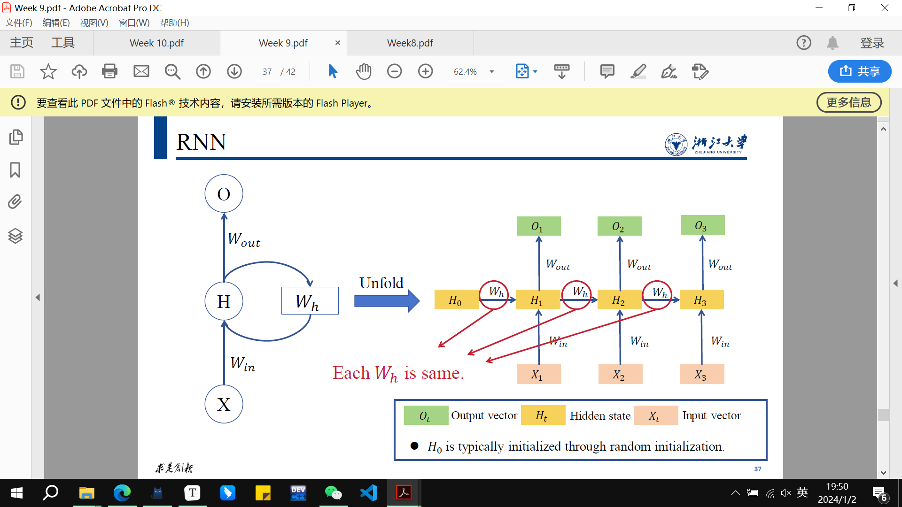

# notes for ZJU-AI-ML

## machine learning bullet points

## 期末主要考后四章？

第8章

[集成学习算法之Boosting - 知乎 (zhihu.com)](https://zhuanlan.zhihu.com/p/260959204)

[一文看懂决策树（Decision Tree） - 知乎 (zhihu.com)](https://zhuanlan.zhihu.com/p/133838427)

[【机器学习】Bootstrap详解 - 知乎 (zhihu.com)](https://zhuanlan.zhihu.com/p/24851814)

KMeans（K均值）和KNN（K最近邻）是两种不同的机器学习算法，它们在任务和实现上有很大的区别。

### KMeans（K均值）:

1. **任务**:
   - KMeans 是一种聚类算法，用于将数据分成K个不同的组或簇，使得每个数据点属于最近的簇中心。
   - 目标是最小化每个簇内的点与簇中心的平方距离之和。
2. **工作原理**:
   - 首先，选择K个初始簇中心。
   - 然后，将每个数据点分配到离它最近的簇中心。
   - 更新簇中心为分配给该簇的所有数据点的平均值。
   - 重复上述两个步骤，直到簇中心不再变化或变化很小。
3. **应用**:
   - KMeans 可用于图像压缩、文档聚类、无监督特征学习等。

### KNN（K最近邻）:

1. **任务**:
   - KNN 是一种分类和回归算法，用于根据最近邻居的标签对新数据进行分类或预测。
2. **工作原理**:
   - 对于给定的数据点，找到与其最近的K个训练数据点。
   - 对于分类，采用多数投票的原则确定该点的类别。
   - 对于回归，采用K个邻居的平均值来预测该点的值。
3. **应用**:
   - KNN 可用于模式识别、图像识别、推荐系统等。

### 区别:

1. **任务**:
   - KMeans 用于聚类，将数据分成K个簇。
   - KNN 用于分类和回归，根据最近邻居的标签对数据进行分类或预测。
2. **目标函数**:
   - KMeans 的目标是最小化簇内平方距离之和。
   - KNN 的目标是基于最近邻居进行分类或回归。
3. **监督/无监督**:
   - KMeans 是无监督学习，不需要类别标签。
   - KNN 既可以是监督学习也可以是无监督学习，具体取决于它是用于分类还是回归任务。
4. **输出**:
   - KMeans 输出是数据点所属的簇。
   - KNN 输出是分类标签（对于分类）或连续值（对于回归）。

总体而言，KMeans 和 KNN 是两种不同类型的算法，用于解决不同的问题。 KMeans 是一种无监督学习算法，用于聚类，而 KNN 通常用于监督学习中的分类和回归任务

监督学习和无监督学习是机器学习中两种不同类型的学习范式，它们之间的主要区别在于训练数据的标签信息。

### 监督学习（Supervised Learning）:

1. **定义**：
   - 在监督学习中，算法接收带有标签（类别或输出）的训练数据。
   - 每个训练样本都包括输入特征和相应的标签。
2. **任务**：
   - 监督学习的目标是学习一个从输入到输出的映射，以便在给定新输入时能够预测相应的输出标签。
   - 典型任务包括分类和回归。
3. **示例**：
   - 分类：预测输入数据属于哪个类别（例如，垃圾邮件分类）。
   - 回归：预测输入数据的数值输出（例如，房价预测）。
4. **训练数据**：
   - 训练数据包括输入-输出对，每个输入都有一个对应的输出标签。

### 无监督学习（Unsupervised Learning）:

1. **定义**：
   - 在无监督学习中，算法接收没有标签信息的训练数据。
   - 训练样本只包括输入特征，没有相应的输出标签。
2. **任务**：
   - 无监督学习的目标是探索数据的结构，发现数据中的模式和关系。
   - 典型任务包括聚类、降维和关联规则学习。
3. **示例**：
   - 聚类：将相似的数据点分组到同一类别中。
   - 降维：减少数据维度，保留关键特征。
   - 关联规则学习：发现数据中的关联性，例如购物篮分析。
4. **训练数据**：
   - 训练数据没有输出标签，算法试图从数据中学习隐藏的结构。

### 区别总结：

- **数据标签**：
  - 监督学习需要带有标签的训练数据。
  - 无监督学习使用没有标签的训练数据。
- **目标**：
  - 监督学习目标是预测输出标签。
  - 无监督学习目标是发现数据中的模式和结构。
- **任务**：
  - 监督学习任务包括分类和回归。
  - 无监督学习任务包括聚类、降维和关联规则学习。
- **示例**：
  - 监督学习示例包括图像分类、语音识别。
  - 无监督学习示例包括社交网络分析、信用卡欺诈检测。

无监督学习通常用于在数据中发现隐藏的结构，而监督学习则用于构建输入和输出之间的映射关系。这两者在解决不同类型的问题时发挥着重要的作用。

## LSTM

一步干四件事情：

输入新的输入信息和上一个状态的cell state和hidden state，输出hidden state和cell state

根据当前新的输入，选择从上个状态的cell state中要忘记的内容，

根据当前新的输入，选择从上个状态的cell state中要更新的内容

根据更新后的状态和当前新的输入，更新hidden state的内容

Softmax、ReLU（Rectified Linear Unit）、和Sigmoid是常用的激活函数，它们在深度学习中用于不同的场景。以下是它们的函数表达式和主要应用情形：

1. **Softmax函数：**
   - **函数表达式：** 
   - 给定一个向量$ z = [z_1, z_2, ..., z_k]$，Softmax函数将每个元素转化为非负且和为1的概率值。
     $ \text{Softmax}(z)_i = \frac{e^{z_i}}{\sum_{j=1}^{k} e^{z_j}} $
   - **应用情形：** 主要用于多类别分类问题的输出层。Softmax将模型的原始输出转化为类别概率分布，便于模型在训练时计算损失并进行梯度下降。
2. **ReLU函数：**
   - **函数表达式：**
   - ReLU激活函数将所有负输入设为零，保持正输入不变。
     ${ReLU}(x) = \max(0, x) $
   - **应用情形：** 用于隐藏层的激活函数。ReLU的非线性特性使得模型能够学习更复杂的表示，同时避免了梯度消失问题。
3. **Sigmoid函数：**
   - **函数表达式：** 
   - Sigmoid函数将输入映射到一个取值范围在0到1之间的概率值。
     ${Sigmoid}(x) = \frac{1}{1 + e^{-x}} $
   - **应用情形：** 主要用于二元分类问题的输出层。Sigmoid将模型的原始输出映射为0到1之间的概率，方便进行二元分类的阈值判定。

这些激活函数的选择通常取决于任务的性质和网络的结构。一般而言，Softmax适用于多类别分类，ReLU适用于隐藏层以增加模型的非线性表达能力，而Sigmoid适用于二元分类。

week 9 

word embedding 词嵌入

Convert words into numerical form (e.g., vector).
例如，Embed words into a mathematical space.

one-hot编码的优点和缺点：维度太高，无法表征相似（靠近）程度

distributional representation 分布式表示方法

distributional hypothesis指出，应该用这个词所处的语境来生成词向量

word2vec is used for distributional representation

inference based methods：在自然语言处理（NLP）中，skip-gram和CBOW（Continuous Bag of Words）是两种用于学习词向量表示的模型，它们被称为“inference based methods”（基于推理的方法）的原因主要与它们的训练目标和方法有关。

这两种模型都是基于推断（inference）的方法，因为它们的核心目标是通过观察词汇之间的上下文关系来推断每个词的词向量表示。具体而言：

1. **Skip-gram模型：** 在skip-gram中，模型试图从给定的中心词预测其周围的上下文词。这就好像模型在推断中心词的上下文信息。因此，skip-gram是一种基于上下文推断的方法。
2. **CBOW模型：** 与skip-gram相反，CBOW试图从周围的上下文词预测中心词。CBOW将上下文中的词汇信息结合起来，试图推断中心词。因此，CBOW也是一种基于上下文推断的方法，只是它关注的是中心词。

这两种方法之所以被称为“inference based methods”，是因为它们的核心任务是从给定的上下文信息中推断单词的表示。这与一些其他方法，如计数方法（count-based methods）不同，后者主要关注的是统计词汇的共现信息而不是直接推断词向量。

总的来说，skip-gram和CBOW模型被称为基于推理的方法，因为它们通过观察上下文关系来推断词汇的语义表示，从而实现更好的词向量学习。

### Continuous bag-of-words model(CBOW model)

Predict one word (target word) from multiple words (context).
The convergence rate is fast.
The distributional representation (word vector) is relatively inferior.

### Skip-gram model

Predict multiple words (context) from one word (target word).
The convergence rate is slow.
The distributional representation (word vector) is relatively superior.

CBOW（Continuous Bag of Words）和Skip-gram是自然语言处理（NLP）中用于生成词向量的两种流行模型。关于CBOW的词向量相对较差的说法可能受到一些因素的影响，但需要注意的是，这些模型的性能可能取决于具体的任务、数据集和训练参数。

以下是CBOW的词向量在某些情境下被认为相对较差的一些原因：

1. **上下文过度简化：** CBOW倾向于对窗口内的上下文词求平均，以预测目标词。这可能导致在处理多义词（具有多个含义的词）或捕捉含义微妙差异时，表征相对过于简化。
2. **丢失词序信息：** CBOW忽略了上下文窗口内的词序，因为它将上下文词视为无序集合。这可能导致顺序信息的丢失，而这对某些任务可能至关重要。
3. **对频繁词汇的优势：** CBOW在语料库中频繁出现的词汇上表现较好，因为在训练过程中它对它们进行了优先考虑。然而，对于稀有词汇或特定词汇关系的捕捉效果可能不够显著。
4. **上下文窗口大小：** 在CBOW中，上下文窗口大小的选择会影响词向量的质量。窗口太小可能无法捕捉足够的上下文信息，而窗口太大可能引入噪声。
5. **任务特定性能：** 对相对较差的看法可能是与具体任务有关的。对于某些NLP任务，Skip-gram或其他嵌入模型可能在性能上优于CBOW。

值得注意的是，在CBOW和Skip-gram之间的选择通常取决于数据集的具体特性以及下游任务的需求。在实践中，研究人员和从业者可能会尝试使用这两种模型，以确定哪种模型更适合其特定的用例。此外，诸如基于Transformer的更近期的词向量模型等技术的进步在各种NLP应用中超越了传统方法，如CBOW和Skip-gram。

"RNN能够Correlate temporal information" 表示循环神经网络（Recurrent Neural Network，RNN）能够关联或捕捉时间上的信息。在这种上下文中，"temporal information" 指的是与时间相关的数据、模式或序列。

RNN是一种具有循环结构的神经网络，它在处理序列数据时表现出色。这意味着它能够考虑先前的时间步信息，从而更好地理解和预测序列中的模式。RNN的循环结构允许信息在网络中传递，使得网络能够捕捉和利用时间上的依赖关系。

具体而言，RNN中的隐藏状态允许网络在处理序列时保留过去的信息，并在当前时间步使用。这种机制使得RNN能够关联不同时间步的输入，从而更好地理解序列中的动态模式。这样，RNN就能够在处理时间序列数据时有效地"correlate temporal information"，也就是关联或捕捉时间上的信息。

然而，传统的RNN在处理长序列时可能会面临梯度消失或梯度爆炸的问题，为了解决这一问题，一些改进的结构，如长短时记忆网络（LSTM）和门控循环单元（GRU）等，被提出来以更有效地捕捉和利用时间信息。这些改进的结构在处理长期依赖性时表现更好。

Large models, especially those based on transformer architectures like OpenAI's GPT-3, have shown significant advancements in various natural language processing (NLP) and machine learning tasks. These models are known for their ability to capture complex patterns in data, generate coherent and contextually relevant outputs, and achieve state-of-the-art performance in multiple benchmarks.

Here are some considerations regarding the future of large models:

1. **Increased Model Size:** There is a trend of increasing model sizes to improve performance. Researchers continue to explore even larger models with more parameters to push the boundaries of what's possible in terms of understanding and generating natural language.

2. **Broader Applicability:** Large models are being adapted and fine-tuned for a broader range of tasks beyond NLP, including computer vision, reinforcement learning, and more. This trend may continue as researchers aim to develop models with general intelligence.

3. **Resource Intensiveness:** Training and deploying large models require substantial computational resources, which may limit accessibility. Future developments might focus on making these models more efficient and accessible, allowing a wider range of researchers and applications to benefit from them.

4. **Ethical Considerations:** As large models become more powerful, there's a growing need to address ethical concerns, including issues related to biases in training data, potential misuse, and the environmental impact of training such models.

5. **Hybrid Models:** Future research might explore hybrid models that combine the strengths of large pre-trained models with more task-specific architectures. This approach could enhance efficiency and performance for specific applications.

   agents

6. **Explainability:** There is a growing demand for models that not only perform well but also provide interpretable and explainable results. Future developments may involve designing large models that are more transparent and easier to interpret.

It's important to note that the field of machine learning is dynamic, and new developments may occur beyond my last update. The future of large models will likely depend on ongoing research, technological advancements, and societal considerations.

贝叶斯分类器：

训练样本为     特征  对应   分类

需要预测的是：某特征x下对应的分类y,求出最大可能性的y，argmax p(y|x)

训练方法是：