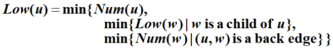
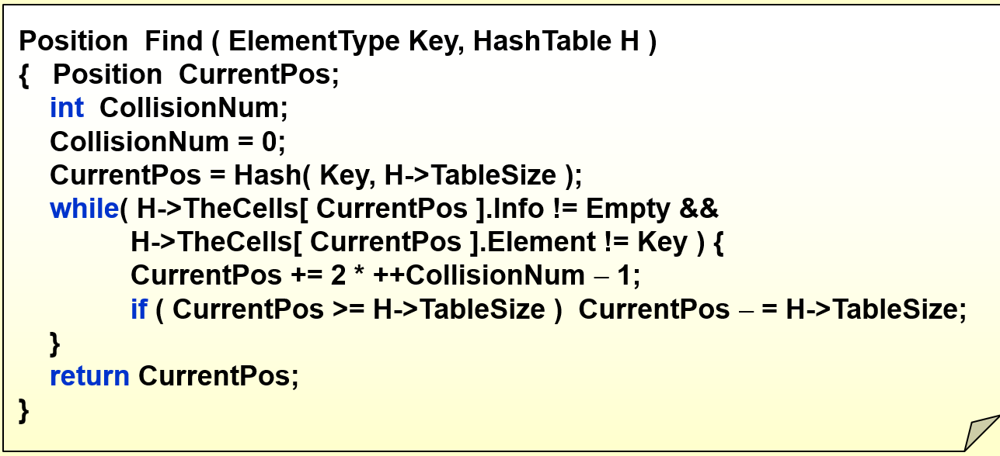

# FDS final exam


程序填空：排序

编程题：图，树

## 背答案没用 要理解 现推

## 基础的能够实现

## ppt(书)>作业,lab做过的题>刷新题

## ppt的每一个角落

1. mergesort 
2. shellsort
3. 四种树遍历非递归实现
4. 并查集 path compression，union find，根据实现看定义
5. 
6. 

# 1.算法分析

1.O(N)是上界，Ω(N)为下界，Θ(N)为常数倍

2.注意循环的条件，以及N^2^还是N^N^，还是N*N

比较 $N^{1.5}和NlogN$


# 2.列表

1.链表中的二分法复杂度大于O(NlogN)

2.sequentially stored linear list这个是顺序存储的线性表，就是和数组差不多，不是链表。链表：linked list

## multilists

## polynomial adt

链表相关操作，考填空

# 3.栈和队列

array implementation of stack

非递归实现，写一写

topological sort 指定使用stack实现

balancing symbol

模拟入栈，出栈序列

infix   inorder traversal的非递归实现

1.prefix和infix和postfix是树的三种遍历方式，变量在叶子结点，而运算符号在非叶子结点。

index->postfix:遇到字母直接输出，遇到符号：要求栈顶的优先级是最高的，如果不能满足，就出栈，直到满足为止。然后该符号入栈。

括号的优先级栈外最高，栈内最低。遇到右括号，出栈直到左括号

2.问不可能的弹出序列，问栈至少多大，都模拟一下栈即可。注意出栈以后可以在该元素的旁边写数字表示入栈，不是在上方。

3.Circle queue:出入队列操作以后，有可能出现尾节点小于头节点的情况。但是它们之间的差不会大于n。尾节点其实是n+尾节点的位置。因此计算个数的时候就加回去。

Circle queue最多可以容纳的元素是数组的大小-1个元素。

circlular queue？装满，满和空是无法区分的？

# 4.树

how to convert general tree into binary tree

expression tree evaluation

preorder和postorder在完全二叉树情况下可以建树

inorder序列must/may 

## 1.树的深度优先遍历：

a.将当前结点的左结点压入栈，直到没有左节点。

b.弹出一个点，将这个点的右节点压入栈，

c.重复b直到遍历完成

## 2.树的广度优先遍历：

a.当前结点所有孩子入队列。

b.弹出一个，将孩子入队列，直到队列空

## 3.有关树的计算：

已知degree为1，2的点有几个这种，需要用公式：$∑degree=2e$，但是degree定义不同，需要+1,求和后需要-1，因为根节点没有父节点。

如果有两个degree的点个数不知道，直接当作0就可以。必须能够约掉，否则算不出来。

（与叶节点相关的计算）

## 4.前中后层序遍历及互相转化，根据任意两个序列还原整棵树


# 5.搜索树

给一个序列。把bst建出来

construct BST recursively

节点下标关系

建堆

建并查集return s[x]=find(s[x],S)


## 1.根据形态还原树

## 2.插入、删除

insertion deletion

## 3.有关二叉树的遍历：

T(N)=2T(N/2)+1，解一下是O(N)

后序遍历：必须最后一个是根，前面必须有一个序列完全小于根，后面一个序列完全大于根。然后再在子序列里找。

## 3.已知BST节点个数，求孩子个数：

节点为$1 + 2 + 2 2 + . . . 2 k + m = 2 k + 1 − 1 + m = n 1+2+2^2+...2^k+m=2^{k+1}-1+m=n1+2+2 
2
 +...2 
k
 +m=2 
k+1
 −1+m=n$

m是最下面一层的孩子。最下面一层的孩子的的一半+完整的k阶二叉树的孩子个数就是总孩子个数。

4.二叉树最方便的方法就是画一个特例验证

5.二叉搜索树不一定是完全的，因此和二分查找是不一样的。二分查找相当于在完全二叉树里找

6.二叉搜索的时间复杂度为：T(N)=T(N/2)+1，如果不是二分，则是N/K,但是复杂度还是O(NlogN)

7.二叉树7,9同级，则8一定共同的祖先，但是不一定是共同的父结点。

# 6.堆

下标问题：从0开始还是从1开始

heapsort从1开始的

下标性质比较重要

1.建堆是从低N/2个元素开始，一个一个往前走，每个执行precdown。precdown是指将该结点和最小的孩子比较，如果大于最小的孩子，则交换，直到小于所有的孩子。

2.建堆最大比较2N-2次

### 1. 第一个叶子节点的序号是多少

### 2.大根堆和小根堆的线性转化方式

### 3.根节点和叶子节点下标线性表示计算

### 4.模拟建堆


# 7.并查集

复杂度是多少

union-by-size 因为每个节点

$O(log_2N+1)$

- **[Lemma]** Let T be a tree created by union-by-size with N nodes, then $height(T)\leq\lfloor\log_2N\rfloor+1$.

  Proved by induction. Each element can have its set name changed at most $\log_2N$ times.

- **Time complexity** of $N$ Union and $M$ Find operations is now $O(N+M\log_2N)$.

N union and M find (M>N):对于有path compression和union by rank的算法，


$T(M,N)=M\alpha(M,N)=Mlog^*(N)$

kruskal为什么是ElogE

akammen

# 8.图和拓扑排序

## 邻接表和邻接矩阵，怎么看入度出度多少

横着看竖着看

## adjacency multilists？

## AOE和AOV的变换

## 定义

边（Edge）

顶点（Vertex）

度：相连边的个数，不同与树的子节点数（少 1）。

$∑ d e g r e e = 2 e$是对所有的图都成立，和是否联通没有关系

## 表示

二维数组：表示边的方向、权。

无向：使用单一数组，多重链表（共用存储，用多链串起每个元素）

有向：邻接链表，十字链表（共用存储，分别用两链串起出入）

关键信息在顶点（AOV，Activity On Vertex）

### 邻接结构：多重邻接？

## 拓扑排序：如何确认图中是否有环？


# 9 最短路和网络流

## 无权图最短路：BFS

单源最短路问题，即选出一个原点，其他所有点到这个原点的最小距离，并找出获得这个最小距离需要走哪条路

两种BFS求无权图最短路的写法，一种是外面一个遍历所有节点的循环，维护一个curdist变量对每个点都判断，若距离=curdist，则更新与该节点相邻的所有节点的dist为curdist+1，如果图退化为线性的则复杂度为$O(N^2)$

一种维护了一个队列，也就是**BFS最经典的结构**，先将原点入队，......直到队空，复杂度降为$O(|V|+|E|)$

## 有权图最短路：dijkstra

每次在unknown的节点中找一个dist最小的节点加入known数组中，更新与之相邻的所有节点的dist，当所有节点都在known中时终止

有很多更新动作：走一条跳数更多的路径可能最后更短

每次找dist的动作：线性扫描 复杂度为$O(|V^2|+|E|)$, 对稠密图好，由于$V<E<V^2$

邻接矩阵，邻接表实现，复杂度

维护堆：

- 堆优化

- Keep distances in a priority queue and call `DeleteMin` to find the smallest unknown distance vertex.——$O(\log|V|)$

- 更新的处理方法

  - **Method 1** : `DecreaseKey`——$O(\log|V|)$

    $T=O(|V|\log|V|+|E|\log|V|)=O(|E|\log|V|)$

  - **Method 2** : insert W with updated Dist into the priority queue

    Must keep doing `DeleteMin` until an unknown vertex emerges

    $T=O(|E|\log|V|)$ but requires $|E|$ `DeleteMin` with `|E|` space

- Good if the graph is sparse

## 有负权边时计算最短路的算法

复杂度：$O(|V|×|E|)$?

combine the update move of weighted graph and the queue of unweighted

循环V-1轮，遍历每条边E，看看对于已经访问过的节点（dist!=INT_MAX）是否能继续更新与之相邻节点的dist

V-1轮对于遍历每条边更新是肯定够的，就算是考虑退化为一条单链表，也只需要V-1次

判断有负权环的条件是，如果在第V-1次迭代后，还能继续松弛，则说明有负权环

使用队列实现，对于出现了更新的顶点，都将其入队，每个顶点最多入队V次，而非发现时的一次，使用邻接表时复杂度为$O(|V|×|E|)$，比dijkstra的$O(|E|\log|V|)$高非常多

任意顶点第V+1出队时终止while循环

## AOE 要求是无环图，能够使用两次拓扑排序

activity on edges，边是重点动作，顶点只是指示该动作完成了，像一个检查点

拓扑排序复杂度：$O(|E|+|V|)$

从v到w的边<v,w>的松弛度：$LC[w]-EC[v]-C_{w,v}$

由松弛时间（**slack time**）==0的路径构成的通路为critical path

在AOE网络中有一个源头顶点和目的顶点。 从源头顶点开始，执行各边上事件的行动，到目的顶点完成为止，所需的时间为所有事件完成的时间总花费。 AOE完成所需的时间是由**一条或数条关键路径**（Critical Path）所控制的。 所谓关键路径，就是AOE有向图从源头顶点到目的顶点之间，所需花费时间最长的一条有方向性的路径。 当有一条以上的路径时间相等并且都是最长，则这些路径都称为此AOE有向图的关键路径。

## All-Pairs Shortest Path Problem

The all-pairs shortest path problem is the determination of the shortest graph distances between every pair of vertices in a given graph. The problem can be solved using V applications of **Dijkstra's algorithm** or all at once using the Floyd-Warshall algorithm.

Dijkstra算法重复用V次可达$O(∣V∣^3 )$，优先级队列实现的话可以简化至$O(|V|×|E|×log|V|)$，

对于稀疏图比较好

```c
warshallFloyd() //1起点数组，对于稠密图比较好
	for k = 1 to |V|
		for i = 1 to |V|
			for j = 1 to |V|
				A[i][j] = min(A[i][j], A[i][k] + A[k][j])
```

## 网络流

手动算网络流要小心：模拟最大流，计算残余网络（residual graph）

过程： Gf是最终流的情况，Gr是剩余容量的情况，开始Gf=0，Gr=原图

1. 在Gr图中找出任意一条增长通路（使用无权最短路算法）
2. 选取这条路上的最小流量，在Gr中减去这条边，并加上等大小的反向边
3. 更新Gr，去除0流量的边


注意是在残余网络中添加反方向的边

#### Analysis

- An augmenting path can be found by an unweighted shortest path algorithm.

- $T=O(f×|E|)$ where $f$ is the maximum flow.

- **Always choose the augmenting path that allows the largest increase in flow**

  - 对Dijkstra算法进行单线(single-line)修改来寻找增长通路
  - $cap_{max}$为最大边容量
  - $O(|E|\log cap_{max})$条增长通路将足以找到最大流，对于增长通路的每次计算需要$O(|E|\log|V|)$时间

  $$
  T=T_{augmentation}\times T_{find\_a\_path}\\
  =O(|E|\log cap_{max})\times O(|E|\log|V|)\\
  =O(|E|^2\log|V|\log cap_{max})\\
  dijkstra算法，邻接表+堆的实现复杂度为O(|E|log|V|)
  $$

- **Always choose the augmenting path that has the least number of edges**

  - 使用无权最短路算法来寻找增长路径

  $$
  T=T_{augmentation}\times T_{find\_a\_path}\\
  =O(|E||V|)\times O(|E|)\\
  =O(|E|^2|V|)
  $$

>Note : 
>
>- If every $v \notin \{ s, t \}$ has either a single incoming edge of capacity 1 or a single outgoing edge of capacity 1, then time bound is reduced to $O( |E| |V|^{1/2} )$.
>- The **min-cost flow** problem is to find, among all maximum flows, the one flow of minimum cost provided that each edge has a cost per unit of flow.

# 10.最小生成树

kruskal 使用并查集？

prim和kruskal $|E|log|V|， Elog|E|？$，

## 最小生成树

n 节点连通且无回路：n-1 条边

### Prim 算法（点扩展）：适合稠密图

由某点开始扩展树，选取最小路径，类 Dijkstra

### Kruskal 算法（边加入）：适合

将边从小到大排序，每次取出最小边，不构成回路则放入。使用事先排序或堆。使用并查集优化环路判别


## 1.找一下特殊的情况，比如3个点的情况？

## 2.判定最小生成树是否唯一：

权值相同的必须都添加（不能构成环）

1.对图中的每一条边，扫描其他边，如果存在相同权值的边，则对此边做标记。

2.然后使用Kruskal（或者prim）算法求出最小生成树。

3.如果这时候的最小生成树没有包含未被标记的边，即可判定最小生成树唯一。如果包含了标记的边，那么依次去掉这些边，再求最小生成树，如果求得的最小生成树的权值和原来的最小生成树的权值相同，即可判断最小生成树不唯一。


# 11.DFS及其应用

递归，访问所有未标记已访问的相邻顶点

遍历非连通图：对每个节点，若未标记已访问，调用深度优先遍历。可由此获得 Component 数

为获得唯一顺序，考试将使用图的具体表示进行考察

## DAG(有向无环): 

## 求强连通分量的个数

## 双连通->桥点（针对图的种类不同？）

## 双连通问题

articulation point 判断：



1. 根节点有两个子节点，则一定是关节点

2. 不是根节点的点，至少有一个叶子节点，且不能够往下通过背向边（back edge)回到父亲

   

## 欧拉回路问题  特殊路径：欧拉路径和Hamilton路径

一笔画问题（边不重复）

欧拉遍历：不重复遍历所有边，要求图有两个节点度奇数，则从一奇数回到另一奇数

欧拉回路：不重复遍历所有边并回到起点，要求所有节点度为偶数。

其他：哈密顿回路（点不重复）

优先考虑是否是联通的。比如成环的一定是强联通，但是不联通的就错。如果边的度数为偶，但是没说是联通图，则不是欧拉图

# 12.排序

shell sort's increment 的决定因素

shell’s increments 

shell 增量：**for** **( Increment = N / 2; Increment > 0; Increment /= 2 )** 


最差$O(N^2)$,平均$O(nlogn)$

**hibbard 增量** $h_k=2^k-1$最差$O(N^{3/2})$,平均$O(N^{5/4})$

**sedgewick 增量** 最差 $O(N^{4/3})$,平均$O(N^{7/6})$

堆排序不用外部维护，可以原地排序，mergesort是唯一外部排序

1.排序复杂度：

归并：归并：O(N)，总复杂度：O(NlogN)

快排：平均和一般情况：O(BNlogN)，最坏O(N^2)

堆排：O(NlogN)


插入：O(N^2)

桶排：O(N+M)，M为桶数

所有排序最坏情况必须为O(N)

2.Heap和quick不用额外空间，Merge需要O(N)空间,外部排序


通常需要$O(N)$复杂度的额外空间

During the sorting, processing every element which is not yet at its final position is called a "run". Which of the following cannot be the result after the second run of quicksort?
A.5, 2, 16, 12, 28, 60, 32, 72

B.2, 16, 5, 28, 12, 60, 32, 72

C.2, 12, 16, 5, 28, 32, 72, 60

D.5, 2, 12, 28, 16, 32, 72, 60

每一个run可以确定一个pivot的位置，两次递归可以确定1+2=3个。

但是要注意，如果在末尾的pivot使得递归只在之前进行，所以也可以

## 操作方法，对应专有名词

## insertion sort

## shell sort

## merge sort

## quick sort

## bucket sort


# 13.哈希表

loading factor？

loading density

probing methods

collision / overflow

如果冲突太多还不如树，树至少有logN

double hashing 和 rehashing是不一样

模拟哈希

冲突处理

## 散列函数

字符串：转换为 32 进制整数，与散列表大小取模。




如果是empty，则key没有定义，先判断会出错。

假设探测步数i不超过TS/2+1步，即假设表<50%。这时CurrentPos+2i-1 <= 2TS-1，所以可以用减法。

## 冲突解决

1. 分离连接法（桶）

2. 开放地址法

线性探测：线性向下查找空位。

二次探测：

必须tablesize=prime，使用二次探测，则

解决查找不存在映射的效率，因不成功搜索需要查找至空位，而平方可较快地避开聚集。

在删除时需要使用标记，使得查找可以在标记位置继续，而插入也可以正常工作。

# 14.历年题错题

2021-2022

quicksort shellsort 的步长

double hashing和quadratic probing的关系

kruskal


# 15.坑

二叉查找树子树所有元素对父节点大小关系均相同，因此判断是否为二叉查找序列可按顺序更新允许的最小值和最大值。

堆排序使用最大堆。

快速排序空间复杂度非 O(1)，而是堆栈引入的 O(NlogN)~O(N)。

由广度优先遍历构建二叉树：寻找根（前序前，后序后），确定两子树，递归。

由元素构建二叉查找树：按图形确定树根和两子树，递归。

单向列表导致尾部不能直接删除

入/出堆栈/队列须判断空/满

队列 Front 可指在队列头前一以使当 Front Rear 重合时队列为满

中缀表达式转后缀表达式，数字直接输出，符号:当已知符号优先级大于等于当前符号已知出栈，之后当前符号入栈。括号处理：左括号在栈外优先级最高（直接入栈），在栈内优先级最低（不出栈），只在遇到右括号时弹出。

二叉树:n0=n2+1，叶子数为双儿子父亲数加一。

二叉查找树插入、删除实现使用返回值式递归，函数总是返回参数节点的元素（可能改变），调用者将该节点用返回值覆盖。

d堆：父节点位于 [(i + d − 2) / d]，儿子节点在 (i − 1)d + 2, ..., id + 1.

森林：根节点右兄弟为其他根节点

开放地址法二次探测要求表大小为素数且最多有 \[表的大小/2] （向下取整）个位置被占用。

DAG：Directed Acyclic Graph

无环连通图为树

稳定性
稳定的排序
冒泡排序 O(n2)
插入排序 O(n2)
桶排序 O(n);需要O(k)额外空间
归并排序 O(n log n);需要O(n)额外空间
原地归并排序 O(n2)
基数排序 O(n·k);需要O(n)额外空间

不稳定的排序
选择排序 O(n2)
希尔排序（shell sort）—O(n log2 n)如果使用最佳的现在版本
堆排序（heap sort）—O(n log n)
快速排序（quick sort）—O(n log n)期望时间, O(n2)最坏情况;对于大的、乱数列表一般相信是最快的已知排序

平均时间复杂度由高到低为：
冒泡排序O(n2)
选择排序O(n2)
插入排序O(n2)
希尔排序O(n1.25)
堆排序O(n log n)
归并排序O(n log n)
快速排序O(n log n)
基数排序O(n)
