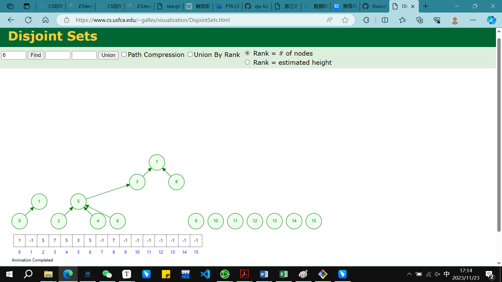
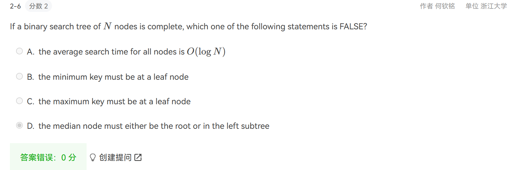

# midterm

## 1.易错复杂度分析

1. 建堆（不是一个个插入）的算法：$O(N)$：对i=n/2到1的所有节点都pecolate down

   原因：对于高度为h，有$2^{h+1}-1$个节点的完全二叉树，节点的高度之和为$2^{h+1}-h-1$

2. **N union + M find**  $O(N+Mlog_2N)$  union by size,因为find大于等于union

3. 循环链表  To delete `p` from a doubly linked list, we must do: 

   `p->prior->next = p->next;p->next->prior=p->prior`

4. 链表 增、删$O(1)$,查$O(N)$  （有序）数组增、删$O(N)$,查$O(1)$

指针比较多，注意调试不要打印或者访问NULL的某个属性，避免越界等段错误

因此所有的find percolate insert都先判断是否为NULL节点，再访问节点的left/right

堆下标从1开始

## 2.堆

**从二叉树中删除节点：**

先找到元素，找到NULL则说明要删除的元素不存在

再看有几个子节点，若0或1个则直接替换（用Null）替换也可

若有两个则用左子树中的**最大节点或右子树中最小的节点替换**，替换过程中只先改变根节点的数值，再执行delete那个底下的重复节点

**插入新元素**

插在最后，向上percolate,注意percolate up自然是不用比较大小的，down需要比较大小

!!! percolate

```c
void PercolateUp(int p, PriorityQueue H)
{
    int i;
    for (i = p; i > 1;){
        if( H->Elements[i / 2] > H->Elements[i]){
             ElementType temp = H->Elements[i/2];
             H->Elements[i/2] = H->Elements[i];
             H->Elements[i] = temp;
              i = i/2;
        }
        else break;
    }
}
void PercolateDown(int p, PriorityQueue H)
{
    int i, Child;
    for (i = p; i * 2 <= H->Size; i = Child)
    {
        Child = i * 2;
        if (Child != H->Size && H->Elements[Child + 1] < H->Elements[Child])
            Child++;
        if (H->Elements[i] > H->Elements[Child]){
             ElementType temp = H->Elements[Child];
             H->Elements[Child] = H->Elements[i];
             H->Elements[i] = temp;
        }
    }
}
```

**弹出最小值（DeleteMin）并维护堆的性质：**

用最后一个元素替换堆顶元素，并进行minHeapify

**minHeapify**过程，就是percolate down的过程

递归传递的参数为堆指针和当前节点的下标i，首先计算出左右节点下标（2i，2i+1），比较左右节点选出较小值与根节点交换，递归持续进行到越界或最小值就是i结束。

## 3.栈、队列

## 


## 4.链表

```c
List Reverse( List L ){
    //原地翻转链表，不申请新的空间，只需要一个临时变量，一个指针
    Position p = L->Next; //p用于保存当前节点
    if(p==NULL)return L; //如果链表为空，直接返回
    Position q = p->Next; //q用于保存p的下一个节点，防止断链
    Position temp; //temp用于保存q的下一个节点，防止断链
    p->Next = NULL; //将头节点的next置空，否则会出现循环链表
    while(q!=NULL){
        temp = q->Next;
        q->Next = p;
        p = q;
        q = temp;
    }
    L->Next = p;
    return L;
}
```

## 5.并查集：

### naive implementaion:

```c
union(r1,r2):
	S[r2]=r1  //将r2指向r1
//问题：r1,r2必须都是root,因此在执行上面之前要先find
=> union(find(node1),find(node2))
```

最坏情况复杂度达到$O(N^2)$!!!!

### union-by-size:总是使较小的树成为较大的树的子树

- **[Lemma]** Let T be a tree created by union-by-size with N nodes, then $height(T)\leq\lfloor\log_2N\rfloor+1$.

  Proved by induction. Each element can have its set name changed at most $\log_2N$ times.

- **Time complexity** of $N$ Union and $M$ Find operations is now $O(N+M\log_2N)$.

- **原因**：被链接的树的大小至少翻倍

```c
/* Assumes Rootl and Root2 are roots*/
void SetUnion(DisjSet S, SetType Root1, SetType Root2)
{
    if (S[Root1] <= S[Root2])
    {
        S[Root1] += S[Root2];
        S[Root2] = Root1;
    }
    else
    {
        S[Root2] += S[Root1];
        S[Root1] = Root2;
    }
}
```

### union-by-height：只有当两颗相同深度的树合并时才要求增加树的深度?

- Always change the shallow tree
- 保证所有的树的深度最多是$O(logN)$

使用S[root]保存树的深度的相反数，都是负数，绝对值越大越深

```c
/* Assumes Rootl and Root2 are roots*/
void SetUnion(DisjSet S, SetType Root1, SetType Root2)
{
	if ( S[Root2] < S[Root1])  /*Root2 is deeper set*/
		S[Root1] = Root2;      /*Make Root2 new root*/
	else
	{
		if (S[Root1] == S[Root2])  /*Same height*/
			S[Root1]--;
		S[Root2] = Root1;
	}
}
```

### find with path-compression akamen-algorithm

普通的find

```c
SetType Find(ElementType X, DisjSet S)
{
	for ( ; S[X]>0; X=S[X]);
	return X;
}
```

带路径压缩的find：

```c
SetType Find( ElementType X, DisjSet S )
{
    if ( S[ X ] <= 0 )    
    	return X;
    else 
    	return S[ X ] = Find( S[ X ], S );
}
```

这两种是一样的

```c
int find_parent(ptr_disjset S, int x)
{
    // find with path compression
    if (x == S->parent[x])
        return x;
    else
    {
        S->parent[x] = find_parent(S, S->parent[x]);
        return S->parent[x];
    }
}
```

递归改写为迭代形式的find，相当于遍历两遍

```c
SetType Find( ElementType X, DisjSet S )
{   
	ElementType root, trail, lead;
    for ( root = X; S[ root ] > 0; root = S[ root ] );  /* find the root */
    for ( trail = X; trail != root; trail = lead )
    {
    	lead = S[ trail ];   
    	S[ trail ] = root;   
    }  /* collapsing */
    return root;
}
```

## 6.树：二叉树，搜索树

### zigzagging on a tree


```c
sample input:
8
12 11 20 17 1 15 8 5  左中右 中序  
12 20 17 11 15 8 5 1  左右中 后序  后序的最后一个节点为根节点
```

```c
sample output:
1 11 5 8 17 12 20 15
```


```c
#include <stdio.h>
#include <string.h>
#include <stdlib.h>
#define MAX_NODE_NUM 60

typedef struct tree_node
{
    int data;
    struct tree_node *left;
    struct tree_node *right;
} tree_node;
typedef tree_node *tree_ptr;

typedef struct
{
    int front;
    int rear;
    tree_ptr list[MAX_NODE_NUM];
} tree_queue;
typedef tree_queue *queue_ptr;

void enqueue(tree_ptr tree, queue_ptr queue)
{
    if (tree == NULL)
        return; // 空树不入队
    queue->list[queue->rear++] = tree;
}

tree_ptr dequeue(queue_ptr queue)
{
    if (queue->front == queue->rear)
        return NULL; // 队列为空时返回NULL
    tree_ptr tree_node = queue->list[queue->front++];
    return tree_node;
}

tree_ptr build_tree(int *in_order, int *post_order, int n)
{
    if (n <= 0 || in_order == NULL || post_order == NULL || n > MAX_NODE_NUM)
        return NULL;
    tree_ptr root = (tree_ptr)malloc(sizeof(tree_node));
    root->data = post_order[n - 1];
    int index = 0;
    for (int i = 0; i < n; i++)
    {
        if (in_order[i] == post_order[n - 1])
            index = i;
    }
    // 把中序序列分成两部分，左边的是左子树，右边的是右子树
    // 此处 in_order + index + 1 忘记+1，导致只有左枝的左子树建成了右子树
    root->left = build_tree(in_order, post_order, index);
    root->right = build_tree(in_order + index + 1, post_order + index, n - index - 1);
    return root;    //build_tree的最后一个参数是子树的节点数，左子树是0~index-1共index个节点，右子树是n-index-1个节点，从index开始到n-1共(n-1)-index+1-1(除去根节点)=n-index-1个节点
    
    中序 （左子树：12 11 20 17 ）【1】 （右子树：15 8 5）
	后序 （12 20 17 11）（ 15 8 5）【1】
        i+5，post_order+4,n-index-1
}

int is_empty(queue_ptr queue)
{
    if (queue->front == queue->rear)
        return 1;
    else
        return 0;
}
/*
void print_tree(tree_ptr tree){
    //打印顺序为根左右
    if(tree == NULL)return;
	printf("%d ", tree->data);
    if(tree->left != NULL)print_tree(tree->left);
    if(tree->right != NULL)print_tree(tree->right);  
}
*/
typedef struct
{
    int data[MAX_NODE_NUM];
    int pointer;
} sequence;
typedef sequence *sequence_ptr;

int zigzag_levelorder(tree_ptr tree, queue_ptr queue)
{
    // zigzag的层序遍历
    int level = 0;
    enqueue(tree, queue);
    while (is_empty(queue) == 0)
    {
        int len = queue->rear - queue->front;
        if (level % 2)
        {
            for (int i = queue->front; i < queue->front + len; i++)
            {
                printf(" %d", queue->list[i]->data);
            }
        }
        else
        {
            for (int i = queue->front + len - 1; i >= queue->front; i--)
            {
                if (level == 0)
                    printf("%d", queue->list[i]->data);
                else
                    printf(" %d", queue->list[i]->data);
            }
        }
        for (int i = queue->front; i < queue->front + len; i++)
        {
            if (queue->list[i]->left != NULL)
                enqueue(queue->list[i]->left, queue);
            if (queue->list[i]->right != NULL)
                enqueue(queue->list[i]->right, queue);
        }
        queue->front = queue->front + len;
        level++;
    }
}

int main()
{
    // zigzag 层序遍历，在每一行输出时打印出逆序的
    int n;
    scanf("%d", &n);
    // The second line gives the inorder sequence
    // and the third line gives the postorder sequence
    /*  1. 根据后序序列的最后一个元素建立根结点；
        2. 在中序序列中找到该元素，确定根结点的左右子树的中序序列；
        3. 在后序序列中确定左右子树的后序序列；
        4. 由左子树的后序序列和中序序列建立左子树；
        5. 由右子树的后序序列和中序序列建立右子树。*/
    int in_order[MAX_NODE_NUM] = {0};
    int post_order[MAX_NODE_NUM] = {0};
    for (int i = 0; i < n; i++)
        scanf("%d", &in_order[i]);
    for (int i = 0; i < n; i++)
        scanf("%d", &post_order[i]);

    tree_ptr tree = build_tree(in_order, post_order, n);
    // 把树打印出来看看
    // print_tree(tree);

    queue_ptr queue = (queue_ptr)malloc(sizeof(tree_queue));
    queue->front = 0;
    queue->rear = 0;
    zigzag_levelorder(tree, queue);
}
```


```c
int Isomorphic( Tree T1, Tree T2 ){
    //左右子树互换，每层的东西应该是相同的
    //层序遍历？只要递归实现一下即可
    if(!T1&&!T2)return 1;
    else if(!T1&&T2||!T2&&T1)return 0;
    if(T1->Element!=T2->Element)return 0;
    int ans1 = Isomorphic(T1->Left,T2->Left);
    int ans2 = Isomorphic(T1->Right,T2->Left);
    int ans3 = Isomorphic(T1->Left,T2->Right);
    int ans4 = Isomorphic(T1->Right,T2->Right);
    return ans1&&ans4||ans2&&ans3;
    
    
}
```

insertion sequence序列不同，构建出的二叉树形状可能有多种


.png)

建立二叉搜索树的顺序

先判断当前节点是否为NULL，若是，则建立新节点（data = x，left=right=NULL）

若不是，则递归向下，若大于当前，则Insert(x,tree->left),小于前，则Insert(x,tree->right)


```c
SearchTree Insert( ElementType X, SearchTree T ) 
{ 
    if ( T == NULL ) /* Create and return a one-node tree */ 
    { 
		T = malloc( sizeof( struct TreeNode ) ); 
		if ( T == NULL ) 
			FatalError( "Out of space!!!" ); 
		else 
		{ 
			T->Element = X; 
	    	T->Left = T->Right = NULL; 
	    } 
    }  /* End creating a one-node tree */
    else  /* If there is a tree */
 		if ( X < T->Element ) 
	   		T->Left = Insert( X, T->Left ); 
		else 
	   		if ( X > T->Element ) 
	      		T->Right = Insert( X, T->Right ); 
	   	/* Else X is in the tree already; we'll do nothing */ 
    return  T;   /* Do not forget this line!! */ 
}
```


作业错题


环形队列 数组实现


Suppose that an array of size `m` is used to store a circular queue. If the front position is `front` and the current size is `size`, then the rear element must be at:

```
A.front+size
```

```
B.(front+size)%m
```

```
C.(front+size-1)%m  this one
```

```
D.front+size-1
```


.png)



disjoint sets


.png)

##### HW3: 栈最多容纳M个数，数字1~N依次入栈，而出栈顺序任意，验证给定的序列是否为出栈序列

对于某个序列，如3，2，1，7，5，6，4，栈的大小为5

预设flag=1，假设是合法出栈序列 

初始化栈顶指针为-1，先将1入栈，因为1一定是第一个入栈，使用i记录下一个将要入栈的元素

栈顶不能超过M，且还未遍历完（使用$num[j]$保存如果是合法出栈序列即将出栈的元素）

若$栈顶元素==num[j]$则弹出，$j$向后遍历

若到最后栈不为空则error

```c
#include <stdio.h>
#include <stdlib.h>
#include <time.h>
#define MAXSIZE 1000

int main()
{
    int M, N, K;
    scanf("%d %d %d", &M, &N, &K);
    // M为栈的最大容量，N为入栈的数字个数，K为需要判断的出栈序列的个数
    int i, j, k;
    int num[MAXSIZE];
    int flag, current;
    // 枚举出栈顺序，然后模拟出栈过程，如果出现不合法的情况，就直接跳出循环，输出NO
    for (i = 0; i < K; i++)
    {
        for (j = 0; j < N; j++)
        {
            scanf("%d", &num[j]);
        }
        flag = test(num, M, N); // 传入出栈序列，栈的最大容量，入栈数字的个数
        if (flag == 0)
            printf("NO\n");
        else
            printf("YES\n");
    }
}

int test(int *num, int M, int N)
{
    int stack[MAXSIZE] = {0};
    int flag = 1;
    int top = -1;
    int i = 0, j = 0;   // i为入栈序列，j为出栈序列的下标
    stack[++top] = ++i; // 先将1入栈
    while (top < M && j < N)
    // 栈不满且出栈序列还未遍历完
    {
        if (top != -1 && stack[top] == num[j])
        // 栈不为空且栈顶元素等于出栈序列的当前元素，则出栈，且j向后遍历
        {
            top--;
            j++;
        }
        else
        {
            stack[++top] = ++i;
        }
    }
    if (top != -1)
        flag = 0; // 栈不为空，说明出栈序列不合法
    return flag;
}

```

polish

infix操作



C

计算机只能在将中缀表达式转换为前缀或后缀表达式后才能进行运算

计算机在计算后缀表达式时只需从左到右线性扫描，遇到操作数压入栈，遇到运算符则**依次**取出栈顶的两个操作数计算后将结果重新压回栈中。

因此将中缀表达式转换为前缀或后缀表达式比较关键

一般使用两个栈进行此操作，在转换时不进行运算，只是将运算符和操作数重新排列

最后输出时一般是倒序输出

**注意，只有S1栈顶运算符优先级小于当前运算符时，才将当前运算符压入S1，否则直接压入中间结果栈S2**

S2不叫操作数栈，因为最后结果从S2中逆序输出得到


倒序输出为ABC+*DEF+/-

操作数顺序不会变化，一定是叶子节点

## 二分查找+1-1问题处理


- 左、中、右索引的分配。
- 循环或递归终止条件。
- 后处理的必要性

模板1相当于 左闭右闭区间 left=0，right=length-1，

模板2相当于 左闭右开区间 left=0，right=length，

模板3相当于 左开右开区间 left=-1，right=length/ left=0，right=length-1，

2和3找的是$>=$target的第一个数


**模板 #1** `(left <= right)：`

- 二分查找的最基础和最基本的形式。
- 查找条件可以在不与元素的两侧进行比较的情况下确定（或使用它周围的特定元素）。
- 不需要后处理，因为每一步中，你都在检查是否找到了元素。如果到达末尾，则知道未找到该元素。

**模板 #2** `(left < right)：`

- 一种实现二分查找的高级方法。
- 查找条件需要访问元素的直接右邻居。
- 使用元素的右邻居来确定是否满足条件，并决定是向左还是向右。
- 保证查找空间在每一步中至少有 2 个元素。
- 需要进行后处理。 当你剩下 1 个元素时，循环 / 递归结束。 需要评估剩余元素是否符合条件。

**模板 #3** `(left + 1 < right)：`

- 实现二分查找的另一种方法。
- 搜索条件需要访问元素的直接左右邻居。
- 使用元素的邻居来确定它是向右还是向左。
- 保证查找空间在每个步骤中至少有 3 个元素。
- 需要进行后处理。 当剩下 2 个元素时，循环 / 递归结束。 需要评估其余元素是否符合条件。


### K-th largest Num

在N个元素的数组中找第K大的数：

N个元素的前K个先做minHeapify，后面的元素依次插入堆的对应位置：

方法：insert，如果比H[1]（堆顶元素，下标从1开始）小，则不插入堆中，因为堆顶就是第K个大的数

若比H[1]大，则percolate down，沿途子节点向上替换父节点，也就是H[1]被替换

将余下的K+1~N个元素全部判断并插入后，最终堆顶元素就是N个数中第K大的数

# 期中考试刷题

# 15-16

No Greater Than X in BST

(20分)

You are supposed to output, in decreasing order, all the elements no greater than `X` in a binary search tree `T`.

```c
#include <stdio.h>
#include <stdlib.h>

typedef struct TreeNode *Tree;
struct TreeNode {
    int Element;
    Tree  Left;
    Tree  Right;
};

Tree BuildTree(); /* details omitted */
void Output( int X ); /* details omitted */

void Print_NGT( Tree T,  int X );

int main()
{
    Tree T;
    int X;

    T = BuildTree();
    scanf("%d", &X);
    Print_NGT( T, X );
    printf("End\n");

    return 0;
}

/* Your function will be put here */
void Print_NGT( Tree T,  int X ){
    
}
```

# midterm correction


