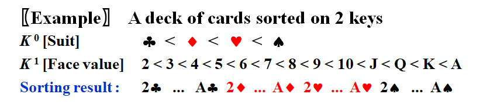
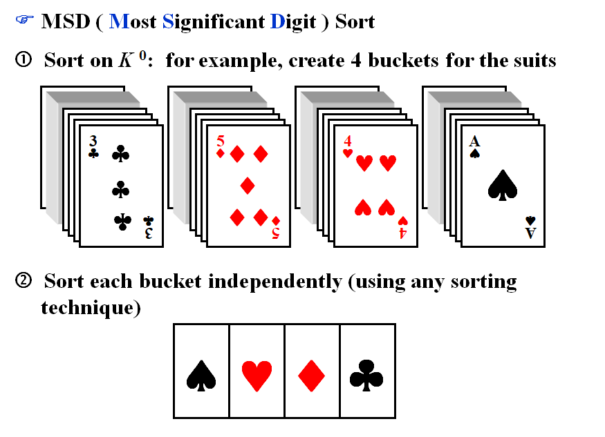
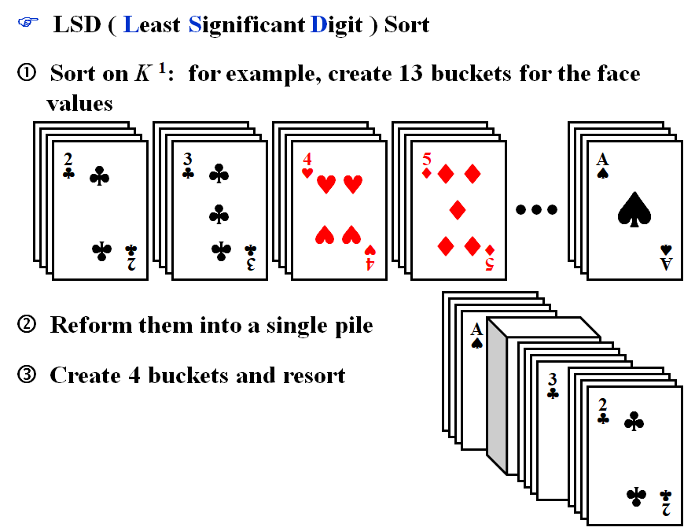

# WEEK 13

qsort非递归实现，自然语言描述（ppt第一页），qsort程序填空

不要只注意i++,j--


### 7.7 Quicksort

- the **fastest** known sorting algorithm in practice

#### Algorithm

```pseudocode
void Quicksort( ElementType A[ ], int N )
{
	if (N < 2) return;
    pivot = pick any element in A[ ]; 
    Partition S = { A[ ] \ pivot } into two disjoint sets:
    	A1 = { a in S | a <= pivot } and A2 = { a in S | a >= pivot };
    A = Quicksort(A1, N1) and { pivot } and Quicksort(A2, N2);
}
```

- The pivot is placed at the right place **once and for all**.
- 要研究的问题是如何选取枢纽元和如何划分

#### Picking the Pivot

##### A Wrong Way

- Pivot = A[ 0 ]
- The worst case : A[ ] is presorted, quicksort will take $O(N^2)$ time to do nothing

##### A Safe Maneuver

- Pivot = random select from A[ ]
- random number generation is **expensive**

##### Median-of-Three Partitioning

- Pivot = median(left, center, right)
- Eliminates the bad case for sorted input and actually reduces the running time by about 5%.

#### Partitioning Strategy

- 当$i$在$j$的左边时，我们将$i$右移，移过那些小于枢纽元的元素，并将$j$左移，移过那些大于枢纽元的元素
- 当$i$和$j$停止时，$i$指向一个大元素而$j$指向一个小元素，如果$i$在$j$的左边，那么将这两个元素互换
- 重复该过程直到$i$和$j$彼此交错为止
- 划分的最后一步是将枢纽元与$i$所指向的元素交换
- 如果$i$和$j$遇到等于枢纽元的键值，就让$i$和$j$都停止，因为若都不停止$T(N)=O(N^2)$
- There will be many dummy swaps, but at least the sequence will be partitioned into two equal-sized subsequences.
- 元素与枢纽元素相等时指针也要停下。这样看起来做了额外的交换，但是可以保证在输入元素全部相等的情况下每次会将输入数组切分成一半。如果相等时指针不停下，快速排序就会在有大量重复元素的输入时复杂度退化为O(n^2)(i直接到了最后)

#### Small Arrays

- Quicksort is slower than insertion sort for small $N(\leq 20)$.
- Cutoff when $N$ gets small and use other efficient algorithms (such as insertion sort).

#### Implementation

```c
void Quicksort( ElementType A[ ], int N ) 
{ 
	Qsort( A, 0, N-1 ); 
	/*A:the array*/
	/*0:Left index*/
	/*N–1:Right index*/
}
```

```c
/* Return median of Left, Center, and Right */ 
/* Order these and hide the pivot */ 
ElementType Median3( ElementType A[ ], int Left, int Right ) 
{
    int Center = ( Left+Right )/2; 
    if ( A[ Left ] > A[ Center ] ) 
        Swap( &A[ Left ], &A[ Center ] ); 
    if ( A[ Left ] > A[ Right ] ) 
        Swap( &A[ Left ], &A[ Right ] ); 
    if ( A[ Center ] > A[ Right ] ) 
        Swap( &A[ Center ], &A[ Right ] ); 
    /*Invariant: A[ Left ] <= A[ Center ] <= A[ Right ]*/ 
    Swap( &A[ Center ], &A[ Right-1 ] ); /*Hide pivot*/ 
    /*only need to sort A[ Left+1 ] … A[ Right–2 ]*/
    return A[ Right-1 ];  /*Return pivot*/ 
}
```

```c
void Qsort( ElementType A[ ], int Left, int Right ) 
{
    int i, j; 
    ElementType Pivot; 
    if ( Left + Cutoff <= Right ) 
    {   /*if the sequence is not too short*/
        Pivot = Median3( A, Left, Right );  /*select pivot*/
        i = Left;     
        j = Right – 1;  /*why not set Left+1 and Right-2?*/
        for( ; ; ) 
        { 
	 		while ( A[ ++i ] < Pivot ) { }  /*scan from left,不能是=号，如果是<=在所有元素相等时就直接扫描到最后一个元素了，相当于N^2*/
	 		while ( A[ --j ] > Pivot ) { }  /*scan from right*/
	 		if ( i < j ) 
	    		Swap( &A[ i ], &A[ j ] );  /*adjust partition*/
	 		else break;  /*partition done*/
        } 
        Swap( &A[ i ], &A[ Right-1 ] ); /*restore pivot */ 
        Qsort( A, Left, i-1 );    /*recursively sort left part*/
        Qsort( A, i+1, Right );   /*recursively sort right part*/
    }  /*end if - the sequence is long*/
    else /*do an insertion sort on the short subarray*/ 
        InsertionSort( A+Left, Right-Left+1 );
}
```

> Note : If set i = Left+1 and j = Right-2, there will be an infinite loop if A[i] = A[j] = pivot.
>
>  如果出现arr[i]=arr[j]=pivot情况，for循环将进入死循环，因为每次检查到arr[i]=pivot和arr[j]=pivot就会终止循环，并且i<j，相互交换，还都是pivot，无法终止。
>
> ​     一个改进的方法就是，我们在每次swap之后，修改i和j的值，对i自加，对j自减，这种操作是可行的，因为当前i和j元素交换，满足i元素小于等于pivot，j元素大于等于pivot。改进如下：
>
> ```c
>    i = left + 1;  // 一开始就将i置为left+1
>         j = right - 2; // 一开始就将j置为right-2
> 
>         for (;;)
>         {
>             while (arr[i] < pivot)
>             {
>                 ++i;
>             }
>             while (arr[j] > pivot)
>             {
>                 --j;
>             }
>             if (i < j)
>             {
>                 swap(arr[i], arr[j]);
>                 ++i; // 修改i
>                 --j; // 修改j
>             }
>             else
>             {
>                 break;
>             }
>         }
> 
> ```

#### Analysis

$$
T(N)=T(i)+T(N-i-1)+cN
$$

- $i$ is the number of the elements in $S_1$.

- **The Worst Case**
  $$
  T(N)=T(N-1)+cN
  $$

  $$
  T(N-1)=T(N-2)+c(N-1)
  $$

  $$
  \cdots
  $$

  $$
  T(2)=T(1)+2c
  $$

  $$
  T(N)=T(1)+c\sum^N_{i=2}i=O(N^2)
  $$

- **The Best Case**
  $$
  T(N)=2T(N/2)+cN
  $$

  $$
  \frac{T(N)}{N}=\frac{T(N/2)}{N/2}+c
  $$

  $$
  \frac{T(N/2)}{N/2}=\frac{T(N/4)}{N/4}+c
  $$

  $$
  \cdots
  $$

  $$
  \frac{T(2)}{2}=\frac{T(1)}{1}+c
  $$

  $$
  \frac{T(N)}{N}=\frac{T(1)}{1}+c\log N\frac{T(N)}{N}=\frac{T(1)}{1}+c\log N
  $$

  $$
  T(N)=cN\log N+N=O(N\log N)
  $$

- **The Average Case**

  - Assume the average value of $T( i )$ for any $i$ is $\frac{1}{N}\left[\sum^{N-1}_{j=0}T(j)\right]$
    $$
    T(N)=\frac{2}{N}\left[\sum^{N-1}_{j=0}T(j)\right]+cN
    $$

  $$
  NT(N)=2\left[\sum^{N-1}_{j=0}T(j)\right]+cN^2
  $$

  $$
  (N-1)T(N-1)=2\left[\sum^{N-2}_{j=0}T(j)\right]+c(N-1)^2
  $$

  $$
  NT(N)-(N-1)T(N-1)=2T(N-1)+2cN-c
  $$

  $$
  NT(N)=(N+1)T(N-1)+2cN
  $$

  $$
  \frac{T(N)}{N+1}=\frac{T(N-1)}{N}+\frac{2c}{N+1}
  $$

  $$
  \frac{T(N-1)}{N}=\frac{T(N-2)}{N-1}+\frac{2c}{N}
  $$

  $$
  \cdots
  $$

  $$
  \frac{T(2)}{3}=\frac{T(1)}{2}+\frac{2c}{3}
  $$

  $$
  \frac{T(N)}{N+1}=\frac{T(1)}{2}+2c\sum^{N+1}_{i=3}\frac{1}{i}
  $$

  $$
  T(N)=O(N\log N)
  $$


#### Quickselect

- 查找第$K$最大(最小)元

```c
/*Places the kth sma11est element in the kth position*/
/*Because arrays start at 0, this will be index k-1*/
void Qselect(ElementType A[ ], int k, int Left, int Right)
{
	int i, j;
	ElementType Pivot;

    if (Left + Cutoff <= Right)
	{
		Pivot = Median3(A, Left, Right);
		i = Left; 
        j = Right-1;
		for( ; ; )
		{
			while(A[ ++i ] < Pivot){ }
			while(A[ --j ] > Pivot){ }
			if(i < j)
				Swap(&A[ i ], &A[ j ]);
			else
				break;
		}
		Swap(&A[ i ], &A[ Right-1 ]); /*Restore pivot*/

        if(k <= i)
			Qselect(A, k, Left, i-1);
		else if (k > i+1)
			Qselect(A, k, i+1, Right);
	}
	else /*Doan insertion sort on the subarray*/
		InsertionSort(A+Left, Right-Left+1);
}
```


正确答案是D

---

### 7.8 Sorting Large Structures

- Swapping large structures can be very much expensive.
- Add a pointer field to the structure and swap pointers instead – **indirect sorting**. Physically rearrange the structures at last if it is really necessary.
- Table Sort

---

### 7.9 A General Lower Bound for Sorting

#### [Theorem] Any algorithm that *sorts by comparisons only* must have a worst case computing time of $\Omega(N\log N)$.

- When sorting $N$ distinct elements, there are $N!$ different possible resu lts.
- Thus any decision tree must have at least $N!$ leaves.
- If the height of the tree is $k$, then $N! \leq 2^{k-1}\rarr k\geq\log(N!)+1$ 
- Since $N!\geq (N/2)^{N/2}$ and $\log_2N!\geq(N/2)\log_2(N/2) = \Theta(N\log_2N )$
- Therefore $T(N)=k\geq c\cdot N\log_2 N$

---

### 7.10 Bucket Sort


```pseudocode
Algorithm
{
    initialize count[ ];
    while(read in a student’s record)
        insert to list count[stdnt.grade];
    for(int i = 0; i < M; i++) 
	{
        if(count[i]) output list count[i];
    }
}
```

$$
T(N,M)=O(M+N)
$$

---

### 7.11 Radix Sort


- $T=O(P(N+B))$ where $P$ is the number of passes, $N$ is the number of elements to sort, and $B$ is the number of buckets.

#### MSD(Most Significant Digit) Sort and LSD(Least Significant Digit) Sort







---

- 稳定的排序算法：冒泡排序、插入排序、归并排序、基数排序
- 不稳定的排序算法：选择排序、快速排序、希尔排序、堆排序

---

