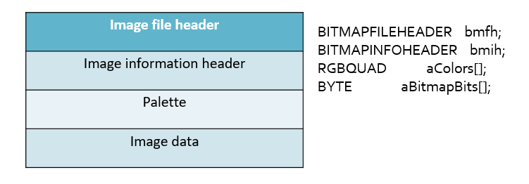
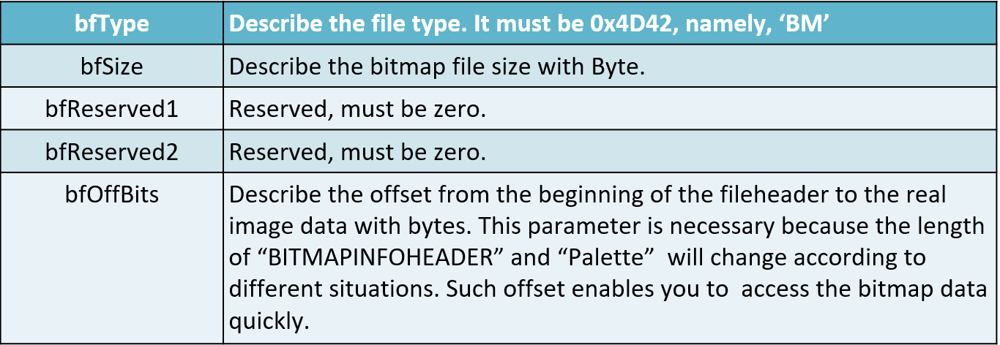
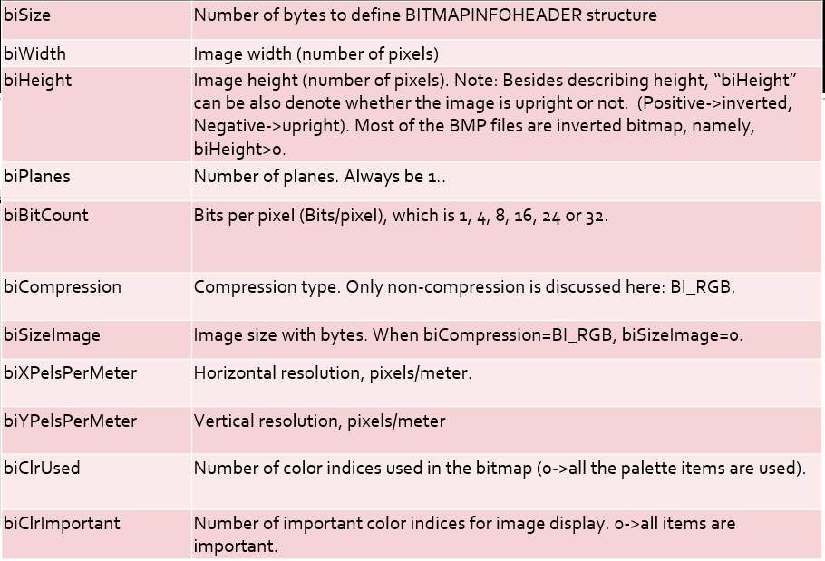
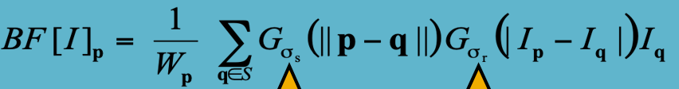

# 图像信息处理

## 课程学习内容[¶](https://zju-turing.github.io/TuringCourses/major_elective/digital_image_processing/#_2)

教授内容以图像基本概念、基本操作为基础，围绕图像合成与编辑核心，并介绍了当前数字图像处理的现状、发展和一些关键技术。 主要知识点为：

- 图像获取
- 图像显示和打印
- 图像存储和传输
- 图像增强和恢复
- 图像识别和理解

## 分数构成[¶](https://zju-turing.github.io/TuringCourses/major_elective/digital_image_processing/#_6)

卷面（60%）+ 作业（40%）

一学期大概会有 5~7 次作业，要使用 C/C++ 编程，不可调用 OpenCV 等图形处理库。

矢量图格式

BITMAPFILEHEADER

BITMAPINFOHEDER

morphing 变形、映射

bilateral filter 双边滤波

guided filter

[数字图像基本处理——空间滤波(spatial filtering) - Bracer - 博客园 (cnblogs.com)](https://www.cnblogs.com/pear-linzhu/p/12508861.html)

# Chapter 1 **Basic concept and programming introduction** 

图像信息处理的应用： image retrieval, scene classification

Object recognition: face detection 

Interactive image retrieval: Mindfinder-> 根据sketch和附加的prompt（颜色，文本）来找网上的图片

▪Grayscale image and color image representation

▪Color space transfer

▪Image format

▪Data structure of image: some typical ones

▪Programming for image processing

▪An image in computer: array(s)

▪Image file: its format and read/write

▪Access DIB: some Windows APIs

▪An image processing example for VC++

▪Image processing in Matlab: some typical instructions

▪Popular image processing softwares

光圈的大小与景深有密切关系

对于给定的主体取景和相机位置，DOF 受镜头光圈直径的控制，光圈直径通常指定为 f 数，即镜头焦距与光圈直径的比值。减小光圈直径（增大 f 值）可以增大景深；但同时也会减小透射光的数量，并增加衍射，这就对通过减小光圈直径来增大景深的程度施加了实际限制。

焦点前后各有一个容许弥散圆，他们之间的距离叫做景深。景深随镜头的焦距、光圈值、拍摄距离而变化

](1)、镜头光圈：
 光圈越大，景深越小；光圈越小，景深越大；
 (2)、镜头焦距
 镜头焦距越长，景深越小；焦距越短，景深越大；
 (3)、拍摄距离
 距离越远，景深越大；距离越近，景深越小

For a given subject framing and camera position, the DOF is controlled by the lens aperture diameter, which is usually specified as the f-number, the ratio of lens focal length to aperture diameter. Reducing the aperture diameter (increasing the f-number) increases the DOF; however, it also reduces the amount of light transmitted, and increases diffraction, placing a practical limit on the extent to which DOF can be increased by reducing the aperture diameter.

对于给定的主体取景和相机位置，景深受镜头光圈直径的控制，光圈直径通常指定为 f 数，即镜头焦距与光圈直径的比值。减小光圈直径（增大 f 值）可以增大景深；但同时也会减小透射光的数量，并增加衍射，这就对通过减小光圈直径来增大景深的程度施加了实际限制。

# Chapter 2 •**Binary image and morphology**

–Binary image

–How to obtain a binary image: binarization

–Image morphological operation

–Definition of ‘set’

–Erosion

–Dilation

–‘Open’ operation

–‘Close’ operation

–Hit-or-miss transform

# Chapter 3 •**Basic operations on image (I)**

–Grayscale image transform

•Visibility of image

•Visibility enhancement: Logarithm

•Histogram of image

•Histogram equalization

•Etc.

# Chapter 4 •**Basic operations on image（II）**

–Simple geometric transform

旋转

–Interpolation

–Application

# Chapter 5 •**Image morphing**

## –Image morphing basic

## –Static morphing

## –Dynamic morphing

## –Feature point based morphing

## –Grid based morphing

这里讨论的Morph变形不同于一般的几何变换(Warp)。

Morph变形指景物的形体变化，它是使一幅图像逐步变化到另一幅图像的处理方法。

这是一种较复杂的二维图像处理，需要对各像素点的颜色、位置作变换。

变形的起始图像和结束图像分别为两幅关键帧，从起始形状变化到结束形状的关键在于自动地生成中间形状，也即自动生成中间帧。

大小相同的两幅图的转换作静态变换。从一幅图a逐渐变化成第二幅图b。

原理：让图a中每个像素的颜色，逐渐变成图b相同位置像素的颜色。

方法：根据变换的快慢，设置相应的步长，将图a每一点的RGB逐渐变成图b相同位置象素的RGB。可以选择等比或等差的方式，或其它方式让：ra-->rb。

对于灰度图像，可以直接用等比或等差级数定义步长，使颜色从原图变到目标图。

### 基于特征点的变形

基于特征点的变形涉及识别两幅原始图像中的特定特征或标志，例如面部变形时脸部的关键点。这些特征点被用作变形过程的参考点，确保在转换过程中保留重要的视觉元素。

### 基于网格的变形

基于网格的变形，也称为基于格的变形，将图像分成网格或格点。这些点作为控制顶点，可以被操纵以使图像发生变形。通过平滑地插值这些网格点的移动，从第一幅图像到第二幅图像，实现了图像的变形，使得变形更加灵活和详细。

总之，图像变形涉及通过一系列中间图像将一幅图像转换成另一幅图像。静态变形关注单一、静态的转换，而动态变形考虑了时间上的转换。基于特征点的变形依赖于特定的标志来进行变形，而基于网格的变形使用一系列点来进行更加灵活和详细的变形。每种方法都提供了独特的方式来实现视觉上引人注目的图像转换。

# Chapter 6 •**Image convolution**

–1-D convolution

–Property of convolution

–Discrete convolution

# Chapter 7 •**Image filtering**

–Smoothing

–Sharpening

–Bilateral filter

–Guided filter (Optional)

去除噪音 image smoothing

高斯模糊

Split an image into:

large-scale features, structure

small-scale features, texture

### bilateral filtering：

An image has two main characteristics

▪The space domain S, which is the set of possible positions in an image. This is related to the resolution, i.e., the number of rows and columns in the image.

▪The intensity domain R, which is the set of possible pixel values. The number of bits used to represent the pixel value may vary. Common pixel representations are unsigned bytes (0 to 255) and floating point.

Every sample is replaced by a weighted average of its neighbors,

These weights reflect two forces

▪How close are the neighbor and the center sample, so that larger weight to closer samples,

▪How similar are the neighbor and the center sample – larger weight to similar samples.

All the weights should be normalized to preserve the local mean.

回顾高斯模糊的问题：确实使图片更平滑了，但是没有保留边缘信息，

Does smooth images  But smooths too much:  **edges are blurred**.

▪Only spatial distance matters

▪No edge term

**Space and Intensity Parameters**

◼space $\sigma_s$ : spatial extent of the kernel, size of the considered neighborhood.

◼intensity $\sigma_r$ : amplitude extent of an edge

$\sigma_{r}$趋于无穷，就是高斯模糊（整个图都考虑，相当于没考虑）

$\sigma_{s}$变大的时候边界内部的纹理被模糊的程度加深，但边界被保留

选择参数取决于应用场景

For instance:

space parameter: proportional to image size e.g., 2% of image diagonal 

intensity parameter: proportional to edge amplitude

e.g., mean or median of image gradients independent of resolution and exposure

图像灰度梯度的中位数/平均数受极端情况影响较小，能够反映图像整体边缘纹理特征的强烈程度，不受分辨率和曝光程度影响

降噪选择小的spatial $\sigma_{s}$不用加速操作，Adapt intensity sigma $\sigma_{s}$ to noise level 

导向滤波：guided filtering  输入一个guided image

解决gradient reversal的问题

在导向滤波（guided filtering）中，导向图像（guided image）通常是从输入图像中得到的。导向图像用于指导滤波器以更好地保留图像的细节和边缘信息。

一种常见的方法是使用输入图像本身作为导向图像。这意味着在进行滤波时，输入图像的某个版本（通常是平滑版本）被用作自身的引导。这种方法有助于确保在进行滤波时保留原始图像中的细节和结构。

另一种方法是通过使用与输入图像相关的其他信息来生成导向图像。例如，可以使用输入图像的梯度信息或者其他相关图像的信息作为导向图像，以便在滤波过程中更好地保留特定的细节和结构。

总的来说，导向图像的获取方式取决于具体的应用场景和对图像细节保留的要求。

## Lab 1

◼Read a color bmp;

◼RGB->YUV;

◼Color to gray: gray=Y in YUV color space;

◼Rearrange gray intensity to lie between [0,255];

◼Write a grayscale bmp;

◼Change the luminance value Y;

◼YUV->RGB;

◼Write a color bmp.

图像文件头，信息头格式，读写操作

图像增强技术

# Chapter 8 •**Fourier transform**

–Fourier and his work

–Background of Fourier transform

–Fourier transform

–Discrete Fourier transform (1D)

–FFT

–FFT in Matlab

–2D Fourier transform

# Chapter 9 •**Image feature**

–SIFT

–SURF

–Deep feature

引入卷积神经网络（CNN）可以大规模减少权重参数训练量的主要原因如下：

1. **参数共享**：在CNN中，卷积层使用参数共享的方式进行特征提取。这意味着卷积核在整个输入图像上滑动，通过同样的权重进行特征提取。这种共享权重的方式大大减少了需要训练的参数数量。例如，对于一个3x3的卷积核，在输入图像的不同位置使用的权重是相同的，因此参数的数量大大减少了。
2. **稀疏连接**：在传统的全连接神经网络中，每个神经元都与上一层的所有神经元相连，导致参数数量巨大。相比之下，CNN中的卷积层只与输入的局部区域相连接，通过卷积操作实现特征提取，这样的稀疏连接方式也大大减少了参数数量。
3. **平移不变性**：图像中的物体通常不依赖于其绝对位置，而是依赖于其相对位置。卷积操作可以捕捉到平移不变性，即学习到的特征对于图像中的不同位置都是有效的。这种特性减少了需要训练的参数数量，因为相同的特征可以在不同位置共享相同的权重。

综上所述，引入CNN可以通过参数共享、稀疏连接和平移不变性等特性，大规模减少权重参数训练量，从而使得神经网络在处理图像等二维数据时更加高效。