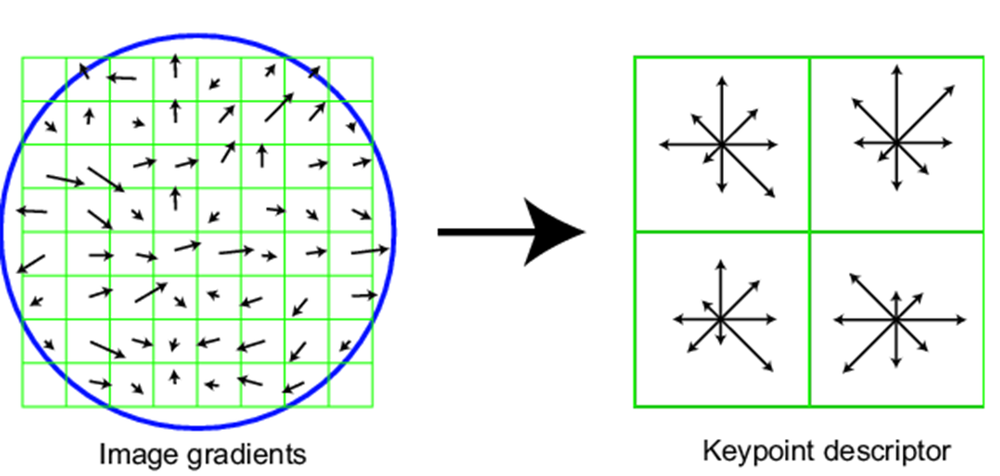
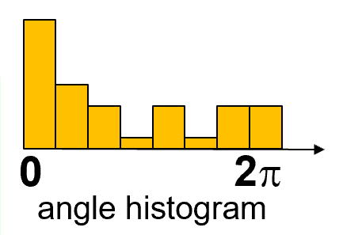

# **Scale Invariant Feature Transform**

对于每个不同尺度的图片，还是使用harris corner detector 来检测可能的特殊点

在不同尺度上检查特殊点，使用Laplace算子，也就是两个二次偏导和的形式，这个值产生峰值的地方，且在不同大小的图片中产生峰值的地方就是特殊点blob可能出现的位置

DoG：difference of guassian:高斯函数的差分值

Maxima and minima

Compare x with its 26 neighbors at 3 scales 

基本思想

- 在检测到的特征角点周围选取 16×16 的方形窗口
- 计算每个像素的边的朝向(梯度的角度- 90°)
- 剔除弱边缘(小于阈值梯度幅度)
- 创建剩下边的方向的直方图

完整版：

- 将 16×16 的窗口 划分为 4×4 的网格
- 对每个网格计算其方向直方图
- 16 cells * 8 orientations = 128 dimensional descriptor(128 维向量)

SIFT Feature

- Descriptor 128-D
  - 
  - 可以通过去掉光照变化带来的影响
- 位置 (�,�)
- 尺度，控制特征提取的覆盖范围
- 方向，实现旋转不变的 descriptor

SIFT 特征可以对图像进行分类
Bag of visual words 提取SIFT特征，将特征做一个聚类(kmeans)，将每个聚类中心称为 visual word 视觉单词

Conclusion of SIFT

- 优点
  - 期望在比例、旋转、光照等变化中的不变性。
  - 局部 patch 具有很强的区分性和表征能力。
  - 在刚性对象表示上非常有效。
- 缺点
  - 提取耗时
    对于大小为400 * 400的图像，平均需要1秒。
  - 对非刚性物体性能较差。
    如人脸、动物等。
  - 在严重的仿射失真下可能无法工作。
    局部补丁是一个圆，而不是一个椭圆调整到仿射失真。

创建直方图的作用是为了对关键点周围的梯度方向进行统计，以便后续确定关键点的主导方向。这种方向直方图的创建有助于实现SIFT算法的方向不变性，具体包括以下步骤：

1. **方向信息统计**：通过将关键点周围的像素根据其梯度方向分配到对应的方向区间内，并对该区间内的计数进行累加，可以得到该区间内梯度方向的统计信息。
2. **主导方向选择**：通过分析这些统计信息，SIFT算法会选择在方向直方图中具有最大累加计数的方向作为该关键点的主导方向。这样做的目的是为了确保描述符能够相对于主导方向进行归一化，以实现旋转不变性。
3. **描述符计算**：在后续计算关键点的描述符时，会相对于主导方向对梯度方向进行调整，以确保描述符对于旋转的变化是不变的。这意味着无论图像如何旋转，描述符都能够在旋转后正确匹配。

通过这种方向直方图的创建和主导方向的选择，SIFT算法实现了对于图像局部特征的方向不变性，使得检测到的关键点能够在一定程度上抵抗图像的旋转变换。

SURF相比SIFT的进步之处在于以下几个方面：

1. **计算速度**：SURF使用积分图像（Integral Image）进行快速计算，这使得特征点检测和描述符计算的速度得到显著提高。相比之下，SIFT算法中使用高斯金字塔进行图像尺度空间的变换，计算量较大，因此在速度上不如SURF。
2. **描述符计算**：SURF使用盒状滤波器（Box Filter）来近似高斯差分滤波器，这简化了描述符计算的复杂度，使得SURF的特征描述符计算更加高效。
3. 维度低, 只用 64 维特征
4. 在均匀、渐变、只有一条边的图像上 SIFT 无法分辨，但 SURF 可以
5. 带噪声会使 SIFT 特征凌乱，对 SURF 几乎没有影响

关于Integral Image 允许我们对滤波器进行上采样而不是对图像进行下采样的意思是，积分图像的使用允许我们通过对滤波器进行上采样来实现尺度不变性，而不是像SIFT那样通过对图像进行下采样来实现尺度不变性。这种方法使得算法更快速，因为上采样可以通过积分图像直接实现，而无需对原始图像进行复杂的操作。

至于为什么SURF需要计算二阶导数，这是因为SURF中的描述符计算涉及对Hessian矩阵的计算，而Hessian矩阵包括二阶导数信息，这对于确定特征点的局部特征形状非常重要。

接下来，对于9x9滤波器的情况，l0 = 3 表示在导数方向上正负半轴的长度。为了保持中心像素，必须至少增加2个像素，因此必须将 l0 增加至少2个像素，这意味着需要增加6个像素的滤波器维度。因此，滤波器的尺寸为：9x9, 15x15, 21x21, 27x27。

这些内容的具体含义是，SURF算法通过使用积分图像实现了对滤波器的上采样，从而实现了尺度不变性，同时利用二阶导数信息来计算特征点的局部特征形状，这些都是SURF相对于SIFT的改进之处。

Hessian矩阵在图像处理中扮演着重要的角色，特别是在特征检测和特征描述方面。其作用主要体现在以下两个方面：

1. **特征点检测**：Hessian矩阵可以用来检测图像中的角点或者边缘等局部特征。通过计算Hessian矩阵的特征值，可以判断局部图像区域的曲率，从而找到潜在的关键点位置。在这种情况下，Hessian矩阵的特征值能够指示出图像区域的变化情况，帮助确定图像中的关键点。
2. **特征描述**：在特征点确定后，Hessian矩阵也可以用来计算描述该特征点周围区域的形状信息。这种形状信息对于后续的特征匹配和识别非常重要，因为它能够帮助区分不同的特征点，并提供更加丰富的特征描述信息。

至于为什么要进行插值，这是因为在实际图像中，特征点的位置通常不会精确地落在像素的中心点上，而是落在像素之间的某个位置。为了更准确地计算Hessian矩阵，需要对局部图像区域进行插值，以便在子像素级别上计算梯度和曲率信息。通过插值，可以更精确地估计局部特征点的梯度和曲率，从而提高特征点检测和描述的精度。

Harris角点检测算法使用Hessian矩阵的特征值来判断图像中的角点。在该算法中，使用λ1和λ2中的较小值作为检测依据的原因如下：

1. **Sensitivity to Edges**：Harris角点检测算法旨在检测角点，而不是边缘。边缘通常具有一个特征值远远大于另一个特征值的Hessian矩阵。因此，通过选择较小的特征值，可以确保检测到的特征更可能代表角点而非边缘。
2. **Local Image Structure**：在角点周围的图像区域，特征值λ1和λ2的大小与图像局部结构的变化有关。较小的特征值通常对应着图像中的变化较小的方向。因此，选择较小的特征值有助于捕捉局部结构的变化，这正是角点所具有的特性。
3. **Noise Robustness**：选择较小的特征值还可以增强算法对噪声的鲁棒性。在受到噪声影响时，较小的特征值更不容易受到干扰，因此能够更可靠地反映图像局部的角点结构。

综上所述，Harris角点检测中使用λ1和λ2的较小值作为检测依据，主要是为了确保检测到的特征更可能代表角点而非边缘，同时提高算法对噪声的鲁棒性，并捕捉局部结构的变化。