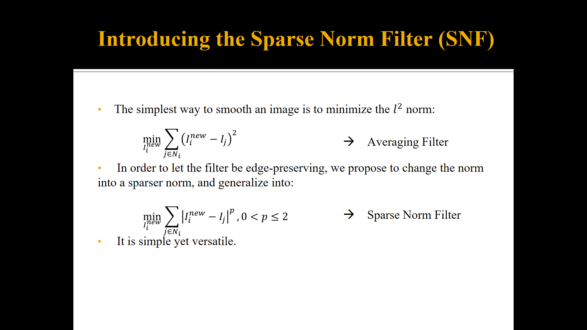

# 高斯滤波和中值滤波

# SNF sparse norm filtering

高斯滤波、均值滤波和中值滤波是常见的图像滤波技术，它们在图像处理中有不同的应用场景和效果特点。

1. **高斯滤波：**
   - **原理：** 高斯滤波使用一个高斯核对图像进行卷积，核的中心具有最高的权重，周围的权重逐渐减小，形成一个高斯分布。这种权重分布有助于平滑图像，同时保留边缘。
   - **效果特点：** 高斯滤波主要用于去除图像中的高频噪声，同时能够在一定程度上保留图像的边缘。它对于平滑图像整体结构效果较好。
2. **均值滤波：**
   - **原理：** 均值滤波使用一个平均权重的核对图像进行卷积，核中的每个权重都相等。这样的平均操作有助于去除噪声，但也可能导致图像的模糊。
   - **效果特点：** 均值滤波适用于去除图像中的均匀噪声，但在平滑过程中可能会损失一些图像的细节信息。它对于一些简单场景的噪声去除效果较好。
3. **中值滤波：**
   - **原理：** 中值滤波使用一个滑动窗口，在窗口中取中值作为当前像素的值。这种操作对于去除椒盐噪声等离群值非常有效。
   - **效果特点：** 中值滤波在处理图像中的椒盐噪声等离群值时表现出色，能够有效地保留图像的细节。但对于高斯噪声等均匀噪声效果相对较差。

p=2时为均值滤波，p=1时是中值滤波

p值足够小：能够保边

HDR compression

保证梯度不会逆转