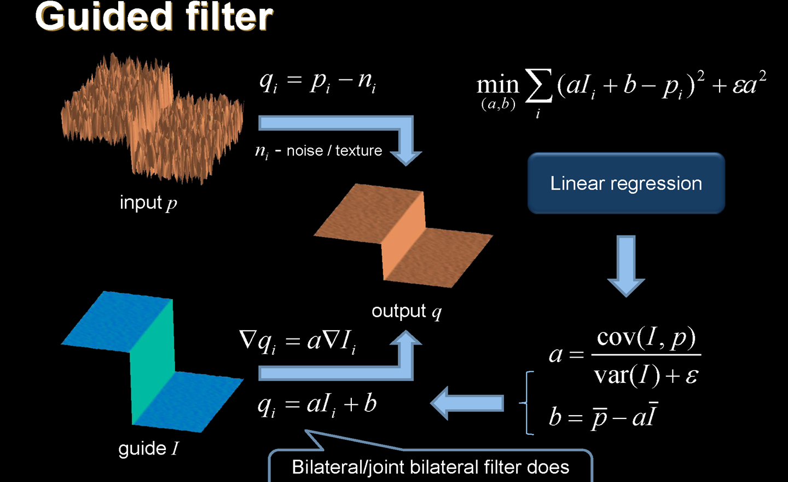

# Guided filtering

引导滤波，基本思想

导向滤波是一种图像处理技术，主要用于图像去噪和增强的目的。其基本原理是利用一个附加的辅助图像（称为导向图像）的信息来引导滤波过程，从而更好地保留图像中的细节和结构。

以下是导向滤波的基本原理和作用：

1. **导向图像：** 导向滤波使用了一个附加的导向图像，该图像包含了原始图像中的一些特征信息，比如梯度、边缘等。导向图像用于指导滤波器如何在图像上进行平滑。
2. **滤波过程：** 导向滤波的核心是在每个像素位置上应用一个滤波器，该滤波器的方向和强度由导向图像的对应位置决定。这样，滤波器的行为在不同的图像区域会有所不同，更好地适应图像的结构。
3. **保留细节和边缘：** 由于导向滤波使用导向图像的信息，它能够更好地保留图像中的细节和边缘。在导向图像中有强烈梯度的区域，滤波器更加注重保留细节，而在平坦区域则进行更强的平滑。
4. **去噪和增强：** 导向滤波广泛应用于图像去噪和增强。通过结合导向图像的信息，它能够有效地减少图像中的噪声，同时增强图像中的有用信息。
5. **适用范围：** 导向滤波适用于各种图像处理任务，包括但不限于去噪、增强、图像平滑和边缘保留等。它在计算机视觉和图像处理领域中得到了广泛的应用。

总体而言，导向滤波通过结合导向图像的信息，使得滤波过程更具方向性和适应性，从而在图像处理中取得更好的效果。

暴力双边滤波迭代次数非常大

解决双边滤波中的梯度反转、计算缓慢问题，能够保边、非迭代
I是guide，p是输入图，q是输出图。输出是I的线性表达
$$
    min\sum(aI_i+b-p_i)^2+\epsilon a^2\\
    q_i=\hat a_iI_i+\hat b_i
$$
​    

