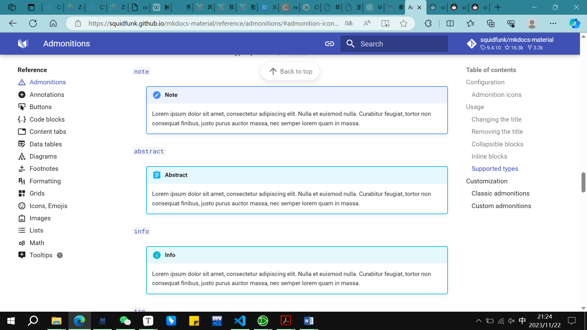
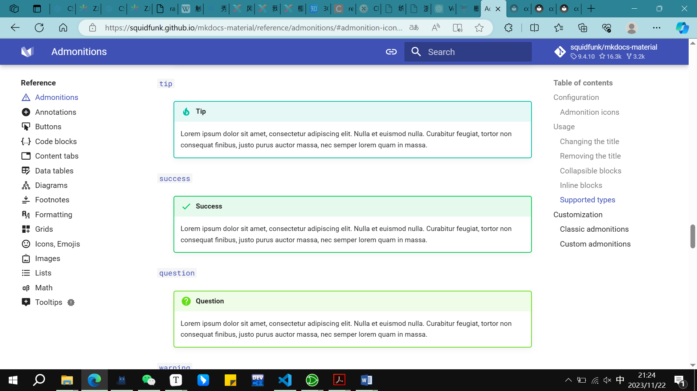
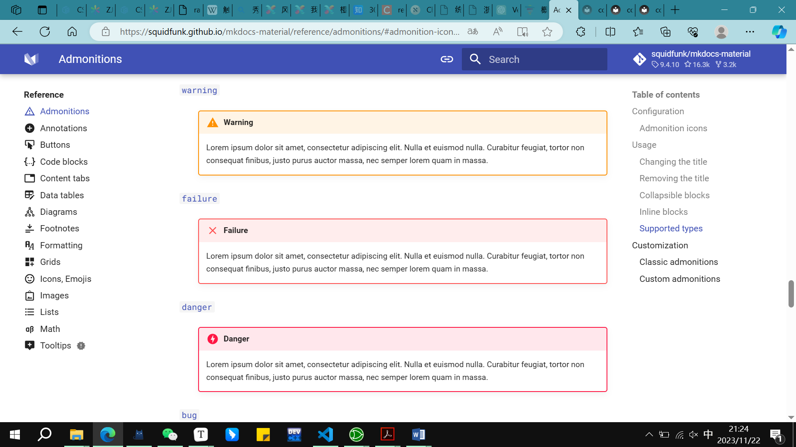
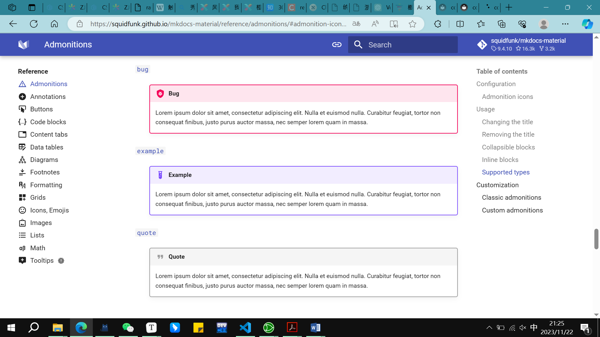
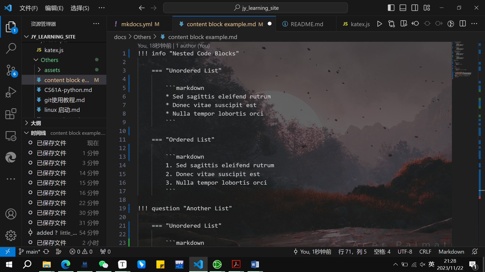

!!! info "Nested Code Blocks"

    === "Unordered List"
    
        ```markdown
        * Sed sagittis eleifend rutrum
        * Donec vitae suscipit est
        * Nulla tempor lobortis orci
        ```
    
    === "Ordered List"
    
        ```markdown
        1. Sed sagittis eleifend rutrum
        2. Donec vitae suscipit est
        3. Nulla tempor lobortis orci
        ```

!!! question "Another List"

    === "Unordered List"
    
        ```markdown
        * Sed sagittis eleifend rutrum
        * Donec vitae suscipit est
        * Nulla tempor lobortis orci
        ```
    
    === "Ordered List"
    
        ```markdown
        1. Sed sagittis eleifend rutrum
        2. Donec vitae suscipit est
        3. Nulla tempor lobortis orci
        ```

nested code block

=== "C"

    ```c
    #include <stdio.h>
    
    int main(void) {
        printf("Hello world!\n");
        return 0;
    }
    ```

=== "C++"

    ```c++
    #include <iostream>
    
    int main(void) {
        std::cout << "Hello world!" << std::endl;
        return 0;
    }
    ```

??? 展开查看nested tab content的使用方法
    note
​        
        
        
        

!!! info "语法格式:"
    tab间隔，建议在vscode/typora原格式(raw)下编辑，可以选中tab
    alt text形式是直接采用在md文件的同目录下插入，可以在nested tab中插入
    

