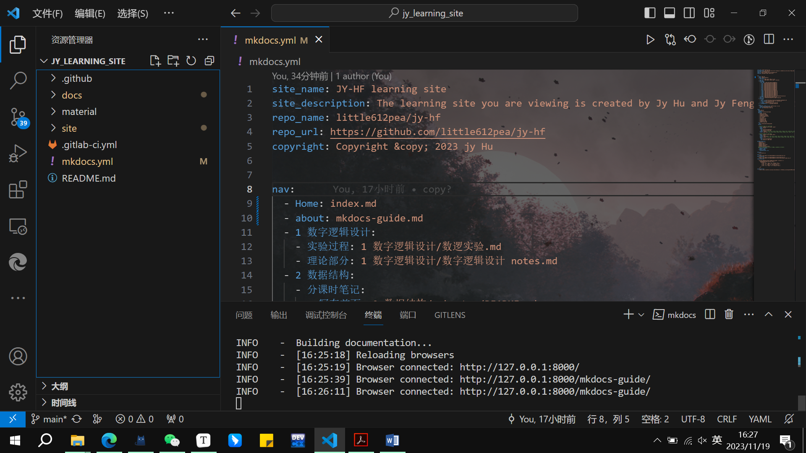

# 欢迎来到JY-HF的代码空间

以下简要介绍本站的主要内容以及搭建、维护网站的方法、更新日志

## 主要内容

一直很想搭建个人的学习网站，当内容存储在本地时虽然维护非常方便，但是有一个统一整合的页面会促使我去记笔记。维护的过程希望不要形式大于内容，而是能够从实质上促进学习。如果觉得重新回归纸质化学习效率更高，也完全ok~

### 1、课内课程学习资料

FDS DIP 电路电子，我也想学复变（bushi，以后的竞赛内容，srtp....

以往的微积分，线代，离散，常微分，只要是硬课，大可全部上传

开个专楼纪念（开喷）某几门通识课

主要支持markdown语法，但是可以直接从网站下载pdf文档哦~~

### 2、生活 个人blog

参考杨xjgg的blog，什么都可以喷，上传一堆堆picture

### 3、课外自学内容，实用工具学习

git bash  shell    linux     摄影技术？  化妆技术       运动技巧...

### 4、想对彼此说的话，可以加密哦

[still developing......]

## 本地部署方式

本文档使用 [mkdocs](https://www.mkdocs.org/) 构建，并使用了 [material](https://squidfunk.github.io/mkdocs-material/) 第三方主题，你需要在本地依次序安装 [Python](https://python.org/)、mkdocs、material 主题。

### Python 安装

官网[安装指导](https://wiki.python.org/moin/BeginnersGuide/Download)已经给出各系统安装方式，根据官网内容安装即可。

### mkdocs、material 主题

均可以通过 [pip](https://pypi.org/project/pip/)（Python 的包管理器） 进行安装。

```
$ pip install mkdocs
$ pip install mkdocs-material
```

具体地，你可以分别查看 [mkdocs 的安装指导](https://www.mkdocs.org/getting-started/#installation) 与 [material 的安装指导](https://squidfunk.github.io/mkdocs-material/getting-started/#installation)。

### 本地构建

你只需要将本仓库拉至本地，后使用 `mkdocs serve` 部署即可。

```
# 拉取仓库，两者皆可
$ git clone git@github.com:little612pea/jy-hf.git
$ git clone https://github.com/little612pea/jy-hf.git
# 构建
$ cd jy-hf
$ mkdocs serve
```

如果你使用本地部署查看文档，请在每次使用前查看并拉取远程仓库的 `main` 分支更新 `git pull`

## 如何搭建网站

原来曾经想自行维护一个白嫖来的2核4G 阿里云服务器,使用[wordpress](https://wordpress.com/zh-cn/)网站建站，

GitHub Pages是GitHub提供的一项免费静态网站托管服务，允许用户将他们的项目托管在GitHub上，并通过GitHub Pages服务发布项目的静态网站。这个服务非常适合用于展示个人、团队或项目的文档、博客、作品集等静态内容。

以下是GitHub Pages的一些关键特点和信息：

1. **免费托管：** GitHub Pages是免费的，用户可以将自己的静态网站直接托管在GitHub上，无需支付额外费用。
2. **域名支持：** 用户可以选择使用GitHub提供的默认域名（如`username.github.io`），也可以将自定义域名关联到他们的GitHub Pages网站上。
3. **支持Jekyll：** GitHub Pages原生支持Jekyll，一个简单的静态网站生成器。用户可以使用Jekyll来自定义和优化他们的网站，添加博客、页面布局等。
4. **自动构建：** 当用户将新的内容推送到他们的GitHub仓库时，GitHub Pages会自动重新构建和部署网站，确保最新的内容能够快速地在网站上更新。
5. **版本控制：** 由于GitHub Pages与GitHub仓库紧密集成，用户可以充分利用Git的版本控制功能来管理和跟踪网站的变化。

使用GitHub Pages的一般步骤包括：

- 在GitHub上创建一个仓库，仓库名字应该是`username.github.io`（其中`username`是你的GitHub用户名）注意，这里新建的是个人/企业网站的首页，相当于服务器本身，如果要新建的仓库不是这个名称，就可以在username.github.io/repo_name处访问，相当于一个端口。只不过github pages是帮你运维好的服务器，比较靠谱
- 在仓库中添加你的静态网站文件，可以是HTML、CSS、JavaScript等。
- 将文件推送到GitHub仓库。
- 在仓库的Settings页面中找到GitHub Pages设置，选择主分支（通常是`main`或`master`）作为源，然后保存设置。
- 在几分钟内，你的网站就会在`username.github.io`上可访问。

总体而言，GitHub Pages是一个方便、简单且功能强大的工具，适用于许多不同类型的静态网站托管需求。


### github action 和 gitlab.ci等内容实操原理等待后续完善

## 建站具体操作

### Commands

* `mkdocs new [dir-name]` - Create a new project.
* `mkdocs serve` - Start the live-reloading docs server.
* `mkdocs build` - Build the documentation site.
* `mkdocs -h` - Print help message and exit.

### Project layout

    mkdocs.yml    # The configuration file.
    docs/
        index.md  # The documentation homepage.
        ...       # Other markdown pages, images and other files.



参考[Material for MkDocs (squidfunk.github.io)](https://squidfunk.github.io/mkdocs-material/)给出的详细建站过程，大佬的UI望尘莫及呐

官方文档参考：For full documentation visit [mkdocs.org](https://www.mkdocs.org).

## 使用aliyun存储桶
github pages限制存储容量为1GB

使用阿里云服务器或其他云服务提供商的外部存储来托管 GitHub Pages 的文件，可以通过以下步骤实现：

1. 在阿里云上创建存储桶
登录阿里云控制台，导航到对象存储服务（OSS）。
创建一个存储桶（Bucket），用于存储你的静态网站文件。
2. 上传文件到存储桶
将你的静态网站文件上传到刚创建的存储桶中。
确保你的文件在存储桶中的适当路径。
3. 设置存储桶为公共读
在存储桶管理页面，找到 "权限管理" 部分。
设置存储桶的权限，确保它对公众可读（Public Read）。
4. 获取外部存储的访问域名
在存储桶管理页面，找到存储桶的访问域名。
这个域名将用于访问存储桶中的文件。
5. 配置 GitHub Pages 使用外部存储
在 GitHub 仓库中的设置（Settings）中，找到 "GitHub Pages" 部分，将源设置为 "master branch"（或你上传文件的分支），然后输入你在阿里云上获取的外部存储访问域名。

6. 测试 GitHub Pages
确保你的仓库中包含一个 index.html 文件或其他默认文档。
访问你的 GitHub Pages 网站的 URL，确保它正确加载。
这样，你的 GitHub Pages 就会从阿里云存储桶中加载文件。这种方法的好处是可以利用云存储的高可用性和快速加载速度。请确保存储桶的权限正确配置，以便 GitHub Pages 可以读取存储桶中的文件。

## 更新日志

11-18 20：55 开始建站

11-19 12：30 解决内联公式无法显示问题，使用mathJax格式

11-19 16：12 基本完成建站

接下来请冯冯同学帮忙看看图片相对路径设置怎么方便渲染，似乎渲染不了html格式，它只会形如

"[2-2] (/assets/imgs)"的形式

11-20 20：15 pdf嵌入，对相对路径以及pathconverter的内容有基本理解

11-22 解决remote文不对板的问题，重定向了remote，参考官网教程正确配置了katex格式，渲染行内公式

使用pymdownx.highlight高亮语法

11-22 20：40 nested tab 格式嵌入 [使用教程](https://little612pea.github.io/jy-hf/Others/content block example)


